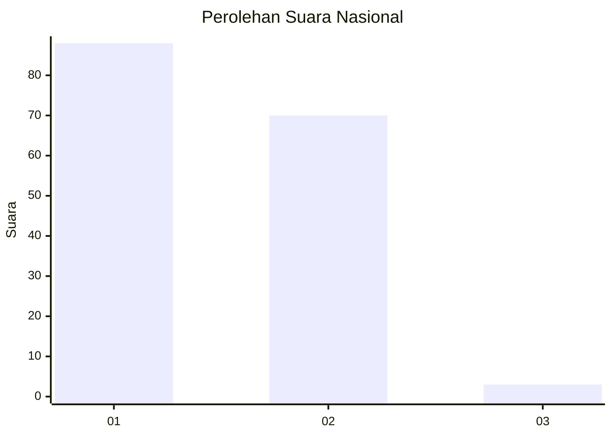
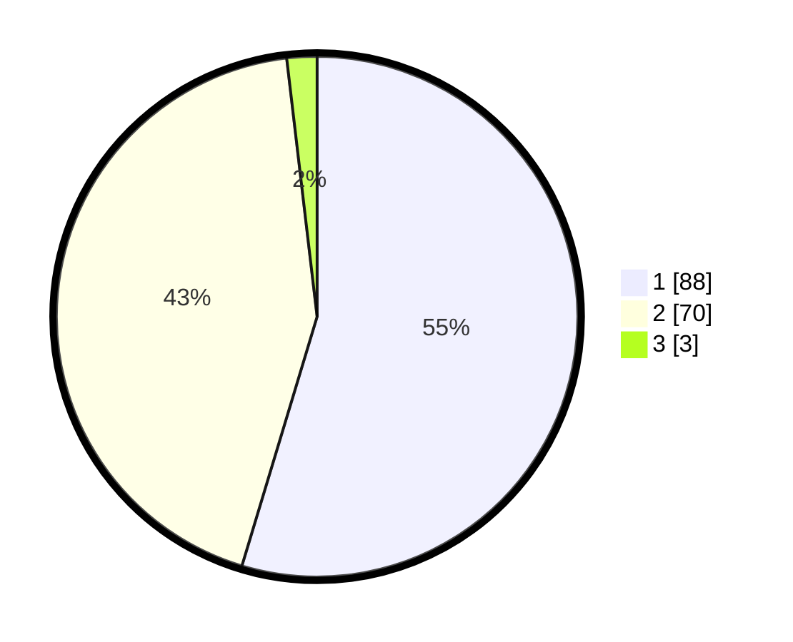

# Hasil

## Grafik

## Tabel

| No. | Nama Paslon    | Suara | Suara (raw) | Persentase |
|:--- |:-------------- | -----:| -----------:| ----------:|
| 1   | ANIES MUHAIMIN | 88    | [88][p-1]   | 54,66      |
| 2   | PRABOWO GIBRAN | 70    | [70][p-2]   | 43,48      |
| 3   | GANJAR MAHFUD  | 3     | [3][p-3]    | 1,86       |

[p-1]: https://github.com/gigit-pemilu/pemilu-2024/blob/main/pilpres/hitung-suara/sub/11-aceh/sub/10-aceh-singkil/sub/01-pulau-banyak/sub/2001-pulau-balai/sub/005-tps/sub/paslon-1.txt
[p-2]: https://github.com/gigit-pemilu/pemilu-2024/blob/main/pilpres/hitung-suara/sub/11-aceh/sub/10-aceh-singkil/sub/01-pulau-banyak/sub/2001-pulau-balai/sub/005-tps/sub/paslon-2.txt
[p-3]: https://github.com/gigit-pemilu/pemilu-2024/blob/main/pilpres/hitung-suara/sub/11-aceh/sub/10-aceh-singkil/sub/01-pulau-banyak/sub/2001-pulau-balai/sub/005-tps/sub/paslon-3.txt

## Foto C Plano

https://sirekap-obj-formc.kpu.go.id/c395/pemilu/ppwp/11/10/01/20/01/1110012001005-20240219-133730--bfdc96ba-36d5-4d74-a6b5-38b012b7214b.jpg

https://sirekap-obj-formc.kpu.go.id/c395/pemilu/ppwp/11/10/01/20/01/1110012001005-20240219-134503--2c932136-743e-4820-8917-dd060f00ce1d.jpg

https://sirekap-obj-formc.kpu.go.id/c395/pemilu/ppwp/11/10/01/20/01/1110012001005-20240219-134818--93c21f17-83c3-43d9-97e8-08e36f720546.jpg

## Metadata

| Key        | Value               |
| ---------- | ------------------- |
| Time Stamp | 2024-02-19 14:00:00 |

## DATA PEMILIH TETAP

Jumlah pemilih dalam DPT: **204**.
 * L: **109**.
 * P: **95**.

## DATA PENGGUNA HAK PILIH

Jumlah pengguna hak pilih dalam DPT: **176**.
 * L: **94**.
 * P: **82**.

Jumlah pengguna hak pilih dalam DPTb: **0**.
 * L: **0**.
 * P: **0**.

Jumlah pengguna hak pilih dalam DPK: **0**.
 * L: **0**.
 * P: **0**.

Jumlah pengguna hak pilih: **176**.
 * L: **94**.
 * P: **82**.

## JUMLAH SUARA SAH DAN TIDAK SAH

JUMLAH SELURUH SUARA SAH: **161**.

JUMLAH SUARA TIDAK SAH: **15**.

JUMLAH SELURUH SUARA SAH DAN SUARA TIDAK SAH: **176**.

