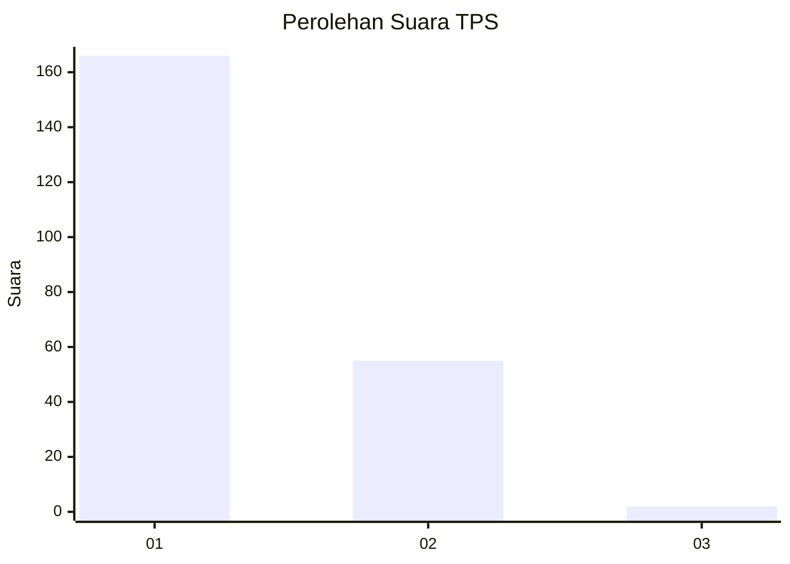
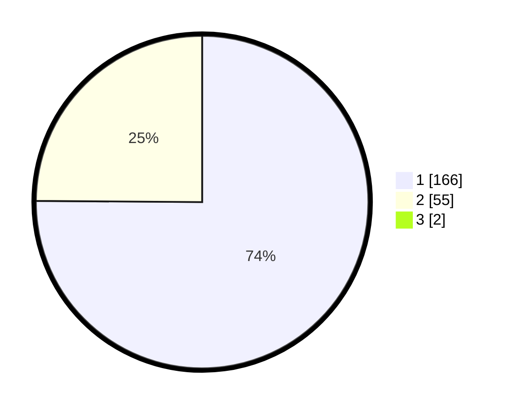

# Hasil

## Grafik

## Tabel

| No. | Nama Paslon    | Suara | Suara (raw) | Persentase |
|:--- |:-------------- | -----:| -----------:| ----------:|
| 1   | ANIES MUHAIMIN | 166   | [166][p-1]  | 74,44      |
| 2   | PRABOWO GIBRAN | 55    | [55][p-2]   | 24,66      |
| 3   | GANJAR MAHFUD  | 2     | [2][p-3]    | 0,90       |

[p-1]: https://github.com/gigit-pemilu/pemilu-2024-11-aceh/blob/main/pilpres/hitung-suara/sub/11-aceh/sub/10-aceh-singkil/sub/02-simpang-kanan/sub/2001-lipat-kajang/sub/003-tps/sub/paslon-1.txt
[p-2]: https://github.com/gigit-pemilu/pemilu-2024-11-aceh/blob/main/pilpres/hitung-suara/sub/11-aceh/sub/10-aceh-singkil/sub/02-simpang-kanan/sub/2001-lipat-kajang/sub/003-tps/sub/paslon-2.txt
[p-3]: https://github.com/gigit-pemilu/pemilu-2024-11-aceh/blob/main/pilpres/hitung-suara/sub/11-aceh/sub/10-aceh-singkil/sub/02-simpang-kanan/sub/2001-lipat-kajang/sub/003-tps/sub/paslon-3.txt

## Foto C Plano

https://sirekap-obj-formc.kpu.go.id/63c9/pemilu/ppwp/11/10/02/20/01/1110022001003-20240224-215334--1564a65b-7c35-4c02-a081-0c657ac31955.jpg

https://sirekap-obj-formc.kpu.go.id/63c9/pemilu/ppwp/11/10/02/20/01/1110022001003-20240224-220018--b2548941-f37b-45e5-bf06-64f834629826.jpg

https://sirekap-obj-formc.kpu.go.id/63c9/pemilu/ppwp/11/10/02/20/01/1110022001003-20240224-220816--1e0665fb-8b49-4005-b2c7-3f35148fedee.jpg

## Metadata

| Key        | Value               |
| ---------- | ------------------- |
| Time Stamp | 2024-02-24 22:31:28 |

## DATA PEMILIH TETAP

Jumlah pemilih dalam DPT: **255**.
 * L: **127**.
 * P: **128**.

## DATA PENGGUNA HAK PILIH

Jumlah pengguna hak pilih dalam DPT: **228**.
 * L: **107**.
 * P: **121**.

Jumlah pengguna hak pilih dalam DPTb: **4**.
 * L: **2**.
 * P: **2**.

Jumlah pengguna hak pilih dalam DPK: **4**.
 * L: **2**.
 * P: **2**.

Jumlah pengguna hak pilih: **235**.
 * L: **111**.
 * P: **124**.

## JUMLAH SUARA SAH DAN TIDAK SAH

JUMLAH SELURUH SUARA SAH: **223**.

JUMLAH SUARA TIDAK SAH: **12**.

JUMLAH SELURUH SUARA SAH DAN SUARA TIDAK SAH: **235**.

