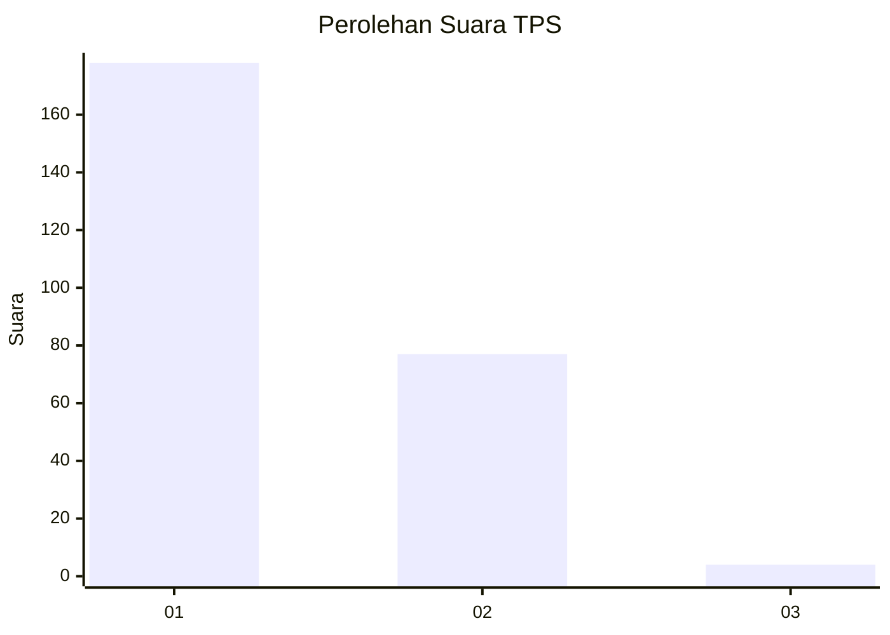
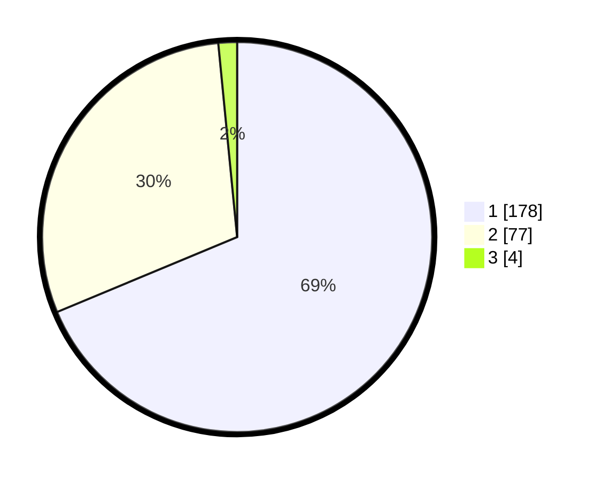

# Hasil

## Grafik

## Tabel

| No. | Nama Paslon    | Suara | Suara (raw) | Persentase |
|:--- |:-------------- | -----:| -----------:| ----------:|
| 1   | ANIES MUHAIMIN | 178   | [178][p-1]  | 68,73      |
| 2   | PRABOWO GIBRAN | 77    | [77][p-2]   | 29,73      |
| 3   | GANJAR MAHFUD  | 4     | [4][p-3]    | 1,54       |

[p-1]: https://github.com/gigit-pemilu/pemilu-2024-11-aceh/blob/main/pilpres/hitung-suara/sub/11-aceh/sub/10-aceh-singkil/sub/02-simpang-kanan/sub/2001-lipat-kajang/sub/004-tps/sub/paslon-1.txt
[p-2]: https://github.com/gigit-pemilu/pemilu-2024-11-aceh/blob/main/pilpres/hitung-suara/sub/11-aceh/sub/10-aceh-singkil/sub/02-simpang-kanan/sub/2001-lipat-kajang/sub/004-tps/sub/paslon-2.txt
[p-3]: https://github.com/gigit-pemilu/pemilu-2024-11-aceh/blob/main/pilpres/hitung-suara/sub/11-aceh/sub/10-aceh-singkil/sub/02-simpang-kanan/sub/2001-lipat-kajang/sub/004-tps/sub/paslon-3.txt

## Foto C Plano

https://sirekap-obj-formc.kpu.go.id/dbcd/pemilu/ppwp/11/10/02/20/01/1110022001004-20240225-034916--5591b1d3-1b1b-444c-89a8-2e73ec0f5b11.jpg

https://sirekap-obj-formc.kpu.go.id/dbcd/pemilu/ppwp/11/10/02/20/01/1110022001004-20240224-231535--061c0a4f-6618-4f59-9746-b3719116351d.jpg

https://sirekap-obj-formc.kpu.go.id/dbcd/pemilu/ppwp/11/10/02/20/01/1110022001004-20240224-231000--60c9bcbd-7a7e-4b1e-9f1e-46b64e7e3f9d.jpg

## Metadata

| Key        | Value               |
| ---------- | ------------------- |
| Time Stamp | 2024-02-25 04:00:00 |

## DATA PEMILIH TETAP

Jumlah pemilih dalam DPT: **276**.
 * L: **126**.
 * P: **150**.

## DATA PENGGUNA HAK PILIH

Jumlah pengguna hak pilih dalam DPT: **261**.
 * L: **118**.
 * P: **143**.

Jumlah pengguna hak pilih dalam DPTb: **5**.
 * L: **4**.
 * P: **1**.

Jumlah pengguna hak pilih dalam DPK: **2**.
 * L: **0**.
 * P: **2**.

Jumlah pengguna hak pilih: **268**.
 * L: **122**.
 * P: **146**.

## JUMLAH SUARA SAH DAN TIDAK SAH

JUMLAH SELURUH SUARA SAH: **259**.

JUMLAH SUARA TIDAK SAH: **9**.

JUMLAH SELURUH SUARA SAH DAN SUARA TIDAK SAH: **268**.

