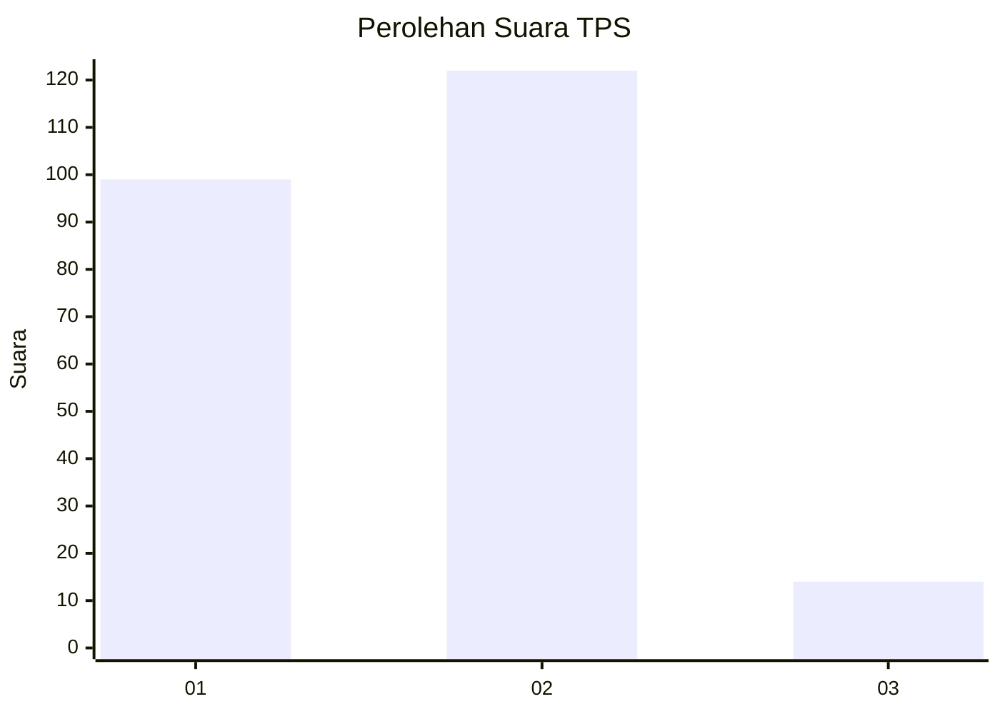
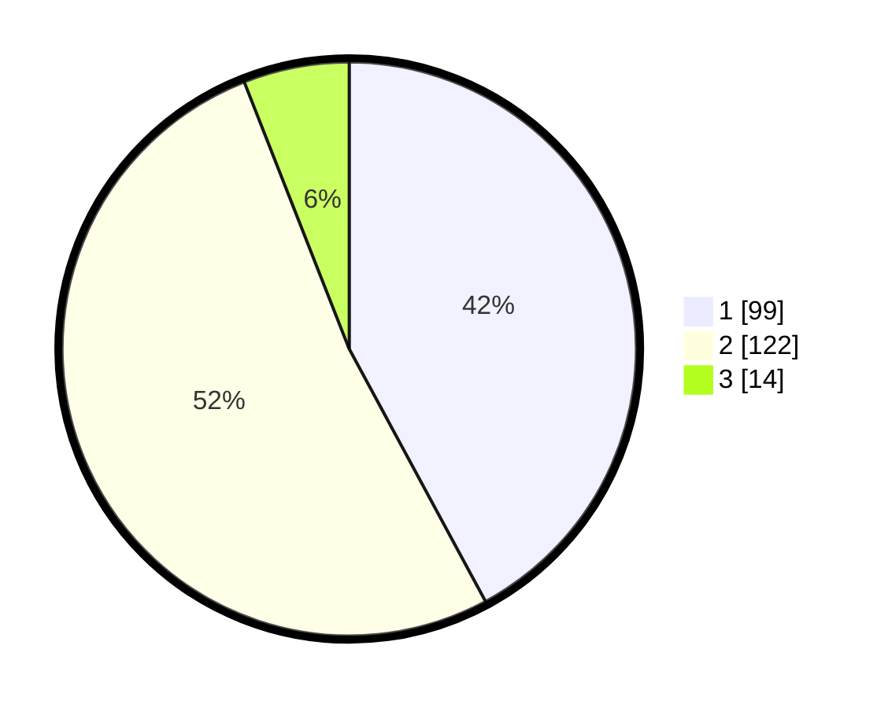

# Hasil

## Grafik

## Tabel

| No. | Nama Paslon    | Suara | Suara (raw) | Persentase |
|:--- |:-------------- | -----:| -----------:| ----------:|
| 1   | ANIES MUHAIMIN | 99    | [99][p-1]   | 42,13      |
| 2   | PRABOWO GIBRAN | 122   | [122][p-2]  | 51,91      |
| 3   | GANJAR MAHFUD  | 14    | [14][p-3]   | 5,96       |

[p-1]: https://github.com/gigit-pemilu/pemilu-2024-11-aceh/blob/main/pilpres/hitung-suara/sub/11-aceh/sub/10-aceh-singkil/sub/02-simpang-kanan/sub/2004-siatas/sub/002-tps/sub/paslon-1.txt
[p-2]: https://github.com/gigit-pemilu/pemilu-2024-11-aceh/blob/main/pilpres/hitung-suara/sub/11-aceh/sub/10-aceh-singkil/sub/02-simpang-kanan/sub/2004-siatas/sub/002-tps/sub/paslon-2.txt
[p-3]: https://github.com/gigit-pemilu/pemilu-2024-11-aceh/blob/main/pilpres/hitung-suara/sub/11-aceh/sub/10-aceh-singkil/sub/02-simpang-kanan/sub/2004-siatas/sub/002-tps/sub/paslon-3.txt

## Foto C Plano

https://sirekap-obj-formc.kpu.go.id/05e9/pemilu/ppwp/11/10/02/20/04/1110022004002-20240224-155651--453fd3ef-d2c1-4181-998c-6c55b6ba8d5b.jpg

https://sirekap-obj-formc.kpu.go.id/05e9/pemilu/ppwp/11/10/02/20/04/1110022004002-20240224-160349--dabb6704-0206-4ed7-bb0e-981a9eb1b604.jpg

https://sirekap-obj-formc.kpu.go.id/05e9/pemilu/ppwp/11/10/02/20/04/1110022004002-20240224-155844--9dc3e5bf-d3ee-43aa-b2d6-fc20da6aefcc.jpg

## Metadata

| Key        | Value               |
| ---------- | ------------------- |
| Time Stamp | 2024-02-25 22:00:00 |

## DATA PEMILIH TETAP

Jumlah pemilih dalam DPT: **289**.
 * L: **136**.
 * P: **153**.

## DATA PENGGUNA HAK PILIH

Jumlah pengguna hak pilih dalam DPT: **264**.
 * L: **134**.
 * P: **130**.

Jumlah pengguna hak pilih dalam DPTb: **1**.
 * L: **0**.
 * P: **1**.

Jumlah pengguna hak pilih dalam DPK: **1**.
 * L: **0**.
 * P: **1**.

Jumlah pengguna hak pilih: **266**.
 * L: **134**.
 * P: **132**.

## JUMLAH SUARA SAH DAN TIDAK SAH

JUMLAH SELURUH SUARA SAH: **235**.

JUMLAH SUARA TIDAK SAH: **31**.

JUMLAH SELURUH SUARA SAH DAN SUARA TIDAK SAH: **266**.

