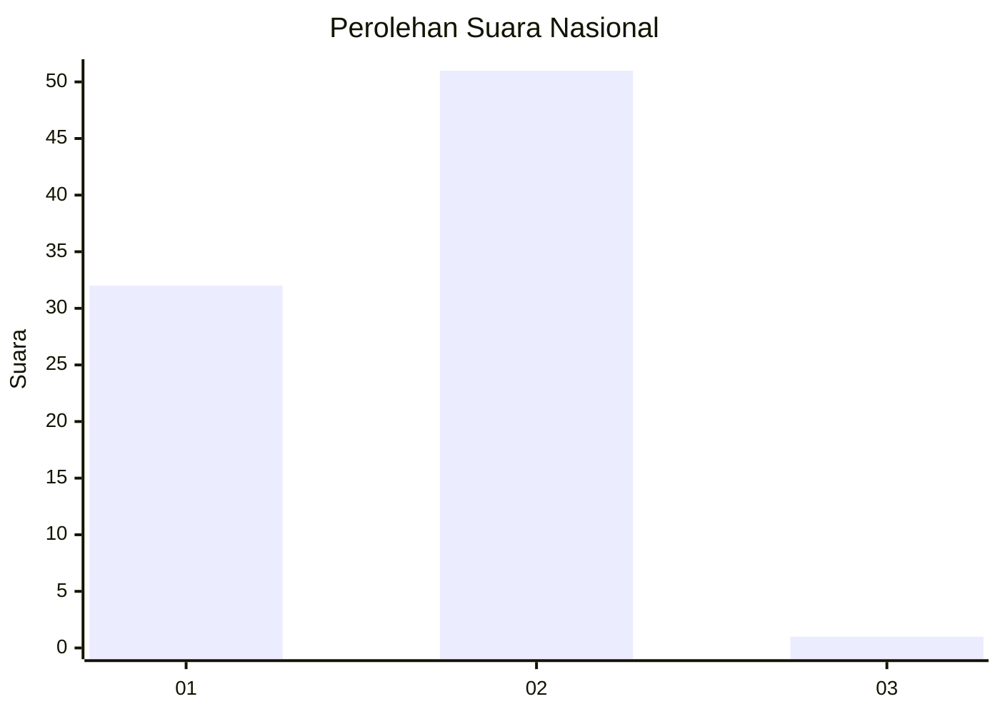
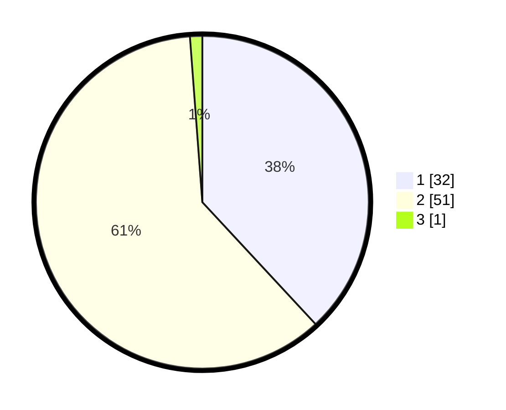

# Hasil

## Grafik

## Tabel

| No. | Nama Paslon    | Suara | Suara (raw) | Persentase |
|:--- |:-------------- | -----:| -----------:| ----------:|
| 1   | ANIES MUHAIMIN | 32    | [32][p-1]   | 38,10      |
| 2   | PRABOWO GIBRAN | 51    | [51][p-2]   | 60,71      |
| 3   | GANJAR MAHFUD  | 1     | [1][p-3]    | 1,19       |

[p-1]: https://github.com/gigit-pemilu/pemilu-2024/blob/main/pilpres/hitung-suara/sub/11-aceh/sub/10-aceh-singkil/sub/02-simpang-kanan/sub/2012-kuta-batu/sub/001-tps/sub/paslon-1.txt
[p-2]: https://github.com/gigit-pemilu/pemilu-2024/blob/main/pilpres/hitung-suara/sub/11-aceh/sub/10-aceh-singkil/sub/02-simpang-kanan/sub/2012-kuta-batu/sub/001-tps/sub/paslon-2.txt
[p-3]: https://github.com/gigit-pemilu/pemilu-2024/blob/main/pilpres/hitung-suara/sub/11-aceh/sub/10-aceh-singkil/sub/02-simpang-kanan/sub/2012-kuta-batu/sub/001-tps/sub/paslon-3.txt

## Foto C Plano

https://sirekap-obj-formc.kpu.go.id/64db/pemilu/ppwp/11/10/02/20/12/1110022012001-20240218-171026--19a383b1-277d-4839-b03e-bc6a1ecbb15f.jpg

https://sirekap-obj-formc.kpu.go.id/64db/pemilu/ppwp/11/10/02/20/12/1110022012001-20240218-115536--ef26ae1e-ad3c-4027-8373-b4ff541b1ed2.jpg

https://sirekap-obj-formc.kpu.go.id/64db/pemilu/ppwp/11/10/02/20/12/1110022012001-20240218-115826--6c15dec7-4ad3-4fc6-9555-3f35070fb61a.jpg

## Metadata

| Key        | Value               |
| ---------- | ------------------- |
| Time Stamp | 2024-02-19 06:16:00 |

## DATA PEMILIH TETAP

Jumlah pemilih dalam DPT: **93**.
 * L: **43**.
 * P: **50**.

## DATA PENGGUNA HAK PILIH

Jumlah pengguna hak pilih dalam DPT: **83**.
 * L: **37**.
 * P: **46**.

Jumlah pengguna hak pilih dalam DPTb: **3**.
 * L: **2**.
 * P: **1**.

Jumlah pengguna hak pilih dalam DPK: **0**.
 * L: **0**.
 * P: **0**.

Jumlah pengguna hak pilih: **86**.
 * L: **39**.
 * P: **47**.

## JUMLAH SUARA SAH DAN TIDAK SAH

JUMLAH SELURUH SUARA SAH: **84**.

JUMLAH SUARA TIDAK SAH: **2**.

JUMLAH SELURUH SUARA SAH DAN SUARA TIDAK SAH: **86**.

