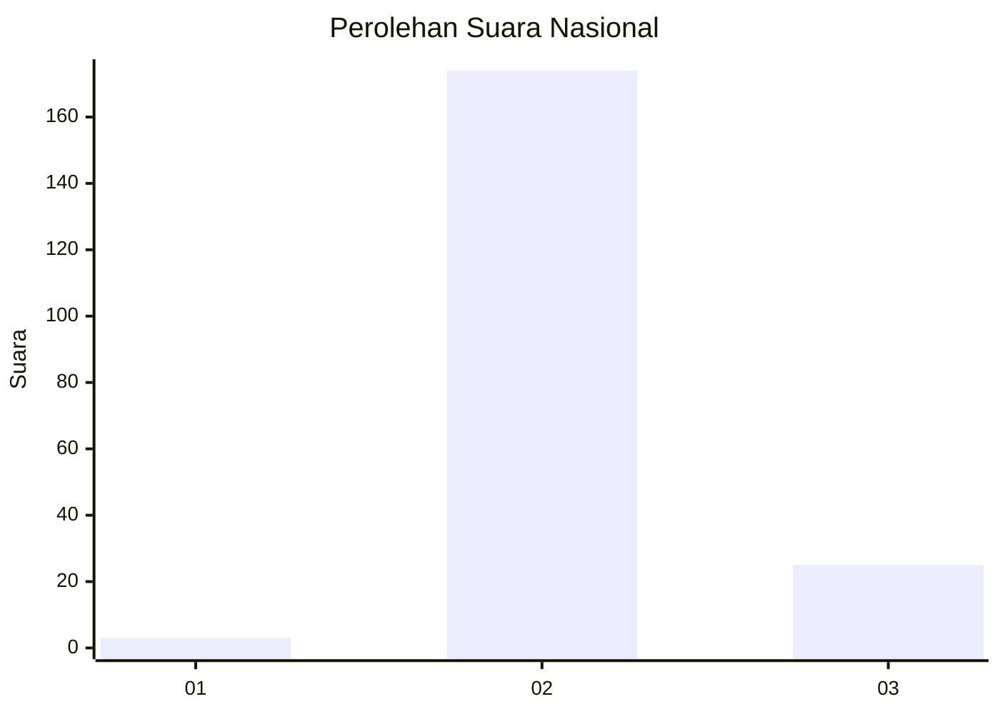
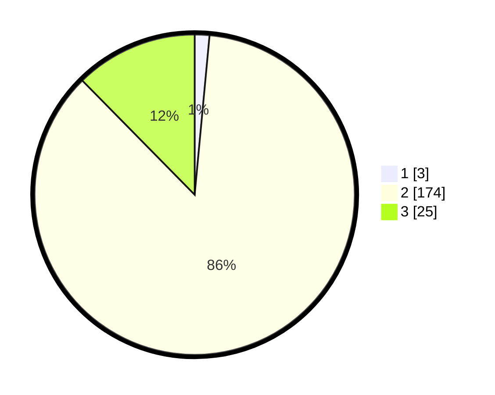

# Hasil

## Grafik

## Tabel

| No. | Nama Paslon    | Suara | Suara (raw) | Persentase |
|:--- |:-------------- | -----:| -----------:| ----------:|
| 1   | ANIES MUHAIMIN | 3     | [3][p-1]    | 1,49       |
| 2   | PRABOWO GIBRAN | 174   | [174][p-2]  | 86,14      |
| 3   | GANJAR MAHFUD  | 25    | [25][p-3]   | 12,38      |

[p-1]: https://github.com/gigit-pemilu/pemilu-2024/blob/main/pilpres/hitung-suara/sub/11-aceh/sub/10-aceh-singkil/sub/02-simpang-kanan/sub/2015-tuhtuhan/sub/001-tps/sub/paslon-1.txt
[p-2]: https://github.com/gigit-pemilu/pemilu-2024/blob/main/pilpres/hitung-suara/sub/11-aceh/sub/10-aceh-singkil/sub/02-simpang-kanan/sub/2015-tuhtuhan/sub/001-tps/sub/paslon-2.txt
[p-3]: https://github.com/gigit-pemilu/pemilu-2024/blob/main/pilpres/hitung-suara/sub/11-aceh/sub/10-aceh-singkil/sub/02-simpang-kanan/sub/2015-tuhtuhan/sub/001-tps/sub/paslon-3.txt

## Foto C Plano

https://sirekap-obj-formc.kpu.go.id/ba89/pemilu/ppwp/11/10/02/20/15/1110022015001-20240214-155709--d5b360cf-0d06-4067-a6d7-5f00544f9c97.jpg

https://sirekap-obj-formc.kpu.go.id/ba89/pemilu/ppwp/11/10/02/20/15/1110022015001-20240215-195222--03ba1232-9491-46dd-ab9d-779877141e35.jpg

https://sirekap-obj-formc.kpu.go.id/ba89/pemilu/ppwp/11/10/02/20/15/1110022015001-20240214-160145--3695ef29-5342-46fa-bf8d-d4847458f5f3.jpg

## Metadata

| Key        | Value               |
| ---------- | ------------------- |
| Time Stamp | 2024-02-16 12:51:22 |

