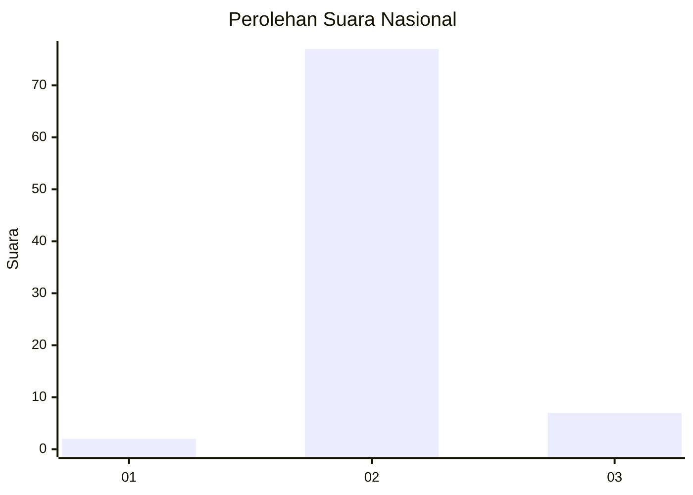
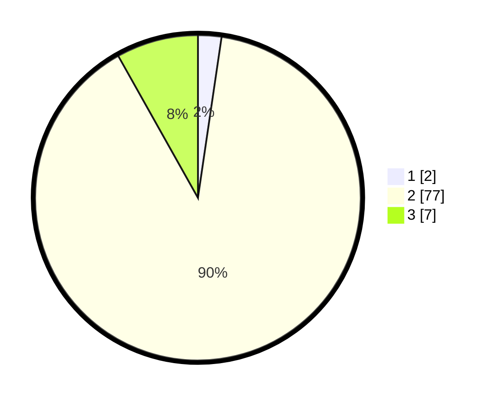

# Hasil

## Grafik

## Tabel

| No. | Nama Paslon    | Suara | Suara (raw) | Persentase |
|:--- |:-------------- | -----:| -----------:| ----------:|
| 1   | ANIES MUHAIMIN | 2     | [2][p-1]    | 2,33       |
| 2   | PRABOWO GIBRAN | 77    | [77][p-2]   | 89,53      |
| 3   | GANJAR MAHFUD  | 7     | [7][p-3]    | 8,14       |

[p-1]: https://github.com/gigit-pemilu/pemilu-2024/blob/main/pilpres/hitung-suara/sub/11-aceh/sub/10-aceh-singkil/sub/02-simpang-kanan/sub/2017-guha/sub/001-tps/sub/paslon-1.txt
[p-2]: https://github.com/gigit-pemilu/pemilu-2024/blob/main/pilpres/hitung-suara/sub/11-aceh/sub/10-aceh-singkil/sub/02-simpang-kanan/sub/2017-guha/sub/001-tps/sub/paslon-2.txt
[p-3]: https://github.com/gigit-pemilu/pemilu-2024/blob/main/pilpres/hitung-suara/sub/11-aceh/sub/10-aceh-singkil/sub/02-simpang-kanan/sub/2017-guha/sub/001-tps/sub/paslon-3.txt

## Foto C Plano

https://sirekap-obj-formc.kpu.go.id/ef01/pemilu/ppwp/11/10/02/20/17/1110022017001-20240224-162913--604949d7-af11-4d4d-92af-03bc868f24d5.jpg

https://sirekap-obj-formc.kpu.go.id/ef01/pemilu/ppwp/11/10/02/20/17/1110022017001-20240224-234640--94d50b6f-040f-4bec-bc73-029853a4277a.jpg

https://sirekap-obj-formc.kpu.go.id/ef01/pemilu/ppwp/11/10/02/20/17/1110022017001-20240224-234639--e15884bc-be3b-4f45-a45d-ac1ae2550bfe.jpg

## Metadata

| Key        | Value               |
| ---------- | ------------------- |
| Time Stamp | 2024-02-25 20:00:00 |

## DATA PEMILIH TETAP

Jumlah pemilih dalam DPT: **707**.
 * L: **53**.
 * P: **54**.

## DATA PENGGUNA HAK PILIH

Jumlah pengguna hak pilih dalam DPT: **84**.
 * L: **43**.
 * P: **41**.

Jumlah pengguna hak pilih dalam DPTb: **3**.
 * L: **2**.
 * P: **1**.

Jumlah pengguna hak pilih dalam DPK: **7**.
 * L: **0**.
 * P: **7**.

Jumlah pengguna hak pilih: **88**.
 * L: **45**.
 * P: **43**.

## JUMLAH SUARA SAH DAN TIDAK SAH

JUMLAH SELURUH SUARA SAH: **86**.

JUMLAH SUARA TIDAK SAH: **2**.

JUMLAH SELURUH SUARA SAH DAN SUARA TIDAK SAH: **88**.

