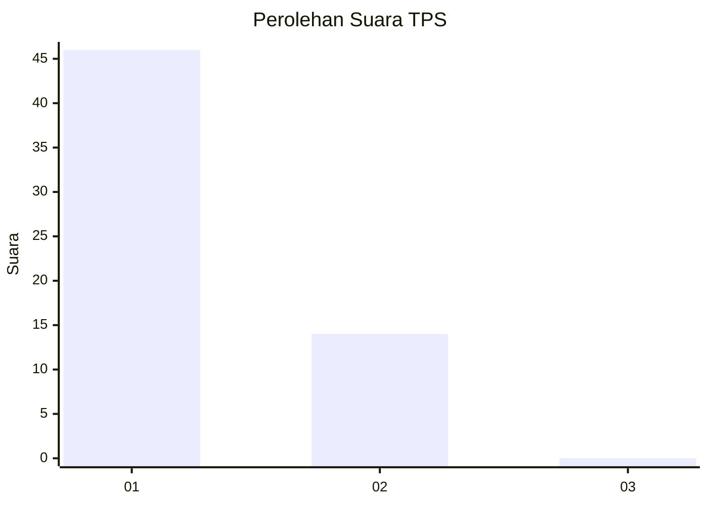
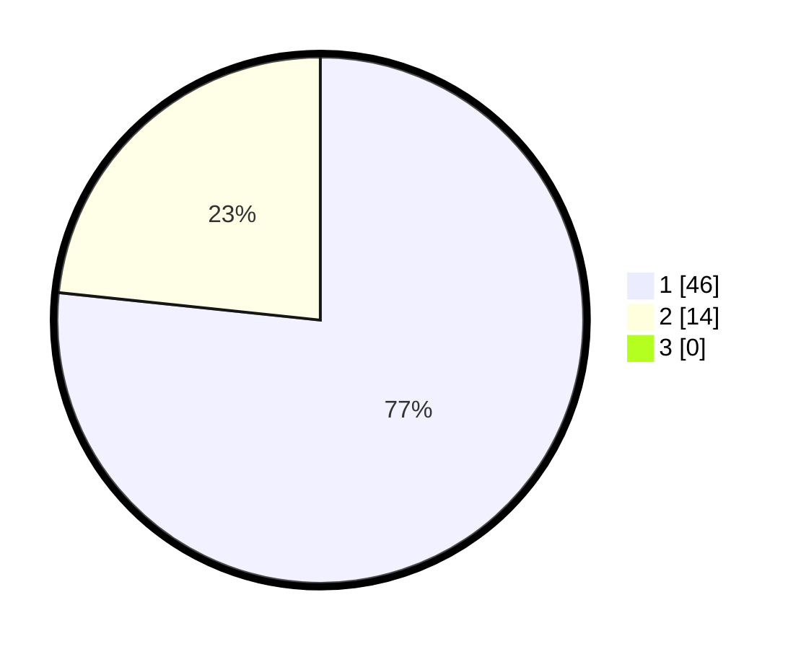

# Hasil

## Grafik

## Tabel

| No. | Nama Paslon    | Suara | Suara (raw) | Persentase |
|:--- |:-------------- | -----:| -----------:| ----------:|
| 1   | ANIES MUHAIMIN | 46    | [46][p-1]   | 76,67      |
| 2   | PRABOWO GIBRAN | 14    | [14][p-2]   | 23,33      |
| 3   | GANJAR MAHFUD  | 0     | [0][p-3]    | 0,00       |

[p-1]: https://github.com/gigit-pemilu/pemilu-2024-11-aceh/blob/main/pilpres/hitung-suara/sub/11-aceh/sub/10-aceh-singkil/sub/02-simpang-kanan/sub/2020-serasah/sub/001-tps/sub/paslon-1.txt
[p-2]: https://github.com/gigit-pemilu/pemilu-2024-11-aceh/blob/main/pilpres/hitung-suara/sub/11-aceh/sub/10-aceh-singkil/sub/02-simpang-kanan/sub/2020-serasah/sub/001-tps/sub/paslon-2.txt
[p-3]: https://github.com/gigit-pemilu/pemilu-2024-11-aceh/blob/main/pilpres/hitung-suara/sub/11-aceh/sub/10-aceh-singkil/sub/02-simpang-kanan/sub/2020-serasah/sub/001-tps/sub/paslon-3.txt

## Foto C Plano

https://sirekap-obj-formc.kpu.go.id/201a/pemilu/ppwp/11/10/02/20/20/1110022020001-20240218-223843--b542f0df-626b-4fb6-8fe3-ed7c4958c10b.jpg

https://sirekap-obj-formc.kpu.go.id/201a/pemilu/ppwp/11/10/02/20/20/1110022020001-20240218-225700--c5820f34-76ab-4388-ba26-c99d036f08e5.jpg

https://sirekap-obj-formc.kpu.go.id/201a/pemilu/ppwp/11/10/02/20/20/1110022020001-20240218-230047--7c47aa12-59a5-4230-a5db-c588ab1c8570.jpg

## Metadata

| Key        | Value               |
| ---------- | ------------------- |
| Time Stamp | 2024-02-19 06:16:00 |

## DATA PEMILIH TETAP

Jumlah pemilih dalam DPT: **64**.
 * L: **34**.
 * P: **30**.

## DATA PENGGUNA HAK PILIH

Jumlah pengguna hak pilih dalam DPT: **60**.
 * L: **32**.
 * P: **28**.

Jumlah pengguna hak pilih dalam DPTb: **2**.
 * L: **1**.
 * P: **1**.

Jumlah pengguna hak pilih dalam DPK: **0**.
 * L: **0**.
 * P: **0**.

Jumlah pengguna hak pilih: **62**.
 * L: **33**.
 * P: **29**.

## JUMLAH SUARA SAH DAN TIDAK SAH

JUMLAH SELURUH SUARA SAH: **60**.

JUMLAH SUARA TIDAK SAH: **2**.

JUMLAH SELURUH SUARA SAH DAN SUARA TIDAK SAH: **62**.

