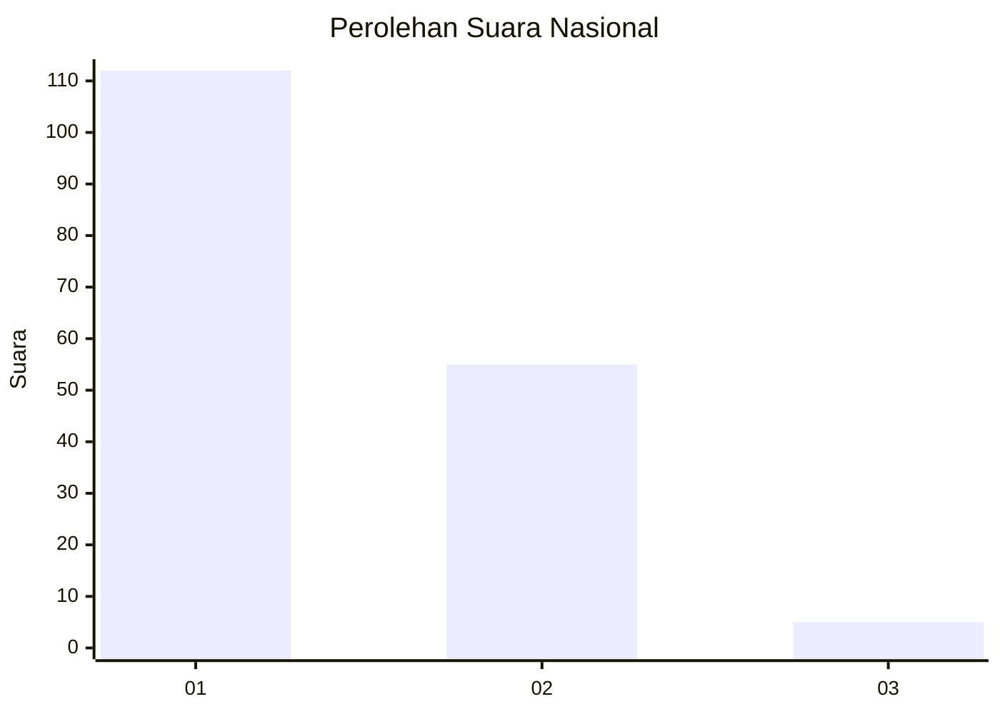
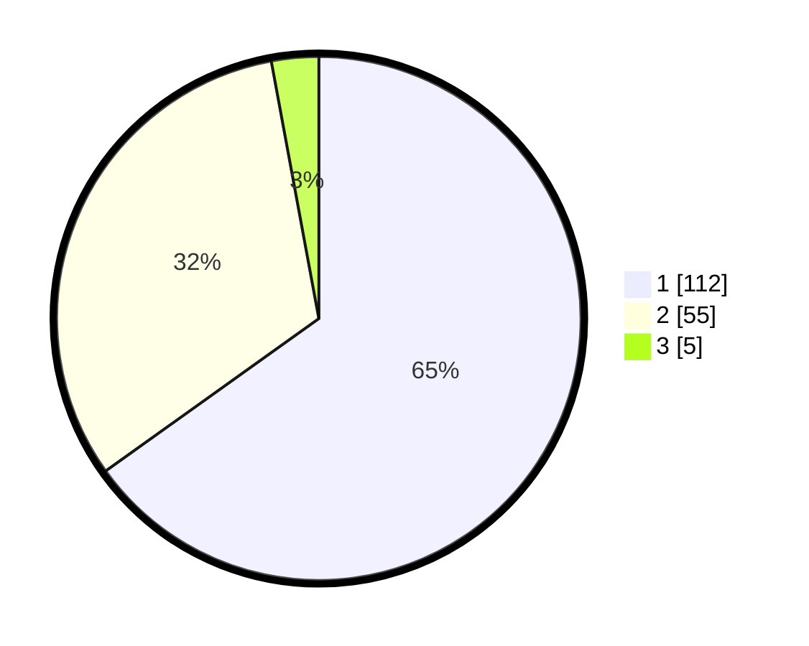

# Hasil

## Grafik

## Tabel

| No. | Nama Paslon    | Suara | Suara (raw) | Persentase |
|:--- |:-------------- | -----:| -----------:| ----------:|
| 1   | ANIES MUHAIMIN | 112   | [112][p-1]  | 65,12      |
| 2   | PRABOWO GIBRAN | 55    | [55][p-2]   | 31,98      |
| 3   | GANJAR MAHFUD  | 5     | [5][p-3]    | 2,91       |

[p-1]: https://github.com/gigit-pemilu/pemilu-2024/blob/main/pilpres/hitung-suara/sub/11-aceh/sub/10-aceh-singkil/sub/04-singkil/sub/2001-pasar/sub/003-tps/sub/paslon-1.txt
[p-2]: https://github.com/gigit-pemilu/pemilu-2024/blob/main/pilpres/hitung-suara/sub/11-aceh/sub/10-aceh-singkil/sub/04-singkil/sub/2001-pasar/sub/003-tps/sub/paslon-2.txt
[p-3]: https://github.com/gigit-pemilu/pemilu-2024/blob/main/pilpres/hitung-suara/sub/11-aceh/sub/10-aceh-singkil/sub/04-singkil/sub/2001-pasar/sub/003-tps/sub/paslon-3.txt

## Foto C Plano

https://sirekap-obj-formc.kpu.go.id/ee6f/pemilu/ppwp/11/10/04/20/01/1110042001003-20240223-000130--63aa1213-cf22-4ad2-9909-bfa95ebaaac5.jpg

https://sirekap-obj-formc.kpu.go.id/ee6f/pemilu/ppwp/11/10/04/20/01/1110042001003-20240223-022035--8fab73d1-51d6-40bd-9ee6-9e8594c62ebf.jpg

https://sirekap-obj-formc.kpu.go.id/ee6f/pemilu/ppwp/11/10/04/20/01/1110042001003-20240217-151938--6db2d101-7b5d-45db-abc2-d18d67d58674.jpg

## Metadata

| Key        | Value               |
| ---------- | ------------------- |
| Time Stamp | 2024-02-25 09:00:00 |

## DATA PEMILIH TETAP

Jumlah pemilih dalam DPT: **199**.
 * L: **100**.
 * P: **99**.

## DATA PENGGUNA HAK PILIH

Jumlah pengguna hak pilih dalam DPT: **169**.
 * L: **87**.
 * P: **82**.

Jumlah pengguna hak pilih dalam DPTb: **2**.
 * L: **1**.
 * P: **1**.

Jumlah pengguna hak pilih dalam DPK: **1**.
 * L: **0**.
 * P: **1**.

Jumlah pengguna hak pilih: **172**.
 * L: **88**.
 * P: **84**.

## JUMLAH SUARA SAH DAN TIDAK SAH

JUMLAH SELURUH SUARA SAH: **172**.

JUMLAH SUARA TIDAK SAH: **0**.

JUMLAH SELURUH SUARA SAH DAN SUARA TIDAK SAH: **172**.

