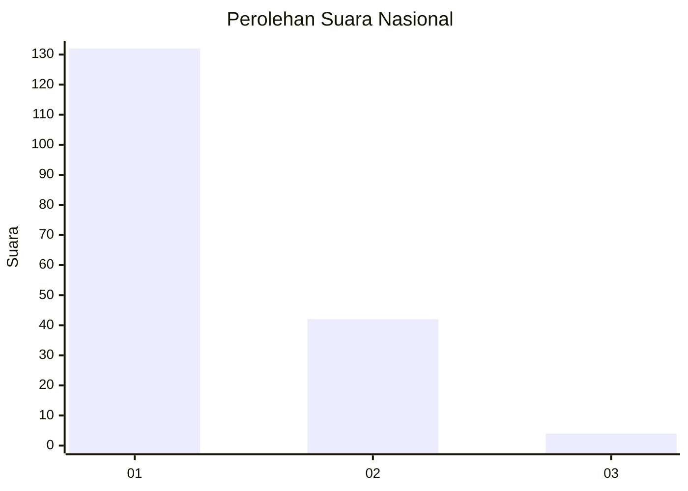
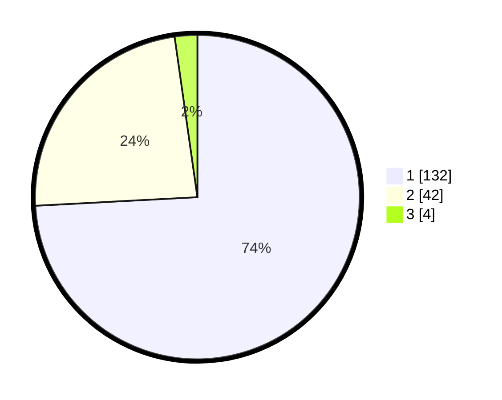

# Hasil

## Grafik

## Tabel

| No. | Nama Paslon    | Suara | Suara (raw) | Persentase |
|:--- |:-------------- | -----:| -----------:| ----------:|
| 1   | ANIES MUHAIMIN | 132   | [132][p-1]  | 74,16      |
| 2   | PRABOWO GIBRAN | 42    | [42][p-2]   | 23,60      |
| 3   | GANJAR MAHFUD  | 4     | [4][p-3]    | 2,25       |

[p-1]: https://github.com/gigit-pemilu/pemilu-2024/blob/main/pilpres/hitung-suara/sub/11-aceh/sub/10-aceh-singkil/sub/04-singkil/sub/2001-pasar/sub/004-tps/sub/paslon-1.txt
[p-2]: https://github.com/gigit-pemilu/pemilu-2024/blob/main/pilpres/hitung-suara/sub/11-aceh/sub/10-aceh-singkil/sub/04-singkil/sub/2001-pasar/sub/004-tps/sub/paslon-2.txt
[p-3]: https://github.com/gigit-pemilu/pemilu-2024/blob/main/pilpres/hitung-suara/sub/11-aceh/sub/10-aceh-singkil/sub/04-singkil/sub/2001-pasar/sub/004-tps/sub/paslon-3.txt

## Foto C Plano

https://sirekap-obj-formc.kpu.go.id/9ce1/pemilu/ppwp/11/10/04/20/01/1110042001004-20240217-160248--58b1d15a-af69-4842-8464-cb6d99a948c8.jpg

https://sirekap-obj-formc.kpu.go.id/9ce1/pemilu/ppwp/11/10/04/20/01/1110042001004-20240217-160311--7a4e18f5-d8ea-45c7-b6ca-761f43f01c36.jpg

https://sirekap-obj-formc.kpu.go.id/9ce1/pemilu/ppwp/11/10/04/20/01/1110042001004-20240217-160350--bf1e8475-6e18-4c15-9cef-4d35eb9ae969.jpg

## Metadata

| Key        | Value               |
| ---------- | ------------------- |
| Time Stamp | 2024-02-24 22:31:28 |

## DATA PEMILIH TETAP

Jumlah pemilih dalam DPT: **209**.
 * L: **97**.
 * P: **112**.

## DATA PENGGUNA HAK PILIH

Jumlah pengguna hak pilih dalam DPT: **179**.
 * L: **83**.
 * P: **96**.

Jumlah pengguna hak pilih dalam DPTb: **0**.
 * L: **0**.
 * P: **0**.

Jumlah pengguna hak pilih dalam DPK: **3**.
 * L: **1**.
 * P: **2**.

Jumlah pengguna hak pilih: **182**.
 * L: **84**.
 * P: **98**.

## JUMLAH SUARA SAH DAN TIDAK SAH

JUMLAH SELURUH SUARA SAH: **178**.

JUMLAH SUARA TIDAK SAH: **4**.

JUMLAH SELURUH SUARA SAH DAN SUARA TIDAK SAH: **182**.

