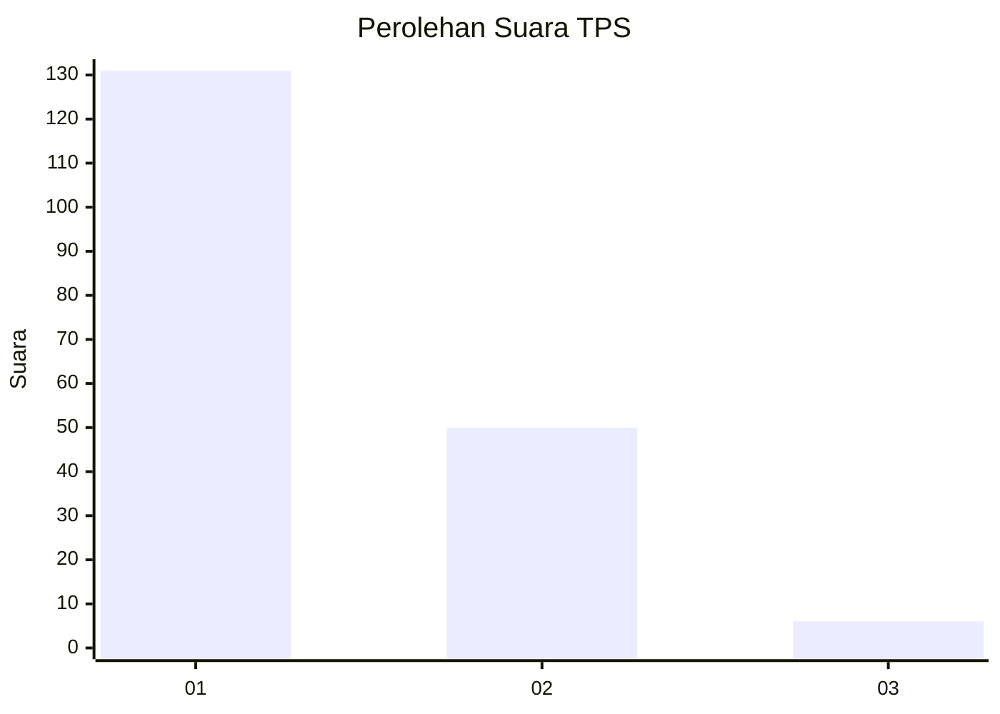
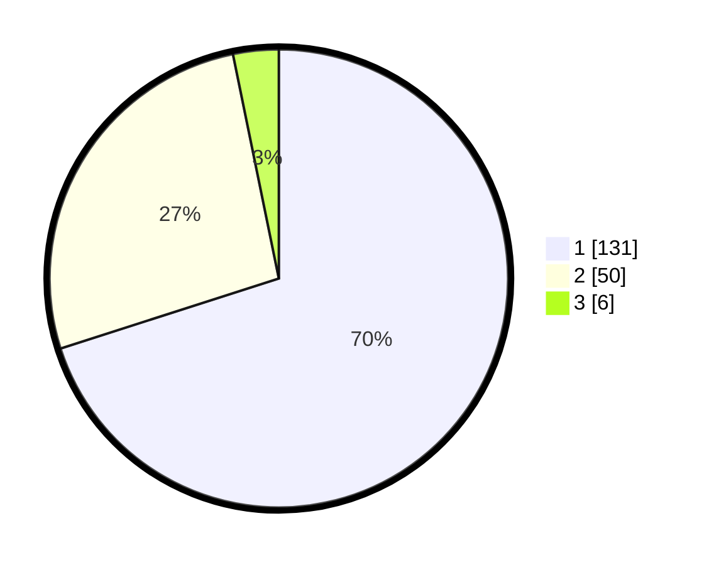

# Hasil

## Grafik

## Tabel

| No. | Nama Paslon    | Suara | Suara (raw) | Persentase |
|:--- |:-------------- | -----:| -----------:| ----------:|
| 1   | ANIES MUHAIMIN | 131   | [131][p-1]  | 70,05      |
| 2   | PRABOWO GIBRAN | 50    | [50][p-2]   | 26,74      |
| 3   | GANJAR MAHFUD  | 6     | [6][p-3]    | 3,21       |

[p-1]: https://github.com/gigit-pemilu/pemilu-2024-11-aceh/blob/main/pilpres/hitung-suara/sub/11-aceh/sub/10-aceh-singkil/sub/04-singkil/sub/2001-pasar/sub/005-tps/sub/paslon-1.txt
[p-2]: https://github.com/gigit-pemilu/pemilu-2024-11-aceh/blob/main/pilpres/hitung-suara/sub/11-aceh/sub/10-aceh-singkil/sub/04-singkil/sub/2001-pasar/sub/005-tps/sub/paslon-2.txt
[p-3]: https://github.com/gigit-pemilu/pemilu-2024-11-aceh/blob/main/pilpres/hitung-suara/sub/11-aceh/sub/10-aceh-singkil/sub/04-singkil/sub/2001-pasar/sub/005-tps/sub/paslon-3.txt

## Foto C Plano

https://sirekap-obj-formc.kpu.go.id/4230/pemilu/ppwp/11/10/04/20/01/1110042001005-20240221-122208--67cd27d9-3a53-4385-9235-efbd029e4659.jpg

https://sirekap-obj-formc.kpu.go.id/4230/pemilu/ppwp/11/10/04/20/01/1110042001005-20240217-151816--25a516c6-7d12-48eb-9b52-eb0c90170a48.jpg

https://sirekap-obj-formc.kpu.go.id/4230/pemilu/ppwp/11/10/04/20/01/1110042001005-20240217-151945--9971d3a0-ba8d-4064-809a-a95d4987016d.jpg

## Metadata

| Key        | Value               |
| ---------- | ------------------- |
| Time Stamp | 2024-02-21 13:00:00 |

