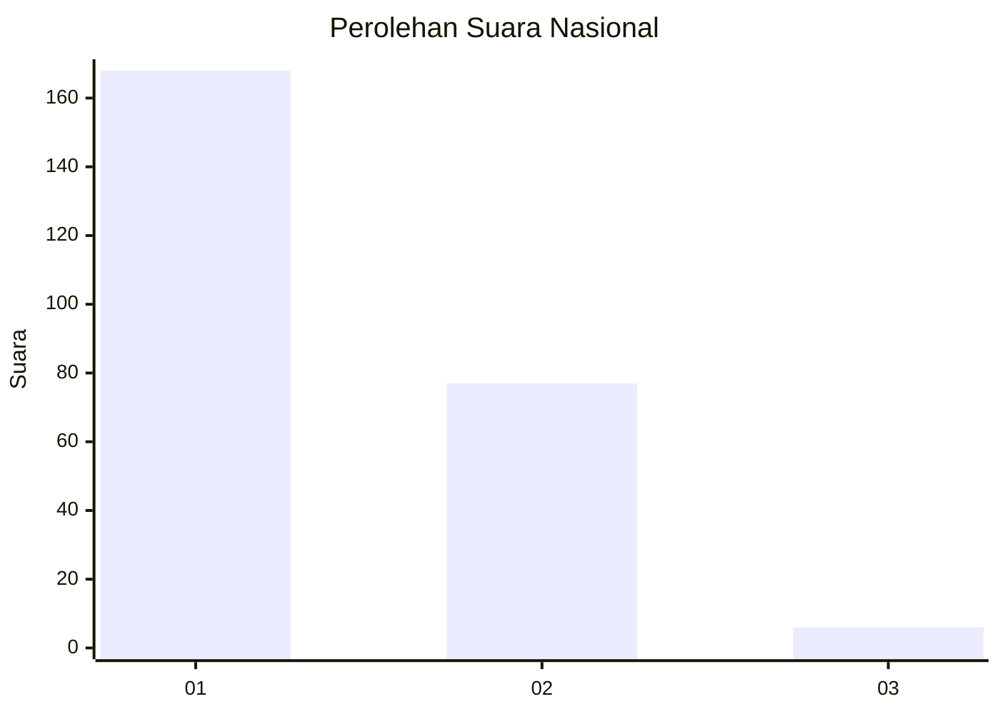
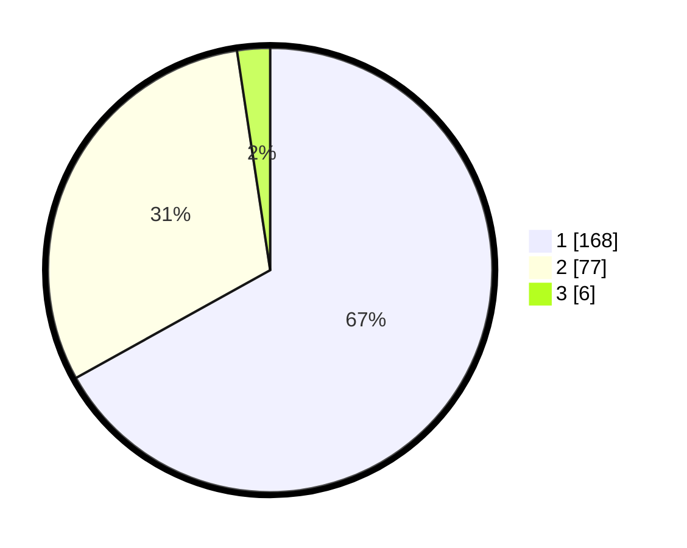

# Hasil

## Grafik

## Tabel

| No. | Nama Paslon    | Suara | Suara (raw) | Persentase |
|:--- |:-------------- | -----:| -----------:| ----------:|
| 1   | ANIES MUHAIMIN | 168   | [168][p-1]  | 66,93      |
| 2   | PRABOWO GIBRAN | 77    | [77][p-2]   | 30,68      |
| 3   | GANJAR MAHFUD  | 6     | [6][p-3]    | 2,39       |

[p-1]: https://github.com/gigit-pemilu/pemilu-2024/blob/main/pilpres/hitung-suara/sub/11-aceh/sub/10-aceh-singkil/sub/04-singkil/sub/2003-pulo-sarok/sub/002-tps/sub/paslon-1.txt
[p-2]: https://github.com/gigit-pemilu/pemilu-2024/blob/main/pilpres/hitung-suara/sub/11-aceh/sub/10-aceh-singkil/sub/04-singkil/sub/2003-pulo-sarok/sub/002-tps/sub/paslon-2.txt
[p-3]: https://github.com/gigit-pemilu/pemilu-2024/blob/main/pilpres/hitung-suara/sub/11-aceh/sub/10-aceh-singkil/sub/04-singkil/sub/2003-pulo-sarok/sub/002-tps/sub/paslon-3.txt

## Foto C Plano

https://sirekap-obj-formc.kpu.go.id/6444/pemilu/ppwp/11/10/04/20/03/1110042003002-20240217-103837--9b4089ba-7221-4c3a-9c10-e2547532f1c3.jpg

https://sirekap-obj-formc.kpu.go.id/6444/pemilu/ppwp/11/10/04/20/03/1110042003002-20240217-133156--3ab86287-4b3c-4b63-8e62-8ca5e0e18bf4.jpg

## Metadata

| Key        | Value               |
| ---------- | ------------------- |
| Time Stamp | 2024-02-24 22:31:28 |

