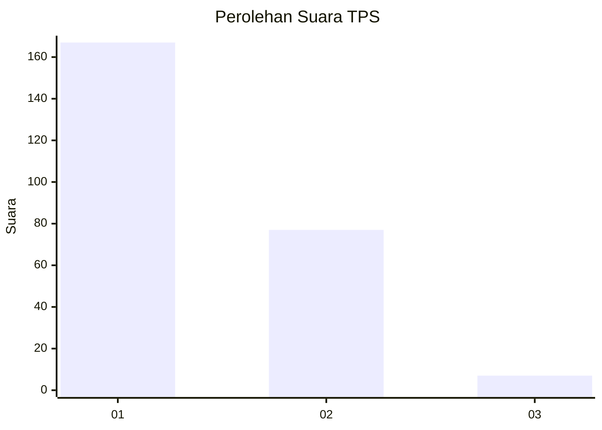
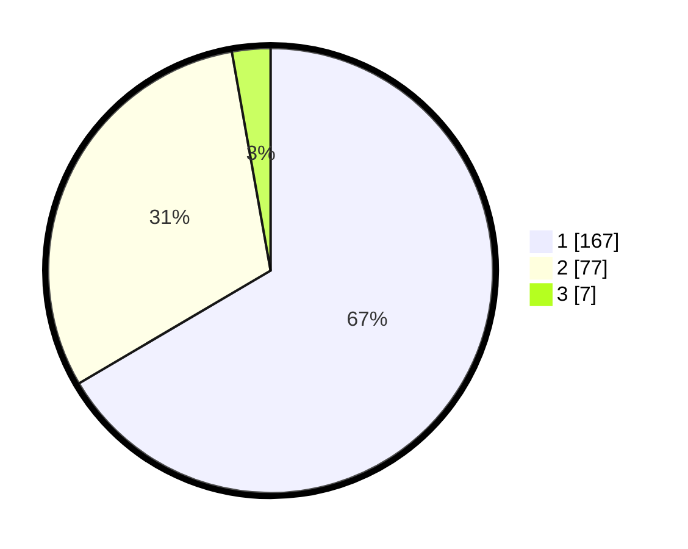

# Hasil

## Grafik

## Tabel

| No. | Nama Paslon    | Suara | Suara (raw) | Persentase |
|:--- |:-------------- | -----:| -----------:| ----------:|
| 1   | ANIES MUHAIMIN | 167   | [167][p-1]  | 66,53      |
| 2   | PRABOWO GIBRAN | 77    | [77][p-2]   | 30,68      |
| 3   | GANJAR MAHFUD  | 7     | [7][p-3]    | 2,79       |

[p-1]: https://github.com/gigit-pemilu/pemilu-2024-11-aceh/blob/main/pilpres/hitung-suara/sub/11-aceh/sub/10-aceh-singkil/sub/04-singkil/sub/2003-pulo-sarok/sub/011-tps/sub/paslon-1.txt
[p-2]: https://github.com/gigit-pemilu/pemilu-2024-11-aceh/blob/main/pilpres/hitung-suara/sub/11-aceh/sub/10-aceh-singkil/sub/04-singkil/sub/2003-pulo-sarok/sub/011-tps/sub/paslon-2.txt
[p-3]: https://github.com/gigit-pemilu/pemilu-2024-11-aceh/blob/main/pilpres/hitung-suara/sub/11-aceh/sub/10-aceh-singkil/sub/04-singkil/sub/2003-pulo-sarok/sub/011-tps/sub/paslon-3.txt

## Foto C Plano

https://sirekap-obj-formc.kpu.go.id/8a17/pemilu/ppwp/11/10/04/20/03/1110042003011-20240214-185626--b99d396e-8cac-4b66-abd3-752628cadd8f.jpg

https://sirekap-obj-formc.kpu.go.id/8a17/pemilu/ppwp/11/10/04/20/03/1110042003011-20240214-184909--97dd85b7-ad2a-4d29-92b2-ac3c905a13a9.jpg

https://sirekap-obj-formc.kpu.go.id/8a17/pemilu/ppwp/11/10/04/20/03/1110042003011-20240214-185227--c8c5a9bb-4dd2-4873-b2a6-9b2c23246afd.jpg

## Metadata

| Key        | Value               |
| ---------- | ------------------- |
| Time Stamp | 2024-02-15 16:30:25 |

