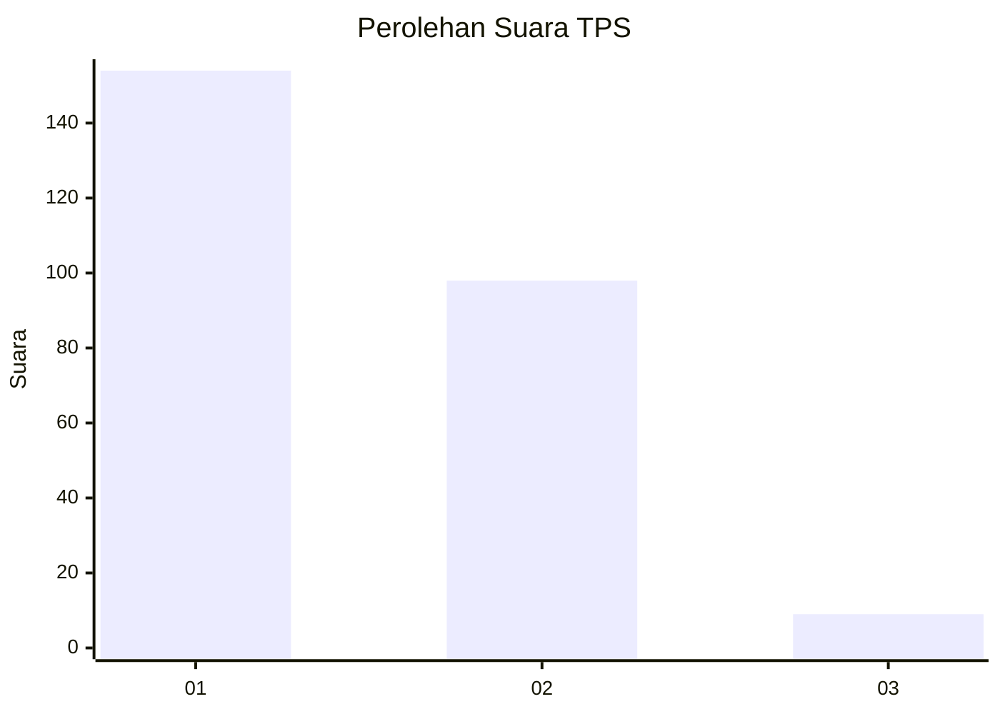
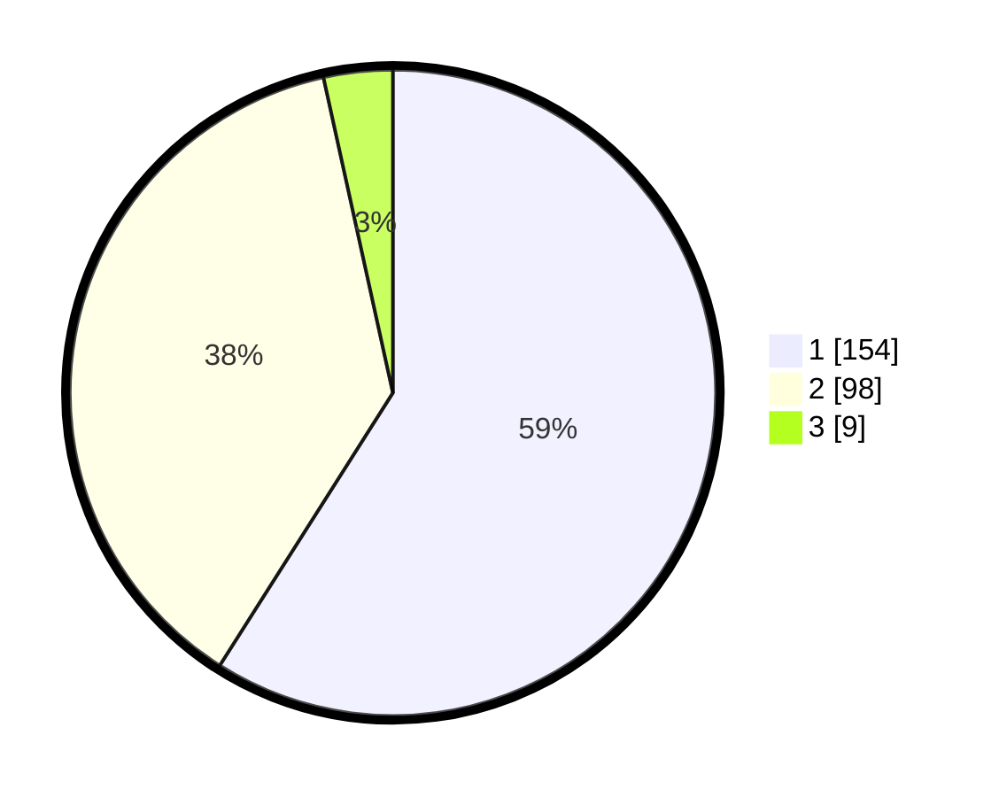

# Hasil

## Grafik

## Tabel

| No. | Nama Paslon    | Suara | Suara (raw) | Persentase |
|:--- |:-------------- | -----:| -----------:| ----------:|
| 1   | ANIES MUHAIMIN | 154   | [154][p-1]  | 59,00      |
| 2   | PRABOWO GIBRAN | 98    | [98][p-2]   | 37,55      |
| 3   | GANJAR MAHFUD  | 9     | [9][p-3]    | 3,45       |

[p-1]: https://github.com/gigit-pemilu/pemilu-2024-11-aceh/blob/main/pilpres/hitung-suara/sub/11-aceh/sub/10-aceh-singkil/sub/04-singkil/sub/2003-pulo-sarok/sub/012-tps/sub/paslon-1.txt
[p-2]: https://github.com/gigit-pemilu/pemilu-2024-11-aceh/blob/main/pilpres/hitung-suara/sub/11-aceh/sub/10-aceh-singkil/sub/04-singkil/sub/2003-pulo-sarok/sub/012-tps/sub/paslon-2.txt
[p-3]: https://github.com/gigit-pemilu/pemilu-2024-11-aceh/blob/main/pilpres/hitung-suara/sub/11-aceh/sub/10-aceh-singkil/sub/04-singkil/sub/2003-pulo-sarok/sub/012-tps/sub/paslon-3.txt

## Foto C Plano

https://sirekap-obj-formc.kpu.go.id/3a15/pemilu/ppwp/11/10/04/20/03/1110042003012-20240215-085658--4fb371ad-07ee-4832-8dcf-b5149124d8c8.jpg

https://sirekap-obj-formc.kpu.go.id/3a15/pemilu/ppwp/11/10/04/20/03/1110042003012-20240215-090117--59f114d8-48ec-4b81-9eaa-d9a6932df58d.jpg

https://sirekap-obj-formc.kpu.go.id/3a15/pemilu/ppwp/11/10/04/20/03/1110042003012-20240215-090253--49773b83-a8af-491d-baaf-03b0c0ef5151.jpg

## Metadata

| Key        | Value               |
| ---------- | ------------------- |
| Time Stamp | 2024-02-16 16:25:10 |

