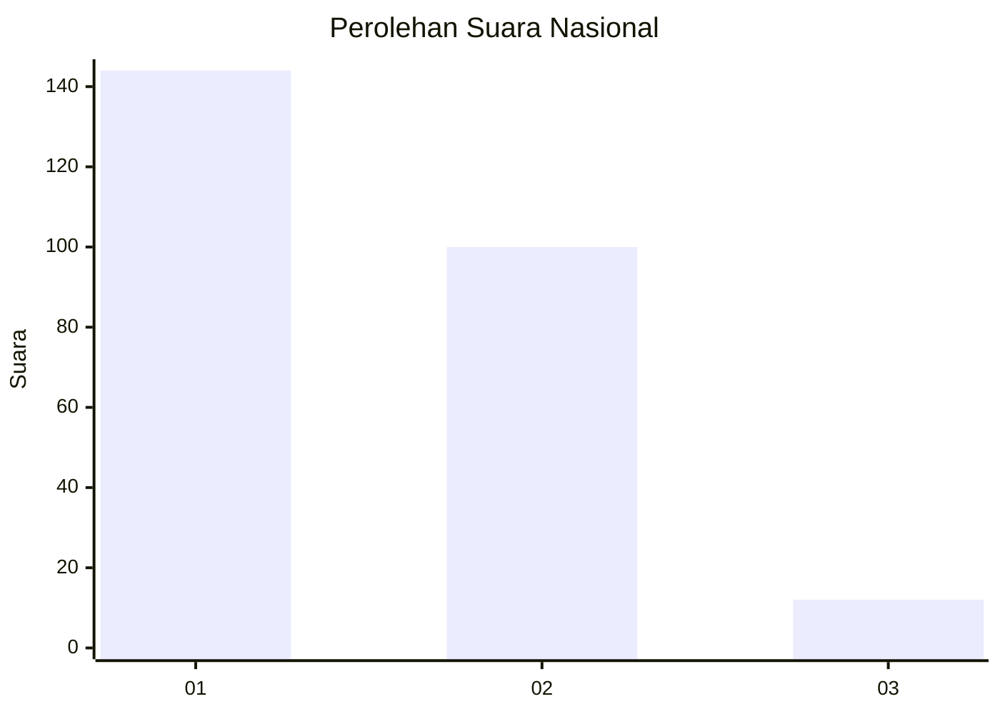
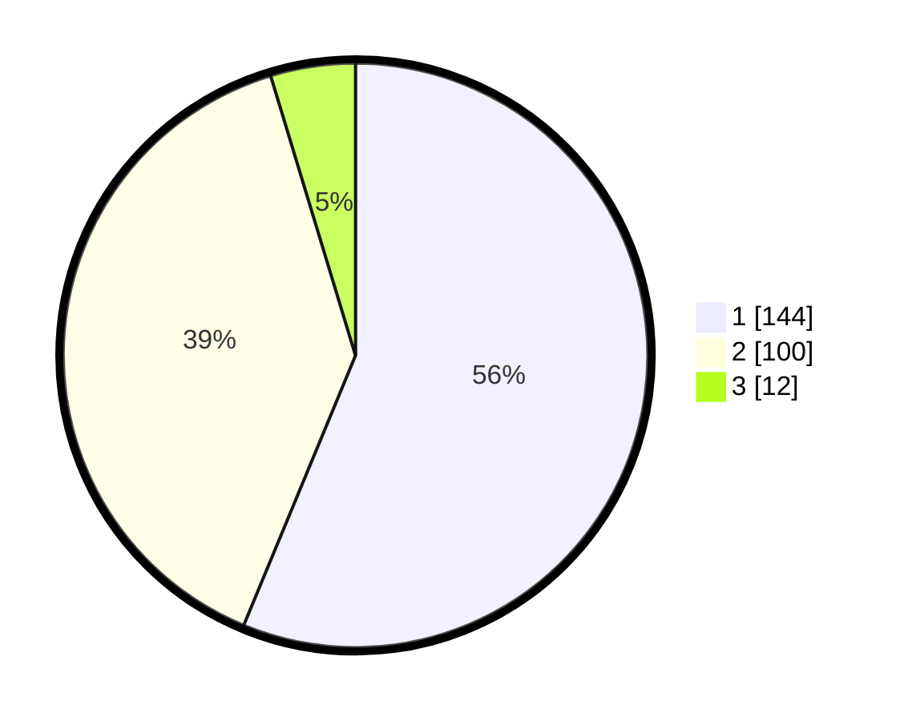

# Hasil

## Grafik

## Tabel

| No. | Nama Paslon    | Suara | Suara (raw) | Persentase |
|:--- |:-------------- | -----:| -----------:| ----------:|
| 1   | ANIES MUHAIMIN | 144   | [144][p-1]  | 56,25      |
| 2   | PRABOWO GIBRAN | 100   | [100][p-2]  | 39,06      |
| 3   | GANJAR MAHFUD  | 12    | [12][p-3]   | 4,69       |

[p-1]: https://github.com/gigit-pemilu/pemilu-2024/blob/main/pilpres/hitung-suara/sub/11-aceh/sub/10-aceh-singkil/sub/04-singkil/sub/2004-kilangan/sub/002-tps/sub/paslon-1.txt
[p-2]: https://github.com/gigit-pemilu/pemilu-2024/blob/main/pilpres/hitung-suara/sub/11-aceh/sub/10-aceh-singkil/sub/04-singkil/sub/2004-kilangan/sub/002-tps/sub/paslon-2.txt
[p-3]: https://github.com/gigit-pemilu/pemilu-2024/blob/main/pilpres/hitung-suara/sub/11-aceh/sub/10-aceh-singkil/sub/04-singkil/sub/2004-kilangan/sub/002-tps/sub/paslon-3.txt

## Foto C Plano

https://sirekap-obj-formc.kpu.go.id/fd01/pemilu/ppwp/11/10/04/20/04/1110042004002-20240216-215027--d20dc3a5-dcae-4734-9229-3a6bed017506.jpg

https://sirekap-obj-formc.kpu.go.id/fd01/pemilu/ppwp/11/10/04/20/04/1110042004002-20240217-183400--40dd4feb-0826-43bf-84e2-315f1be8d698.jpg

https://sirekap-obj-formc.kpu.go.id/fd01/pemilu/ppwp/11/10/04/20/04/1110042004002-20240214-191509--f6f4ba47-f08f-416f-91a0-bfbf25f32f15.jpg

## Metadata

| Key        | Value               |
| ---------- | ------------------- |
| Time Stamp | 2024-02-24 22:31:28 |

