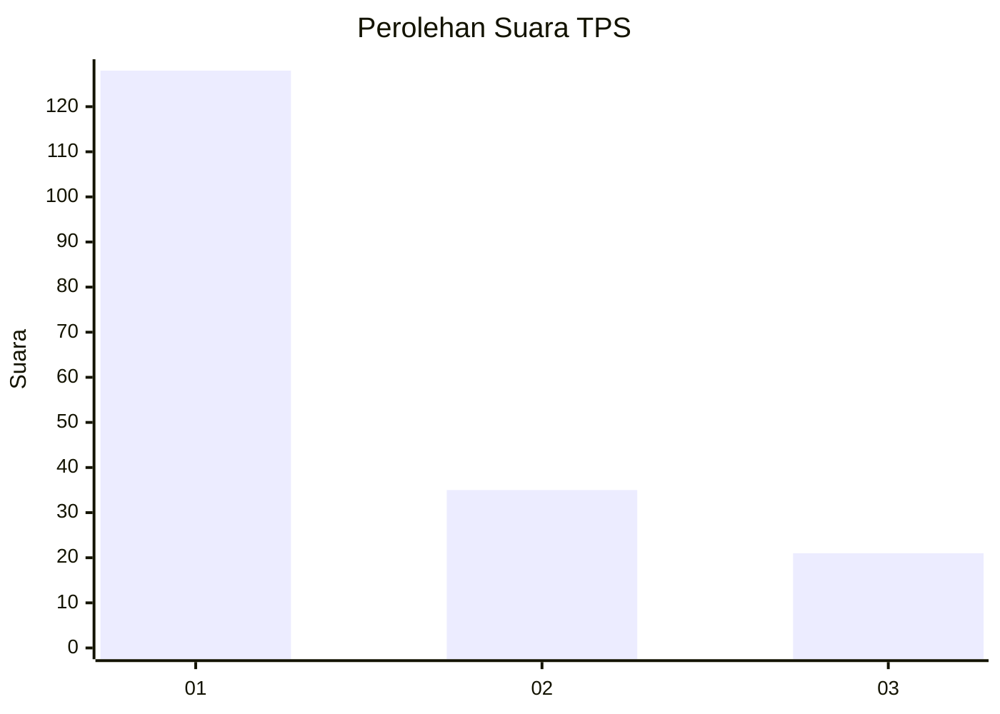
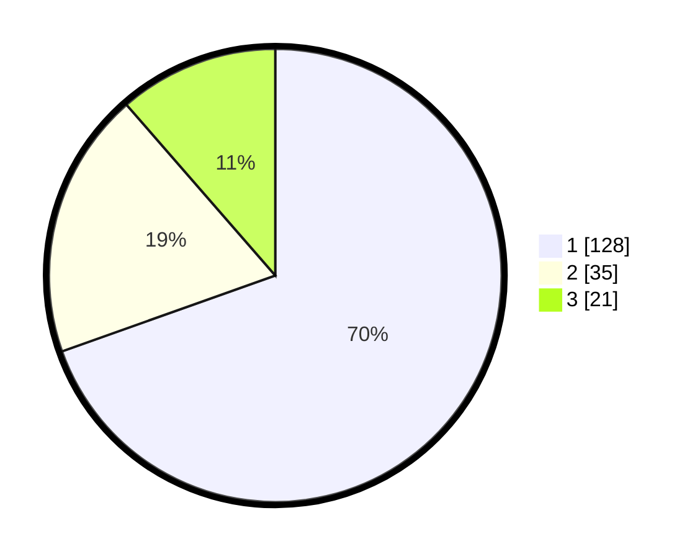

# Hasil

## Grafik

## Tabel

| No. | Nama Paslon    | Suara | Suara (raw) | Persentase |
|:--- |:-------------- | -----:| -----------:| ----------:|
| 1   | ANIES MUHAIMIN | 128   | [128][p-1]  | 69,57      |
| 2   | PRABOWO GIBRAN | 35    | [35][p-2]   | 19,02      |
| 3   | GANJAR MAHFUD  | 21    | [21][p-3]   | 11,41      |

[p-1]: https://github.com/gigit-pemilu/pemilu-2024-11-aceh/blob/main/pilpres/hitung-suara/sub/11-aceh/sub/10-aceh-singkil/sub/04-singkil/sub/2008-rantau-gedang/sub/002-tps/sub/paslon-1.txt
[p-2]: https://github.com/gigit-pemilu/pemilu-2024-11-aceh/blob/main/pilpres/hitung-suara/sub/11-aceh/sub/10-aceh-singkil/sub/04-singkil/sub/2008-rantau-gedang/sub/002-tps/sub/paslon-2.txt
[p-3]: https://github.com/gigit-pemilu/pemilu-2024-11-aceh/blob/main/pilpres/hitung-suara/sub/11-aceh/sub/10-aceh-singkil/sub/04-singkil/sub/2008-rantau-gedang/sub/002-tps/sub/paslon-3.txt

## Foto C Plano

https://sirekap-obj-formc.kpu.go.id/e6b9/pemilu/ppwp/11/10/04/20/08/1110042008002-20240219-085229--a4b91962-7dbc-4664-a80b-a0597483133c.jpg

https://sirekap-obj-formc.kpu.go.id/e6b9/pemilu/ppwp/11/10/04/20/08/1110042008002-20240219-084838--b825afbf-34f9-49cb-a5b1-e8ba0c7a4096.jpg

https://sirekap-obj-formc.kpu.go.id/e6b9/pemilu/ppwp/11/10/04/20/08/1110042008002-20240219-084121--ceec7864-ef2c-4761-8235-117db0b6c3cc.jpg

## Metadata

| Key        | Value               |
| ---------- | ------------------- |
| Time Stamp | 2024-02-19 18:00:00 |

