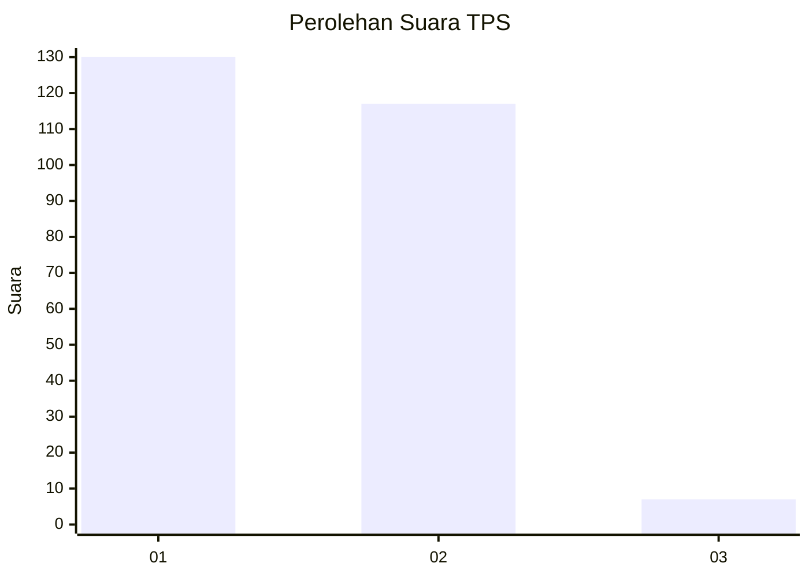
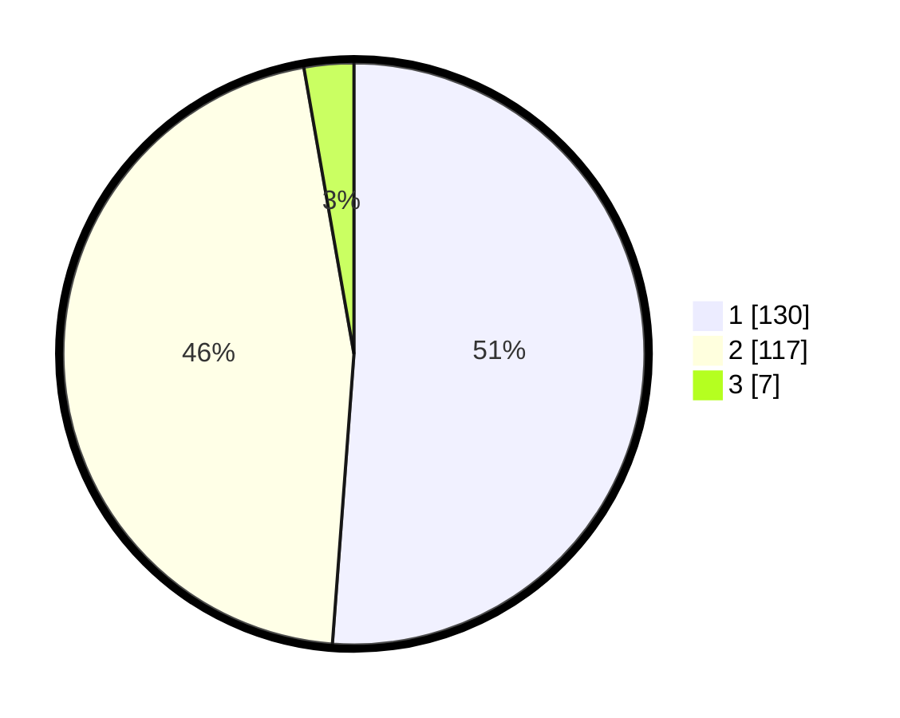

# Hasil

## Grafik

## Tabel

| No. | Nama Paslon    | Suara | Suara (raw) | Persentase |
|:--- |:-------------- | -----:| -----------:| ----------:|
| 1   | ANIES MUHAIMIN | 130   | [130][p-1]  | 51,18      |
| 2   | PRABOWO GIBRAN | 117   | [117][p-2]  | 46,06      |
| 3   | GANJAR MAHFUD  | 7     | [7][p-3]    | 2,76       |

[p-1]: https://github.com/gigit-pemilu/pemilu-2024-11-aceh/blob/main/pilpres/hitung-suara/sub/11-aceh/sub/10-aceh-singkil/sub/04-singkil/sub/2009-teluk-rumbia/sub/001-tps/sub/paslon-1.txt
[p-2]: https://github.com/gigit-pemilu/pemilu-2024-11-aceh/blob/main/pilpres/hitung-suara/sub/11-aceh/sub/10-aceh-singkil/sub/04-singkil/sub/2009-teluk-rumbia/sub/001-tps/sub/paslon-2.txt
[p-3]: https://github.com/gigit-pemilu/pemilu-2024-11-aceh/blob/main/pilpres/hitung-suara/sub/11-aceh/sub/10-aceh-singkil/sub/04-singkil/sub/2009-teluk-rumbia/sub/001-tps/sub/paslon-3.txt

## Foto C Plano

https://sirekap-obj-formc.kpu.go.id/0601/pemilu/ppwp/11/10/04/20/09/1110042009001-20240219-172247--b079dd0b-290f-4054-ba58-a5fc29c41c7d.jpg

https://sirekap-obj-formc.kpu.go.id/0601/pemilu/ppwp/11/10/04/20/09/1110042009001-20240219-171727--ad83245b-7b3a-4c7b-9df7-66c94cbd804e.jpg

## Metadata

| Key        | Value               |
| ---------- | ------------------- |
| Time Stamp | 2024-02-24 22:31:28 |

