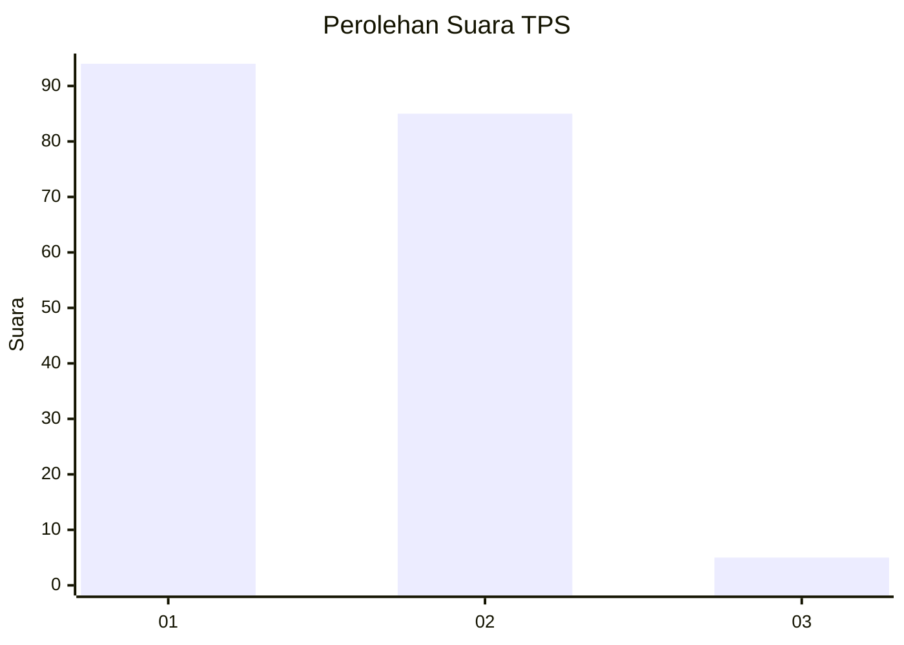
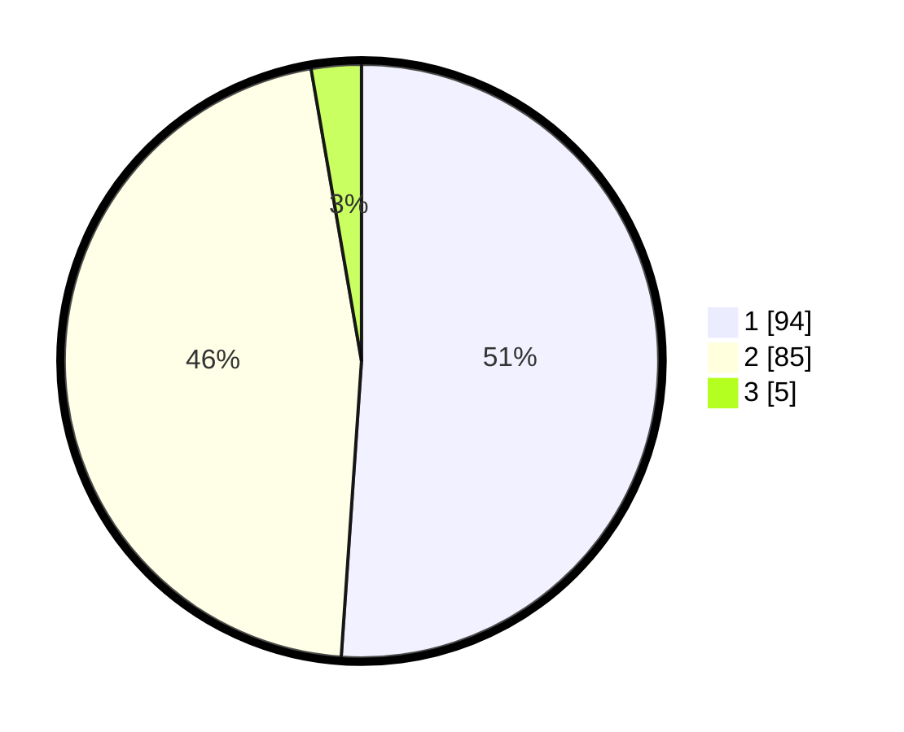

# Hasil

## Grafik

## Tabel

| No. | Nama Paslon    | Suara | Suara (raw) | Persentase |
|:--- |:-------------- | -----:| -----------:| ----------:|
| 1   | ANIES MUHAIMIN | 94    | [94][p-1]   | 51,09      |
| 2   | PRABOWO GIBRAN | 85    | [85][p-2]   | 46,20      |
| 3   | GANJAR MAHFUD  | 5     | [5][p-3]    | 2,72       |

[p-1]: https://github.com/gigit-pemilu/pemilu-2024-11-aceh/blob/main/pilpres/hitung-suara/sub/11-aceh/sub/10-aceh-singkil/sub/04-singkil/sub/2010-pea-bumbung/sub/002-tps/sub/paslon-1.txt
[p-2]: https://github.com/gigit-pemilu/pemilu-2024-11-aceh/blob/main/pilpres/hitung-suara/sub/11-aceh/sub/10-aceh-singkil/sub/04-singkil/sub/2010-pea-bumbung/sub/002-tps/sub/paslon-2.txt
[p-3]: https://github.com/gigit-pemilu/pemilu-2024-11-aceh/blob/main/pilpres/hitung-suara/sub/11-aceh/sub/10-aceh-singkil/sub/04-singkil/sub/2010-pea-bumbung/sub/002-tps/sub/paslon-3.txt

## Foto C Plano

https://sirekap-obj-formc.kpu.go.id/e8d3/pemilu/ppwp/11/10/04/20/10/1110042010002-20240217-124558--d3c80933-9c38-475c-9bd8-3977cc972a46.jpg

https://sirekap-obj-formc.kpu.go.id/e8d3/pemilu/ppwp/11/10/04/20/10/1110042010002-20240219-122730--aa1399f5-c457-4976-a742-ac085c4d89dc.jpg

https://sirekap-obj-formc.kpu.go.id/e8d3/pemilu/ppwp/11/10/04/20/10/1110042010002-20240217-135936--74c25c69-732e-4410-9d00-fcec32371a8e.jpg

## Metadata

| Key        | Value               |
| ---------- | ------------------- |
| Time Stamp | 2024-02-19 13:00:00 |

