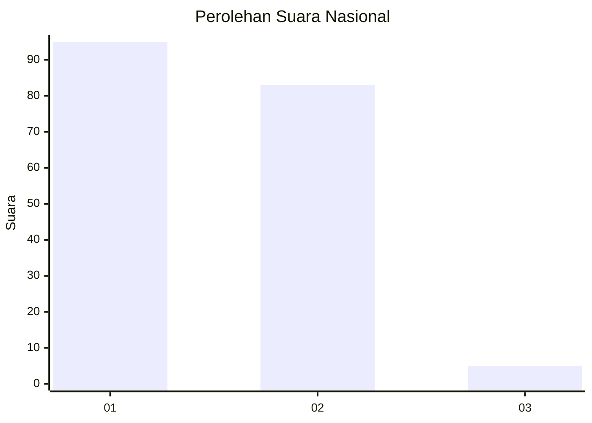
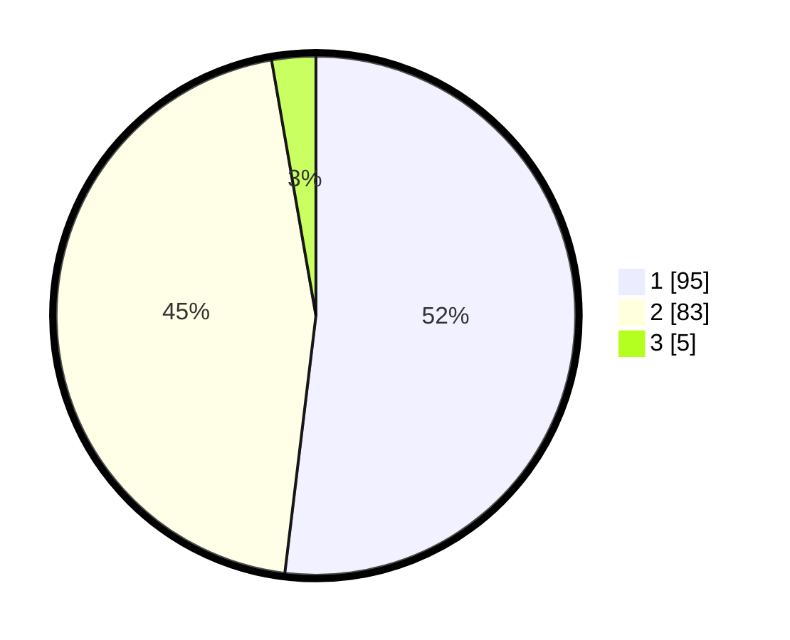

# Hasil

## Grafik

## Tabel

| No. | Nama Paslon    | Suara | Suara (raw) | Persentase |
|:--- |:-------------- | -----:| -----------:| ----------:|
| 1   | ANIES MUHAIMIN | 95    | [95][p-1]   | 51,91      |
| 2   | PRABOWO GIBRAN | 83    | [83][p-2]   | 45,36      |
| 3   | GANJAR MAHFUD  | 5     | [5][p-3]    | 2,73       |

[p-1]: https://github.com/gigit-pemilu/pemilu-2024/blob/main/pilpres/hitung-suara/sub/11-aceh/sub/10-aceh-singkil/sub/04-singkil/sub/2014-selok-aceh/sub/002-tps/sub/paslon-1.txt
[p-2]: https://github.com/gigit-pemilu/pemilu-2024/blob/main/pilpres/hitung-suara/sub/11-aceh/sub/10-aceh-singkil/sub/04-singkil/sub/2014-selok-aceh/sub/002-tps/sub/paslon-2.txt
[p-3]: https://github.com/gigit-pemilu/pemilu-2024/blob/main/pilpres/hitung-suara/sub/11-aceh/sub/10-aceh-singkil/sub/04-singkil/sub/2014-selok-aceh/sub/002-tps/sub/paslon-3.txt

## Foto C Plano

https://sirekap-obj-formc.kpu.go.id/1c3c/pemilu/ppwp/11/10/04/20/14/1110042014002-20240215-111117--f5af877d-c3b1-4253-aea4-18ccf00ca052.jpg

https://sirekap-obj-formc.kpu.go.id/1c3c/pemilu/ppwp/11/10/04/20/14/1110042014002-20240215-111515--ddbce00a-af3d-4bc1-ad29-debf97c1bd8c.jpg

https://sirekap-obj-formc.kpu.go.id/1c3c/pemilu/ppwp/11/10/04/20/14/1110042014002-20240217-123500--bf85a25b-f31f-47e8-a33a-53fb9df97ee7.jpg

## Metadata

| Key        | Value               |
| ---------- | ------------------- |
| Time Stamp | 2024-02-17 13:37:34 |

