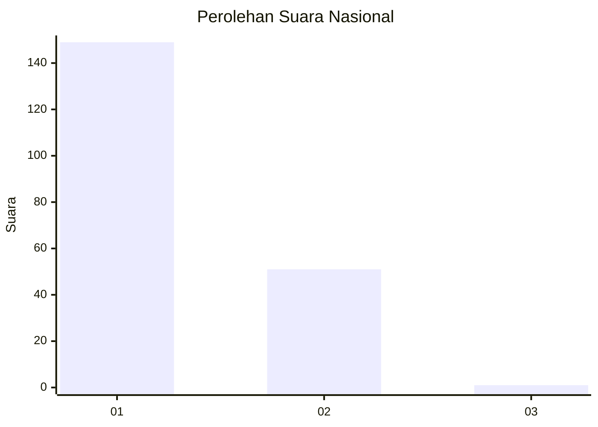
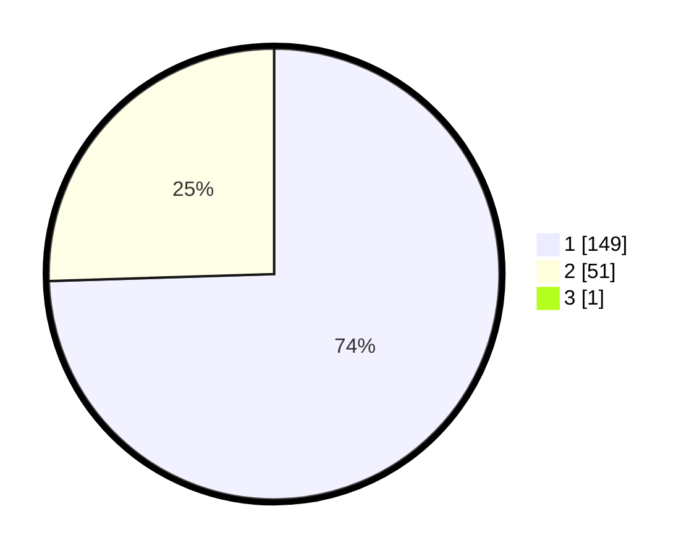

# Hasil

## Grafik

## Tabel

| No. | Nama Paslon    | Suara | Suara (raw) | Persentase |
|:--- |:-------------- | -----:| -----------:| ----------:|
| 1   | ANIES MUHAIMIN | 149   | [149][p-1]  | 74,13      |
| 2   | PRABOWO GIBRAN | 51    | [51][p-2]   | 25,37      |
| 3   | GANJAR MAHFUD  | 1     | [1][p-3]    | 0,50       |

[p-1]: https://github.com/gigit-pemilu/pemilu-2024/blob/main/pilpres/hitung-suara/sub/11-aceh/sub/10-aceh-singkil/sub/04-singkil/sub/2017-ujung-bawang/sub/003-tps/sub/paslon-1.txt
[p-2]: https://github.com/gigit-pemilu/pemilu-2024/blob/main/pilpres/hitung-suara/sub/11-aceh/sub/10-aceh-singkil/sub/04-singkil/sub/2017-ujung-bawang/sub/003-tps/sub/paslon-2.txt
[p-3]: https://github.com/gigit-pemilu/pemilu-2024/blob/main/pilpres/hitung-suara/sub/11-aceh/sub/10-aceh-singkil/sub/04-singkil/sub/2017-ujung-bawang/sub/003-tps/sub/paslon-3.txt

## Foto C Plano

https://sirekap-obj-formc.kpu.go.id/673b/pemilu/ppwp/11/10/04/20/17/1110042017003-20240215-052856--0322a625-43ea-4b9a-880e-4262b8b5af7e.jpg

https://sirekap-obj-formc.kpu.go.id/673b/pemilu/ppwp/11/10/04/20/17/1110042017003-20240215-052948--d5a98990-dc96-474c-abb1-d1ec43bf3164.jpg

https://sirekap-obj-formc.kpu.go.id/673b/pemilu/ppwp/11/10/04/20/17/1110042017003-20240215-053034--e37997c5-c036-4759-8094-67dd2675fec7.jpg

## Metadata

| Key        | Value               |
| ---------- | ------------------- |
| Time Stamp | 2024-02-16 12:51:22 |

