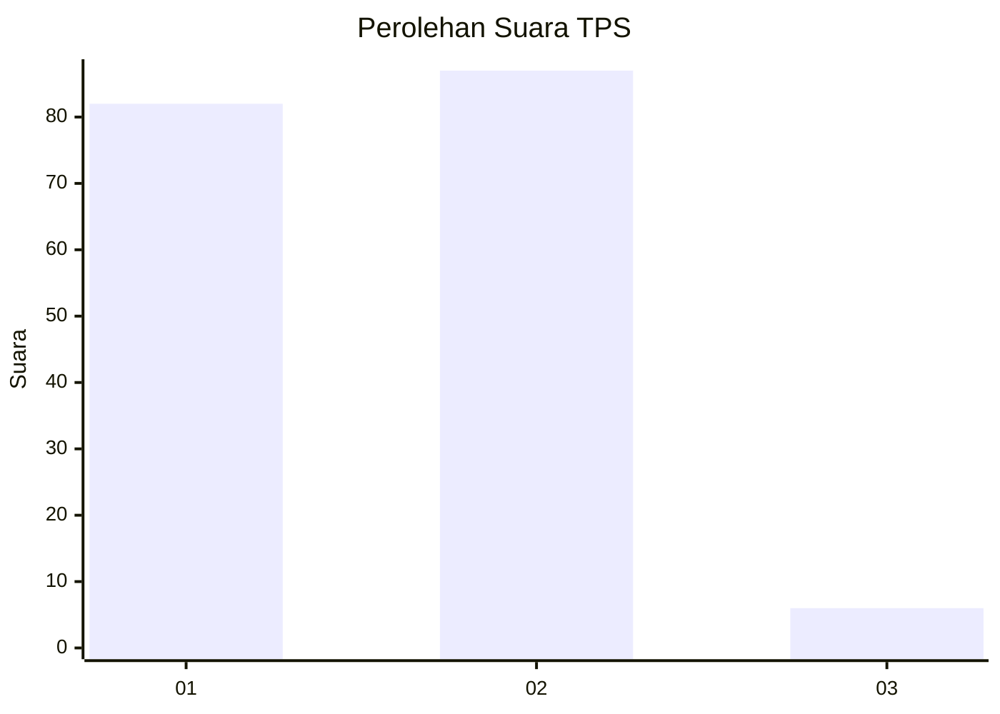
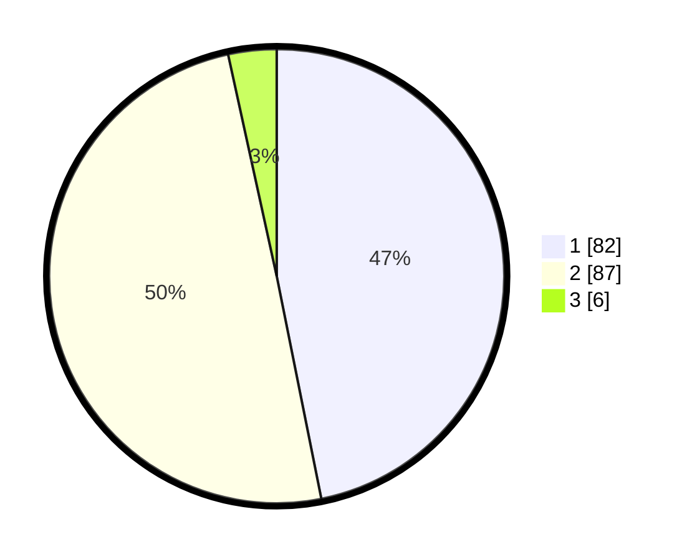

# Hasil

## Grafik

## Tabel

| No. | Nama Paslon    | Suara | Suara (raw) | Persentase |
|:--- |:-------------- | -----:| -----------:| ----------:|
| 1   | ANIES MUHAIMIN | 82    | [82][p-1]   | 46,86      |
| 2   | PRABOWO GIBRAN | 87    | [87][p-2]   | 49,71      |
| 3   | GANJAR MAHFUD  | 6     | [6][p-3]    | 3,43       |

[p-1]: https://github.com/gigit-pemilu/pemilu-2024-11-aceh/blob/main/pilpres/hitung-suara/sub/11-aceh/sub/10-aceh-singkil/sub/06-gunung-meriah/sub/2001-tanjung-betik/sub/001-tps/sub/paslon-1.txt
[p-2]: https://github.com/gigit-pemilu/pemilu-2024-11-aceh/blob/main/pilpres/hitung-suara/sub/11-aceh/sub/10-aceh-singkil/sub/06-gunung-meriah/sub/2001-tanjung-betik/sub/001-tps/sub/paslon-2.txt
[p-3]: https://github.com/gigit-pemilu/pemilu-2024-11-aceh/blob/main/pilpres/hitung-suara/sub/11-aceh/sub/10-aceh-singkil/sub/06-gunung-meriah/sub/2001-tanjung-betik/sub/001-tps/sub/paslon-3.txt

## Foto C Plano

https://sirekap-obj-formc.kpu.go.id/8ca0/pemilu/ppwp/11/10/06/20/01/1110062001001-20240219-094410--35d6773a-300b-4dc1-b5f5-fdc88b980263.jpg

https://sirekap-obj-formc.kpu.go.id/8ca0/pemilu/ppwp/11/10/06/20/01/1110062001001-20240219-094456--d5bd494a-6991-4ebe-b37e-568fa3eeb164.jpg

https://sirekap-obj-formc.kpu.go.id/8ca0/pemilu/ppwp/11/10/06/20/01/1110062001001-20240219-094542--fd75d92a-ccc6-4115-8931-ae2ead991591.jpg

## Metadata

| Key        | Value               |
| ---------- | ------------------- |
| Time Stamp | 2024-02-19 10:00:00 |

## DATA PEMILIH TETAP

Jumlah pemilih dalam DPT: **194**.
 * L: **96**.
 * P: **98**.

## DATA PENGGUNA HAK PILIH

Jumlah pengguna hak pilih dalam DPT: **179**.
 * L: **88**.
 * P: **91**.

Jumlah pengguna hak pilih dalam DPTb: **2**.
 * L: **1**.
 * P: **1**.

Jumlah pengguna hak pilih dalam DPK: **3**.
 * L: **0**.
 * P: **3**.

Jumlah pengguna hak pilih: **184**.
 * L: **89**.
 * P: **95**.

## JUMLAH SUARA SAH DAN TIDAK SAH

JUMLAH SELURUH SUARA SAH: **175**.

JUMLAH SUARA TIDAK SAH: **9**.

JUMLAH SELURUH SUARA SAH DAN SUARA TIDAK SAH: **184**.

