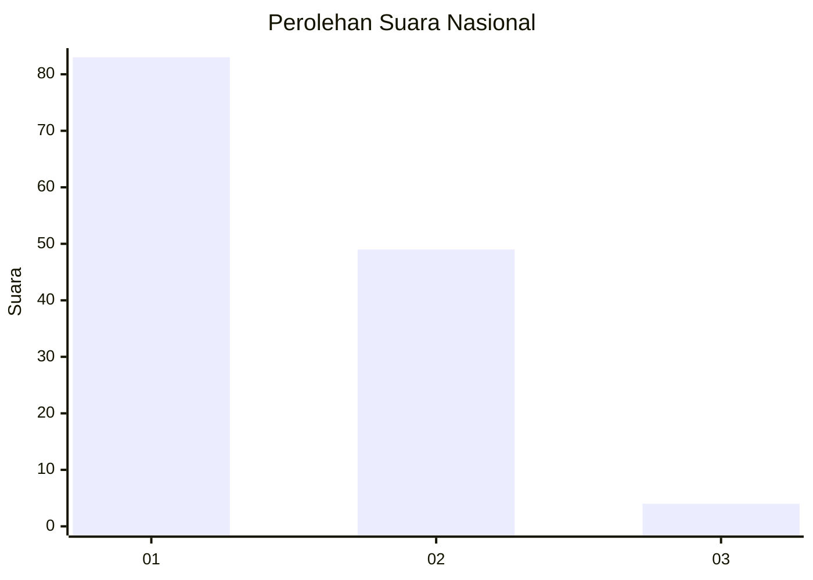
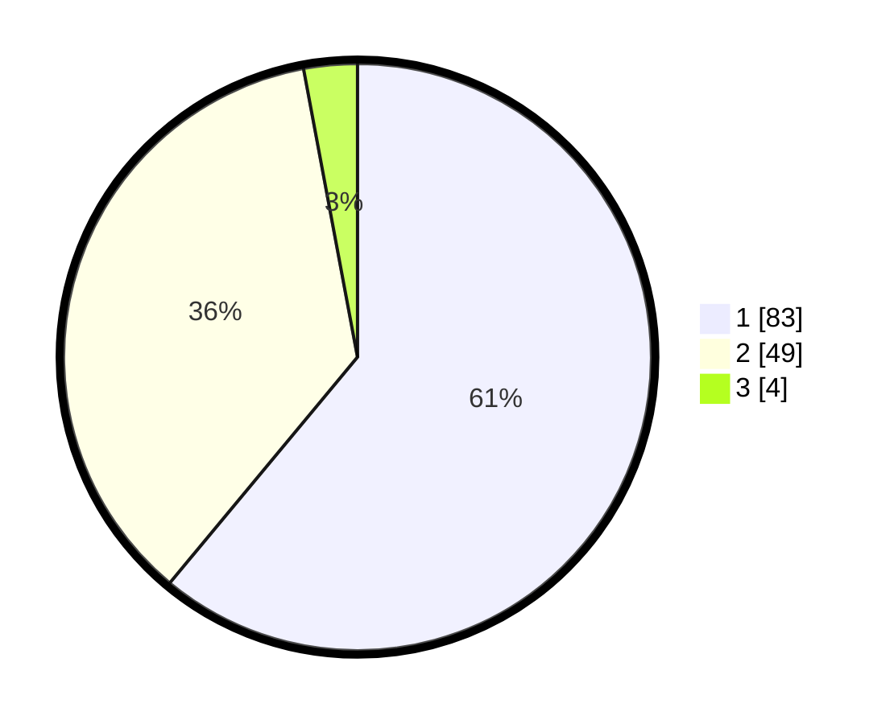

# Hasil

## Grafik

## Tabel

| No. | Nama Paslon    | Suara | Suara (raw) | Persentase |
|:--- |:-------------- | -----:| -----------:| ----------:|
| 1   | ANIES MUHAIMIN | 83    | [83][p-1]   | 61,03      |
| 2   | PRABOWO GIBRAN | 49    | [49][p-2]   | 36,03      |
| 3   | GANJAR MAHFUD  | 4     | [4][p-3]    | 2,94       |

[p-1]: https://github.com/gigit-pemilu/pemilu-2024/blob/main/pilpres/hitung-suara/sub/11-aceh/sub/10-aceh-singkil/sub/06-gunung-meriah/sub/2002-penjahitan/sub/001-tps/sub/paslon-1.txt
[p-2]: https://github.com/gigit-pemilu/pemilu-2024/blob/main/pilpres/hitung-suara/sub/11-aceh/sub/10-aceh-singkil/sub/06-gunung-meriah/sub/2002-penjahitan/sub/001-tps/sub/paslon-2.txt
[p-3]: https://github.com/gigit-pemilu/pemilu-2024/blob/main/pilpres/hitung-suara/sub/11-aceh/sub/10-aceh-singkil/sub/06-gunung-meriah/sub/2002-penjahitan/sub/001-tps/sub/paslon-3.txt

## Foto C Plano

https://sirekap-obj-formc.kpu.go.id/e3da/pemilu/ppwp/11/10/06/20/02/1110062002001-20240219-100153--93ae772e-a9c8-44db-87e9-abab57dcf309.jpg

https://sirekap-obj-formc.kpu.go.id/e3da/pemilu/ppwp/11/10/06/20/02/1110062002001-20240219-100227--7070b49c-28c6-4b65-9ab8-55450df55e1c.jpg

https://sirekap-obj-formc.kpu.go.id/e3da/pemilu/ppwp/11/10/06/20/02/1110062002001-20240219-100322--7f3c7603-f3cc-48d6-a2b6-fc0a437fb4cb.jpg

## Metadata

| Key        | Value               |
| ---------- | ------------------- |
| Time Stamp | 2024-02-19 16:00:00 |

## DATA PEMILIH TETAP

Jumlah pemilih dalam DPT: **149**.
 * L: **70**.
 * P: **79**.

## DATA PENGGUNA HAK PILIH

Jumlah pengguna hak pilih dalam DPT: **143**.
 * L: **64**.
 * P: **79**.

Jumlah pengguna hak pilih dalam DPTb: **0**.
 * L: **0**.
 * P: **0**.

Jumlah pengguna hak pilih dalam DPK: **0**.
 * L: **0**.
 * P: **0**.

Jumlah pengguna hak pilih: **143**.
 * L: **64**.
 * P: **79**.

## JUMLAH SUARA SAH DAN TIDAK SAH

JUMLAH SELURUH SUARA SAH: **136**.

JUMLAH SUARA TIDAK SAH: **7**.

JUMLAH SELURUH SUARA SAH DAN SUARA TIDAK SAH: **143**.

