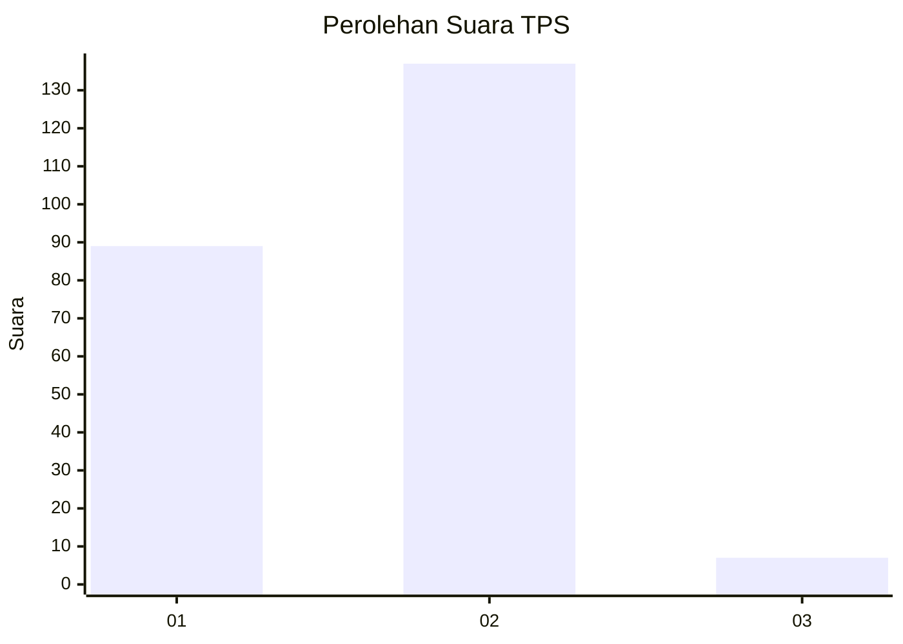
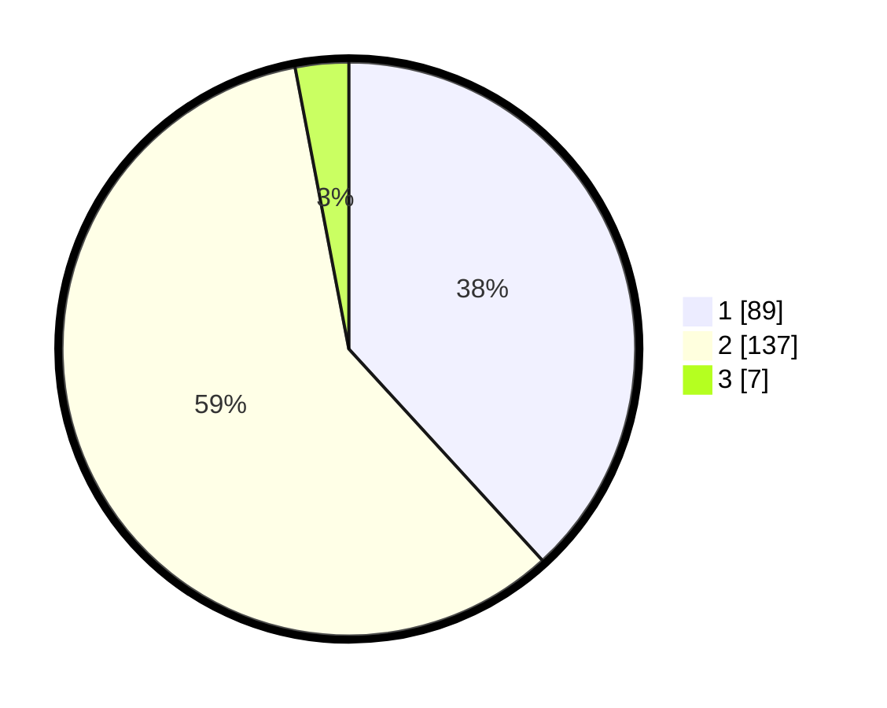

# Hasil

## Grafik

## Tabel

| No. | Nama Paslon    | Suara | Suara (raw) | Persentase |
|:--- |:-------------- | -----:| -----------:| ----------:|
| 1   | ANIES MUHAIMIN | 89    | [89][p-1]   | 38,20      |
| 2   | PRABOWO GIBRAN | 137   | [137][p-2]  | 58,80      |
| 3   | GANJAR MAHFUD  | 7     | [7][p-3]    | 3,00       |

[p-1]: https://github.com/gigit-pemilu/pemilu-2024-11-aceh/blob/main/pilpres/hitung-suara/sub/11-aceh/sub/10-aceh-singkil/sub/06-gunung-meriah/sub/2003-bukit-harapan/sub/002-tps/sub/paslon-1.txt
[p-2]: https://github.com/gigit-pemilu/pemilu-2024-11-aceh/blob/main/pilpres/hitung-suara/sub/11-aceh/sub/10-aceh-singkil/sub/06-gunung-meriah/sub/2003-bukit-harapan/sub/002-tps/sub/paslon-2.txt
[p-3]: https://github.com/gigit-pemilu/pemilu-2024-11-aceh/blob/main/pilpres/hitung-suara/sub/11-aceh/sub/10-aceh-singkil/sub/06-gunung-meriah/sub/2003-bukit-harapan/sub/002-tps/sub/paslon-3.txt

## Foto C Plano

https://sirekap-obj-formc.kpu.go.id/764a/pemilu/ppwp/11/10/06/20/03/1110062003002-20240220-102747--2f34d087-e656-427d-a673-842976699f4e.jpg

https://sirekap-obj-formc.kpu.go.id/764a/pemilu/ppwp/11/10/06/20/03/1110062003002-20240220-102906--6c10ac24-a6dc-4fef-b50b-17cc5b8e4a9e.jpg

https://sirekap-obj-formc.kpu.go.id/764a/pemilu/ppwp/11/10/06/20/03/1110062003002-20240220-103050--c5074131-4853-4691-b258-28c489e89295.jpg

## Metadata

| Key        | Value               |
| ---------- | ------------------- |
| Time Stamp | 2024-02-21 15:00:00 |

## DATA PEMILIH TETAP

Jumlah pemilih dalam DPT: **275**.
 * L: **137**.
 * P: **138**.

## DATA PENGGUNA HAK PILIH

Jumlah pengguna hak pilih dalam DPT: **231**.
 * L: **114**.
 * P: **117**.

Jumlah pengguna hak pilih dalam DPTb: **3**.
 * L: **1**.
 * P: **2**.

Jumlah pengguna hak pilih dalam DPK: **8**.
 * L: **4**.
 * P: **4**.

Jumlah pengguna hak pilih: **242**.
 * L: **119**.
 * P: **123**.

## JUMLAH SUARA SAH DAN TIDAK SAH

JUMLAH SELURUH SUARA SAH: **233**.

JUMLAH SUARA TIDAK SAH: **9**.

JUMLAH SELURUH SUARA SAH DAN SUARA TIDAK SAH: **242**.

