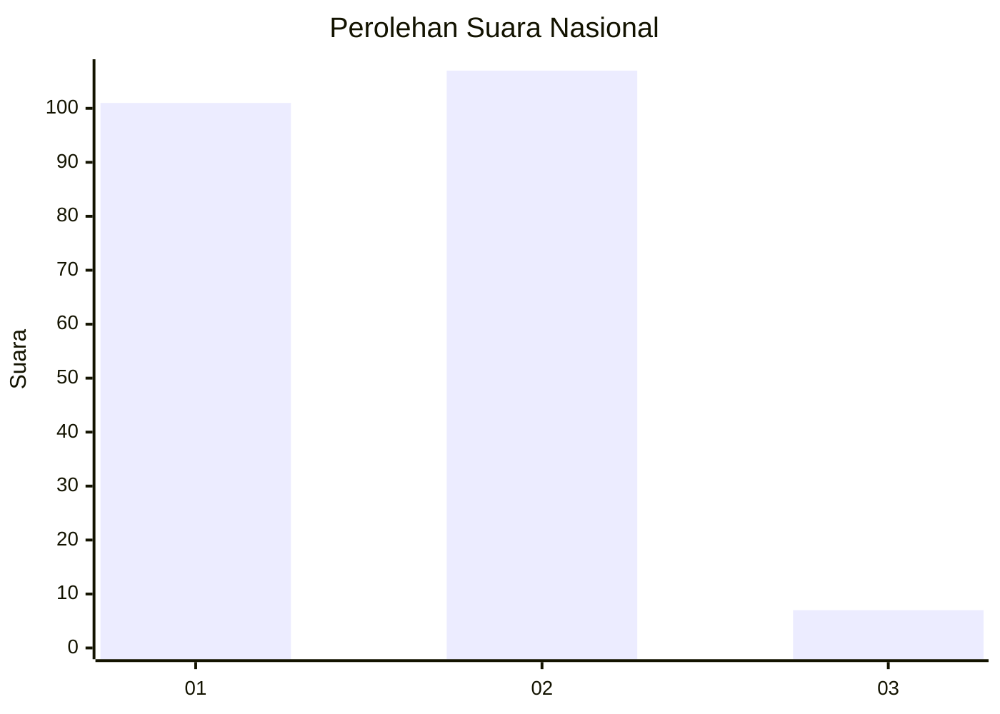
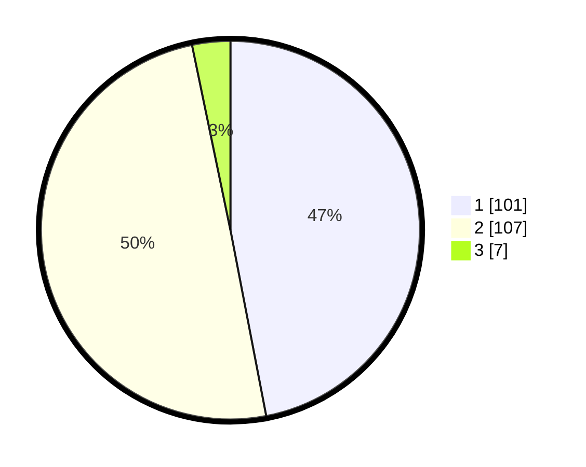

# Hasil

## Grafik

## Tabel

| No. | Nama Paslon    | Suara | Suara (raw) | Persentase |
|:--- |:-------------- | -----:| -----------:| ----------:|
| 1   | ANIES MUHAIMIN | 101   | [101][p-1]  | 46,98      |
| 2   | PRABOWO GIBRAN | 107   | [107][p-2]  | 49,77      |
| 3   | GANJAR MAHFUD  | 7     | [7][p-3]    | 3,26       |

[p-1]: https://github.com/gigit-pemilu/pemilu-2024/blob/main/pilpres/hitung-suara/sub/11-aceh/sub/10-aceh-singkil/sub/06-gunung-meriah/sub/2003-bukit-harapan/sub/003-tps/sub/paslon-1.txt
[p-2]: https://github.com/gigit-pemilu/pemilu-2024/blob/main/pilpres/hitung-suara/sub/11-aceh/sub/10-aceh-singkil/sub/06-gunung-meriah/sub/2003-bukit-harapan/sub/003-tps/sub/paslon-2.txt
[p-3]: https://github.com/gigit-pemilu/pemilu-2024/blob/main/pilpres/hitung-suara/sub/11-aceh/sub/10-aceh-singkil/sub/06-gunung-meriah/sub/2003-bukit-harapan/sub/003-tps/sub/paslon-3.txt

## Foto C Plano

https://sirekap-obj-formc.kpu.go.id/0763/pemilu/ppwp/11/10/06/20/03/1110062003003-20240220-105202--aba0068d-0a8d-4fc2-82d4-554b2f91cb5c.jpg

https://sirekap-obj-formc.kpu.go.id/0763/pemilu/ppwp/11/10/06/20/03/1110062003003-20240220-105425--ec4b16ce-0ecd-4bc1-99b6-b0bc27eeaa33.jpg

https://sirekap-obj-formc.kpu.go.id/0763/pemilu/ppwp/11/10/06/20/03/1110062003003-20240220-105518--67715e55-a95e-4563-b8ac-1a4c815770ea.jpg

## Metadata

| Key        | Value               |
| ---------- | ------------------- |
| Time Stamp | 2024-02-20 11:00:00 |

## DATA PEMILIH TETAP

Jumlah pemilih dalam DPT: **245**.
 * L: **126**.
 * P: **119**.

## DATA PENGGUNA HAK PILIH

Jumlah pengguna hak pilih dalam DPT: **210**.
 * L: **105**.
 * P: **105**.

Jumlah pengguna hak pilih dalam DPTb: **1**.
 * L: **1**.
 * P: **0**.

Jumlah pengguna hak pilih dalam DPK: **7**.
 * L: **4**.
 * P: **3**.

Jumlah pengguna hak pilih: **218**.
 * L: **110**.
 * P: **108**.

## JUMLAH SUARA SAH DAN TIDAK SAH

JUMLAH SELURUH SUARA SAH: **215**.

JUMLAH SUARA TIDAK SAH: **3**.

JUMLAH SELURUH SUARA SAH DAN SUARA TIDAK SAH: **218**.

