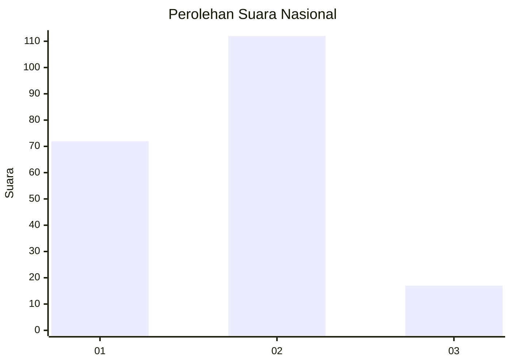

# Hasil

## Grafik

## Tabel

| No. | Nama Paslon    | Suara | Suara (raw) | Persentase |
|:--- |:-------------- | -----:| -----------:| ----------:|
| 1   | ANIES MUHAIMIN | 72    | [72][p-1]   | 35,82      |
| 2   | PRABOWO GIBRAN | 112   | [112][p-2]  | 55,72      |
| 3   | GANJAR MAHFUD  | 17    | [17][p-3]   | 8,46       |

[p-1]: https://github.com/gigit-pemilu/pemilu-2024/blob/main/pilpres/hitung-suara/sub/11-aceh/sub/10-aceh-singkil/sub/06-gunung-meriah/sub/2003-bukit-harapan/sub/004-tps/sub/paslon-1.txt
[p-2]: https://github.com/gigit-pemilu/pemilu-2024/blob/main/pilpres/hitung-suara/sub/11-aceh/sub/10-aceh-singkil/sub/06-gunung-meriah/sub/2003-bukit-harapan/sub/004-tps/sub/paslon-2.txt
[p-3]: https://github.com/gigit-pemilu/pemilu-2024/blob/main/pilpres/hitung-suara/sub/11-aceh/sub/10-aceh-singkil/sub/06-gunung-meriah/sub/2003-bukit-harapan/sub/004-tps/sub/paslon-3.txt

## Foto C Plano

https://sirekap-obj-formc.kpu.go.id/0947/pemilu/ppwp/11/10/06/20/03/1110062003004-20240227-150057--fd019dc1-3d6b-40d4-b45f-62a9bbcdcd86.jpg

https://sirekap-obj-formc.kpu.go.id/0947/pemilu/ppwp/11/10/06/20/03/1110062003004-20240220-123204--94c7dc93-bdc5-49aa-a6f4-4b6e3657de0e.jpg

https://sirekap-obj-formc.kpu.go.id/0947/pemilu/ppwp/11/10/06/20/03/1110062003004-20240220-122809--75e02449-fd05-48bd-81f2-9e9bd44c23e8.jpg

## Metadata

| Key        | Value               |
| ---------- | ------------------- |
| Time Stamp | 2024-02-27 16:00:00 |

