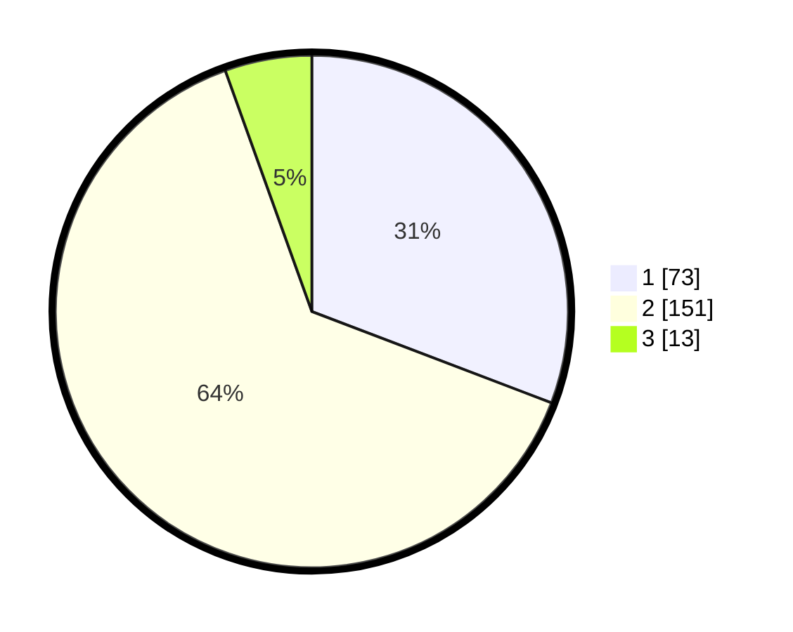

# Hasil

## Grafik

## Tabel

| No. | Nama Paslon    | Suara | Suara (raw) | Persentase |
|:--- |:-------------- | -----:| -----------:| ----------:|
| 1   | ANIES MUHAIMIN | 73    | [73][p-1]   | 30,80      |
| 2   | PRABOWO GIBRAN | 151   | [151][p-2]  | 63,71      |
| 3   | GANJAR MAHFUD  | 13    | [13][p-3]   | 5,49       |

[p-1]: https://github.com/gigit-pemilu/pemilu-2024-11-aceh/blob/main/pilpres/hitung-suara/sub/11-aceh/sub/10-aceh-singkil/sub/06-gunung-meriah/sub/2003-bukit-harapan/sub/005-tps/sub/paslon-1.txt
[p-2]: https://github.com/gigit-pemilu/pemilu-2024-11-aceh/blob/main/pilpres/hitung-suara/sub/11-aceh/sub/10-aceh-singkil/sub/06-gunung-meriah/sub/2003-bukit-harapan/sub/005-tps/sub/paslon-2.txt
[p-3]: https://github.com/gigit-pemilu/pemilu-2024-11-aceh/blob/main/pilpres/hitung-suara/sub/11-aceh/sub/10-aceh-singkil/sub/06-gunung-meriah/sub/2003-bukit-harapan/sub/005-tps/sub/paslon-3.txt

## Foto C Plano

https://sirekap-obj-formc.kpu.go.id/1030/pemilu/ppwp/11/10/06/20/03/1110062003005-20240214-221448--acfba251-56c9-482c-af52-5f428bb0bf7b.jpg

https://sirekap-obj-formc.kpu.go.id/1030/pemilu/ppwp/11/10/06/20/03/1110062003005-20240214-221548--87a0f942-ce38-4d42-b31c-ed2a39f6e5a2.jpg

https://sirekap-obj-formc.kpu.go.id/1030/pemilu/ppwp/11/10/06/20/03/1110062003005-20240214-221645--3143daf1-68ff-4645-ad14-89f15112a874.jpg

## Metadata

| Key        | Value               |
| ---------- | ------------------- |
| Time Stamp | 2024-02-15 17:00:25 |

