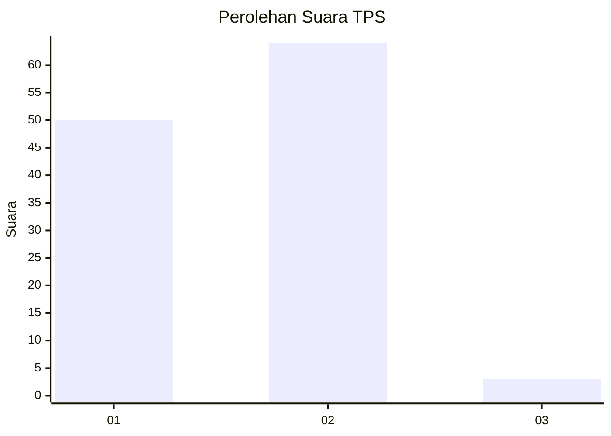
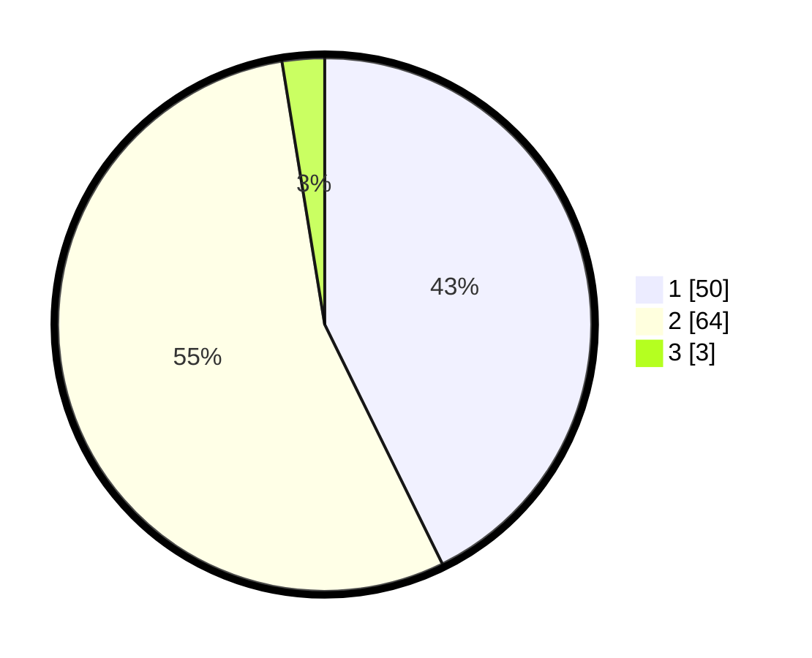

# Hasil

## Grafik

## Tabel

| No. | Nama Paslon    | Suara | Suara (raw) | Persentase |
|:--- |:-------------- | -----:| -----------:| ----------:|
| 1   | ANIES MUHAIMIN | 50    | [50][p-1]   | 42,74      |
| 2   | PRABOWO GIBRAN | 64    | [64][p-2]   | 54,70      |
| 3   | GANJAR MAHFUD  | 3     | [3][p-3]    | 2,56       |

[p-1]: https://github.com/gigit-pemilu/pemilu-2024-11-aceh/blob/main/pilpres/hitung-suara/sub/11-aceh/sub/10-aceh-singkil/sub/06-gunung-meriah/sub/2003-bukit-harapan/sub/011-tps/sub/paslon-1.txt
[p-2]: https://github.com/gigit-pemilu/pemilu-2024-11-aceh/blob/main/pilpres/hitung-suara/sub/11-aceh/sub/10-aceh-singkil/sub/06-gunung-meriah/sub/2003-bukit-harapan/sub/011-tps/sub/paslon-2.txt
[p-3]: https://github.com/gigit-pemilu/pemilu-2024-11-aceh/blob/main/pilpres/hitung-suara/sub/11-aceh/sub/10-aceh-singkil/sub/06-gunung-meriah/sub/2003-bukit-harapan/sub/011-tps/sub/paslon-3.txt

## Foto C Plano

https://sirekap-obj-formc.kpu.go.id/4b4d/pemilu/ppwp/11/10/06/20/03/1110062003011-20240223-120006--cba9e797-e9f5-4920-aeb5-b905a4134366.jpg

https://sirekap-obj-formc.kpu.go.id/4b4d/pemilu/ppwp/11/10/06/20/03/1110062003011-20240220-225226--8f42288c-c565-43bd-8543-b1be1a65fb3d.jpg

https://sirekap-obj-formc.kpu.go.id/4b4d/pemilu/ppwp/11/10/06/20/03/1110062003011-20240220-225315--798e01a0-3fdd-416c-8354-db8233a6c6e2.jpg

## Metadata

| Key        | Value               |
| ---------- | ------------------- |
| Time Stamp | 2024-02-24 22:31:28 |

