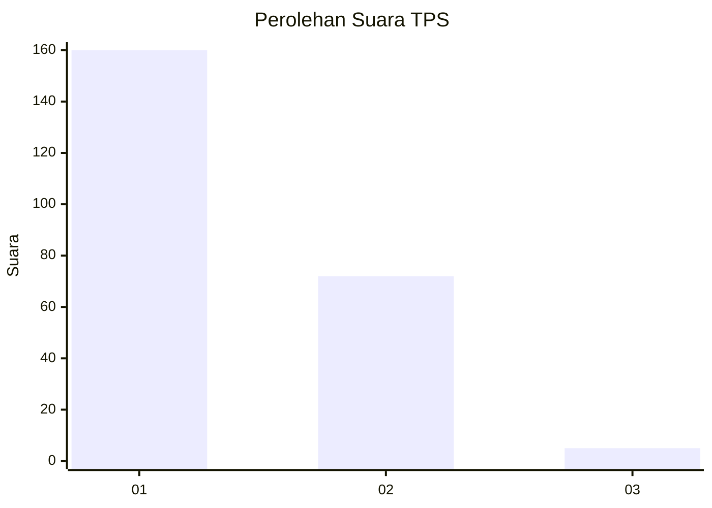
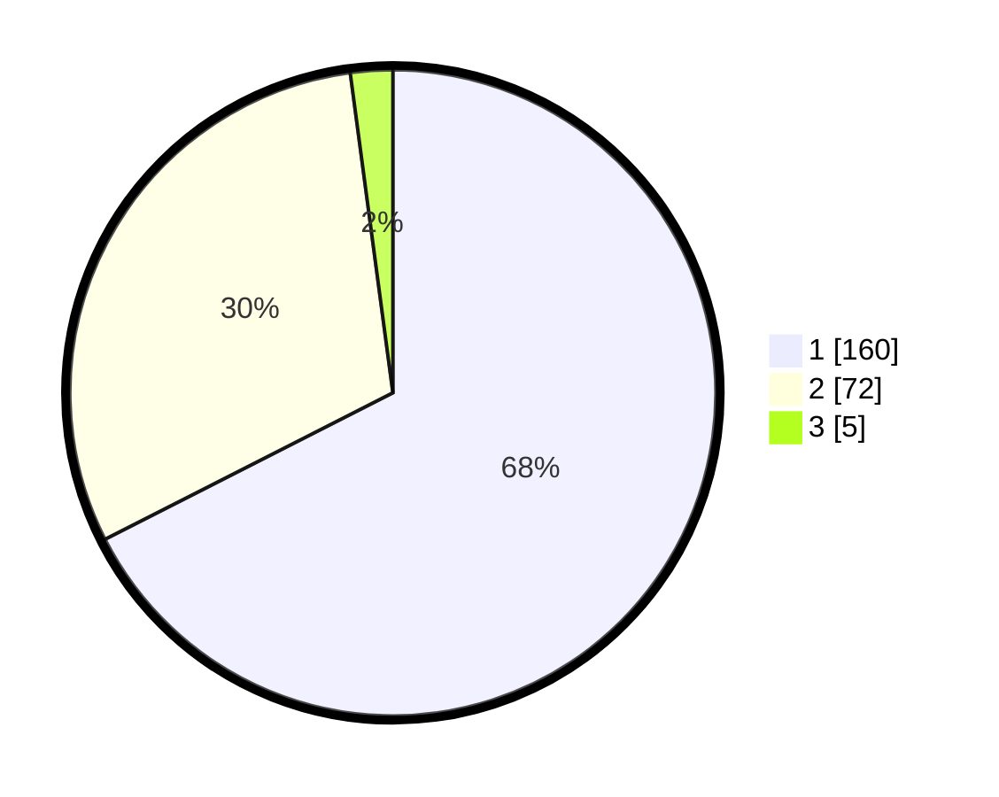

# Hasil

## Grafik

## Tabel

| No. | Nama Paslon    | Suara | Suara (raw) | Persentase |
|:--- |:-------------- | -----:| -----------:| ----------:|
| 1   | ANIES MUHAIMIN | 160   | [160][p-1]  | 67,51      |
| 2   | PRABOWO GIBRAN | 72    | [72][p-2]   | 30,38      |
| 3   | GANJAR MAHFUD  | 5     | [5][p-3]    | 2,11       |

[p-1]: https://github.com/gigit-pemilu/pemilu-2024-11-aceh/blob/main/pilpres/hitung-suara/sub/11-aceh/sub/10-aceh-singkil/sub/06-gunung-meriah/sub/2006-tanah-bara/sub/005-tps/sub/paslon-1.txt
[p-2]: https://github.com/gigit-pemilu/pemilu-2024-11-aceh/blob/main/pilpres/hitung-suara/sub/11-aceh/sub/10-aceh-singkil/sub/06-gunung-meriah/sub/2006-tanah-bara/sub/005-tps/sub/paslon-2.txt
[p-3]: https://github.com/gigit-pemilu/pemilu-2024-11-aceh/blob/main/pilpres/hitung-suara/sub/11-aceh/sub/10-aceh-singkil/sub/06-gunung-meriah/sub/2006-tanah-bara/sub/005-tps/sub/paslon-3.txt

## Foto C Plano

https://sirekap-obj-formc.kpu.go.id/3faa/pemilu/ppwp/11/10/06/20/06/1110062006005-20240227-164337--55a8c47f-986f-4fb8-a1e5-7357616336f0.jpg

https://sirekap-obj-formc.kpu.go.id/3faa/pemilu/ppwp/11/10/06/20/06/1110062006005-20240227-111555--380b89ca-d8ac-4b65-a7c0-56a6463fd19e.jpg

## Metadata

| Key        | Value               |
| ---------- | ------------------- |
| Time Stamp | 2024-02-27 17:00:00 |

