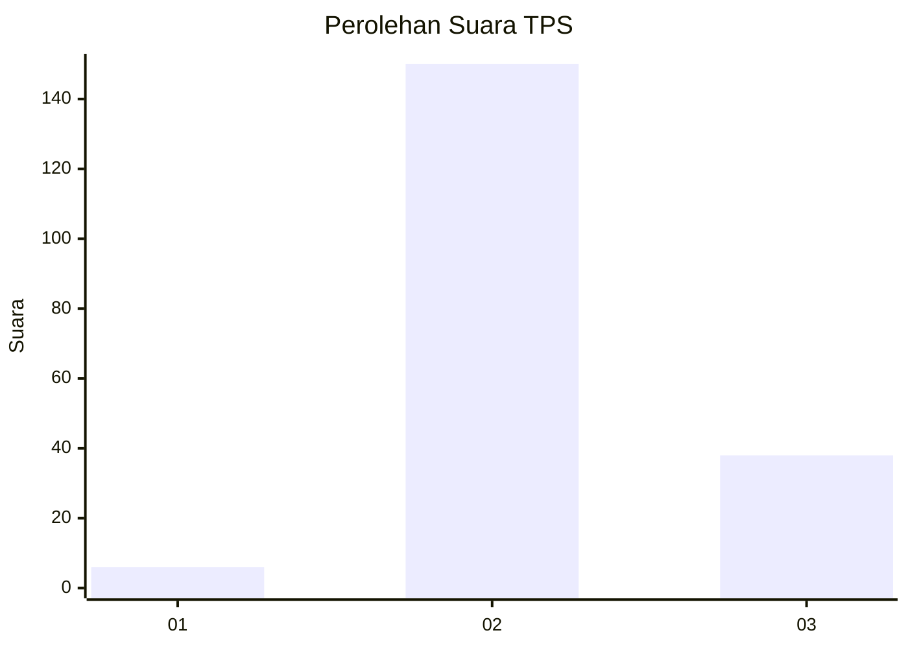

# Hasil

## Grafik

## Tabel

| No. | Nama Paslon    | Suara | Suara (raw) | Persentase |
|:--- |:-------------- | -----:| -----------:| ----------:|
| 1   | ANIES MUHAIMIN | 6     | [6][p-1]    | 3,09       |
| 2   | PRABOWO GIBRAN | 150   | [150][p-2]  | 77,32      |
| 3   | GANJAR MAHFUD  | 38    | [38][p-3]   | 19,59      |

[p-1]: https://github.com/gigit-pemilu/pemilu-2024-11-aceh/blob/main/pilpres/hitung-suara/sub/11-aceh/sub/10-aceh-singkil/sub/06-gunung-meriah/sub/2013-suka-makmur/sub/005-tps/sub/paslon-1.txt
[p-2]: https://github.com/gigit-pemilu/pemilu-2024-11-aceh/blob/main/pilpres/hitung-suara/sub/11-aceh/sub/10-aceh-singkil/sub/06-gunung-meriah/sub/2013-suka-makmur/sub/005-tps/sub/paslon-2.txt
[p-3]: https://github.com/gigit-pemilu/pemilu-2024-11-aceh/blob/main/pilpres/hitung-suara/sub/11-aceh/sub/10-aceh-singkil/sub/06-gunung-meriah/sub/2013-suka-makmur/sub/005-tps/sub/paslon-3.txt

## Foto C Plano

https://sirekap-obj-formc.kpu.go.id/a008/pemilu/ppwp/11/10/06/20/13/1110062013005-20240227-203717--596e4416-dca4-46e8-bf29-e0073e127dde.jpg

https://sirekap-obj-formc.kpu.go.id/a008/pemilu/ppwp/11/10/06/20/13/1110062013005-20240227-203901--6dbe318a-b5e4-4b06-886a-8cc163441b73.jpg

https://sirekap-obj-formc.kpu.go.id/a008/pemilu/ppwp/11/10/06/20/13/1110062013005-20240227-204025--80e8ce8f-307c-4adf-9e09-2812b707bd76.jpg

## Metadata

| Key        | Value               |
| ---------- | ------------------- |
| Time Stamp | 2024-02-27 21:00:04 |

## DATA PEMILIH TETAP

Jumlah pemilih dalam DPT: **220**.
 * L: **106**.
 * P: **114**.

## DATA PENGGUNA HAK PILIH

Jumlah pengguna hak pilih dalam DPT: **194**.
 * L: **86**.
 * P: **108**.

Jumlah pengguna hak pilih dalam DPTb: **1**.
 * L: **0**.
 * P: **1**.

Jumlah pengguna hak pilih dalam DPK: **0**.
 * L: **0**.
 * P: **0**.

Jumlah pengguna hak pilih: **195**.
 * L: **86**.
 * P: **109**.

## JUMLAH SUARA SAH DAN TIDAK SAH

JUMLAH SELURUH SUARA SAH: **194**.

JUMLAH SUARA TIDAK SAH: **1**.

JUMLAH SELURUH SUARA SAH DAN SUARA TIDAK SAH: **195**.

