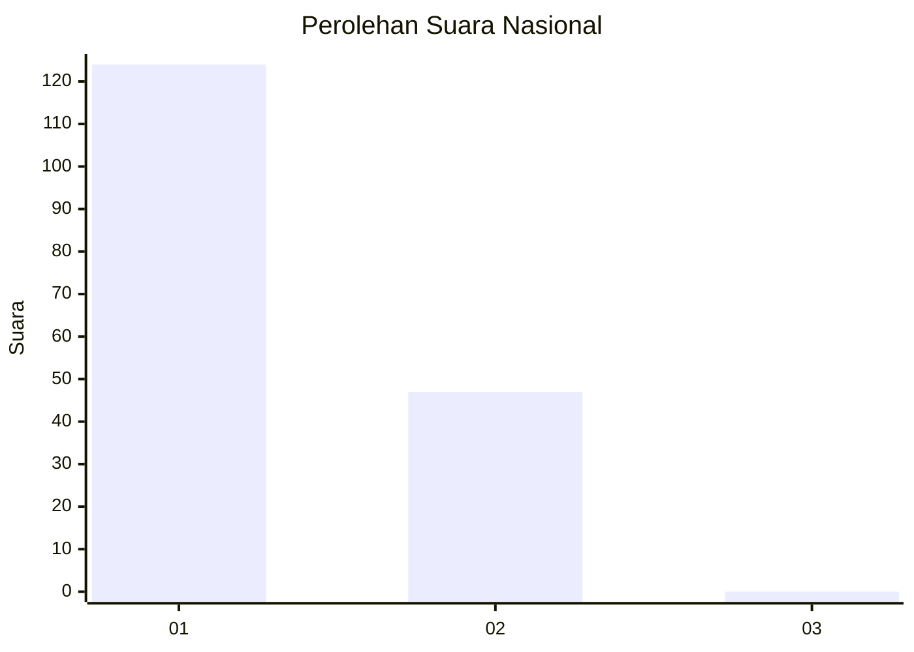
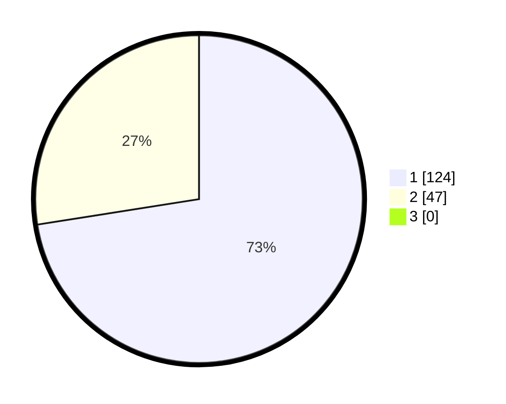

# Hasil

## Grafik

## Tabel

| No. | Nama Paslon    | Suara | Suara (raw) | Persentase |
|:--- |:-------------- | -----:| -----------:| ----------:|
| 1   | ANIES MUHAIMIN | 124   | [124][p-1]  | 72,51      |
| 2   | PRABOWO GIBRAN | 47    | [47][p-2]   | 27,49      |
| 3   | GANJAR MAHFUD  | 0     | [0][p-3]    | 0,00       |

[p-1]: https://github.com/gigit-pemilu/pemilu-2024/blob/main/pilpres/hitung-suara/sub/11-aceh/sub/10-aceh-singkil/sub/06-gunung-meriah/sub/2017-sebatang/sub/002-tps/sub/paslon-1.txt
[p-2]: https://github.com/gigit-pemilu/pemilu-2024/blob/main/pilpres/hitung-suara/sub/11-aceh/sub/10-aceh-singkil/sub/06-gunung-meriah/sub/2017-sebatang/sub/002-tps/sub/paslon-2.txt
[p-3]: https://github.com/gigit-pemilu/pemilu-2024/blob/main/pilpres/hitung-suara/sub/11-aceh/sub/10-aceh-singkil/sub/06-gunung-meriah/sub/2017-sebatang/sub/002-tps/sub/paslon-3.txt

## Foto C Plano

https://sirekap-obj-formc.kpu.go.id/4772/pemilu/ppwp/11/10/06/20/17/1110062017002-20240227-233111--c208fc03-5290-43de-b9d1-53597e4ded02.jpg

https://sirekap-obj-formc.kpu.go.id/4772/pemilu/ppwp/11/10/06/20/17/1110062017002-20240227-211234--41cf0308-ceed-4cd6-bb39-f4d506ee4e3d.jpg

https://sirekap-obj-formc.kpu.go.id/4772/pemilu/ppwp/11/10/06/20/17/1110062017002-20240227-211334--63d0af40-cc4e-4576-b092-4c1cc413da84.jpg

## Metadata

| Key        | Value               |
| ---------- | ------------------- |
| Time Stamp | 2024-03-01 14:00:00 |

