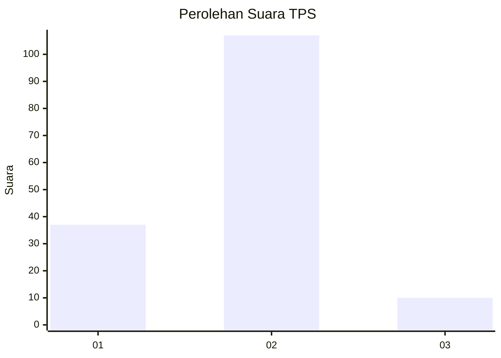

# Hasil

## Grafik

## Tabel

| No. | Nama Paslon    | Suara | Suara (raw) | Persentase |
|:--- |:-------------- | -----:| -----------:| ----------:|
| 1   | ANIES MUHAIMIN | 37    | [37][p-1]   | 24,03      |
| 2   | PRABOWO GIBRAN | 107   | [107][p-2]  | 69,48      |
| 3   | GANJAR MAHFUD  | 10    | [10][p-3]   | 6,49       |

[p-1]: https://github.com/gigit-pemilu/pemilu-2024-11-aceh/blob/main/pilpres/hitung-suara/sub/11-aceh/sub/10-aceh-singkil/sub/06-gunung-meriah/sub/2020-pandan-sari/sub/003-tps/sub/paslon-1.txt
[p-2]: https://github.com/gigit-pemilu/pemilu-2024-11-aceh/blob/main/pilpres/hitung-suara/sub/11-aceh/sub/10-aceh-singkil/sub/06-gunung-meriah/sub/2020-pandan-sari/sub/003-tps/sub/paslon-2.txt
[p-3]: https://github.com/gigit-pemilu/pemilu-2024-11-aceh/blob/main/pilpres/hitung-suara/sub/11-aceh/sub/10-aceh-singkil/sub/06-gunung-meriah/sub/2020-pandan-sari/sub/003-tps/sub/paslon-3.txt

## Foto C Plano

https://sirekap-obj-formc.kpu.go.id/eb42/pemilu/ppwp/11/10/06/20/20/1110062020003-20240226-164049--3915f47e-977c-4145-bbe2-6e974534c2be.jpg

https://sirekap-obj-formc.kpu.go.id/eb42/pemilu/ppwp/11/10/06/20/20/1110062020003-20240226-164241--9bd3ecb1-ae74-4d3a-909f-2c35a2f3c939.jpg

https://sirekap-obj-formc.kpu.go.id/eb42/pemilu/ppwp/11/10/06/20/20/1110062020003-20240226-164346--cb66bd89-7a9c-4633-a693-e71dd961c070.jpg

## Metadata

| Key        | Value               |
| ---------- | ------------------- |
| Time Stamp | 2024-02-26 17:00:04 |

## DATA PEMILIH TETAP

Jumlah pemilih dalam DPT: **187**.
 * L: **99**.
 * P: **88**.

## DATA PENGGUNA HAK PILIH

Jumlah pengguna hak pilih dalam DPT: **148**.
 * L: **79**.
 * P: **69**.

Jumlah pengguna hak pilih dalam DPTb: **8**.
 * L: **5**.
 * P: **3**.

Jumlah pengguna hak pilih dalam DPK: **3**.
 * L: **1**.
 * P: **2**.

Jumlah pengguna hak pilih: **159**.
 * L: **85**.
 * P: **74**.

## JUMLAH SUARA SAH DAN TIDAK SAH

JUMLAH SELURUH SUARA SAH: **154**.

JUMLAH SUARA TIDAK SAH: **5**.

JUMLAH SELURUH SUARA SAH DAN SUARA TIDAK SAH: **159**.

