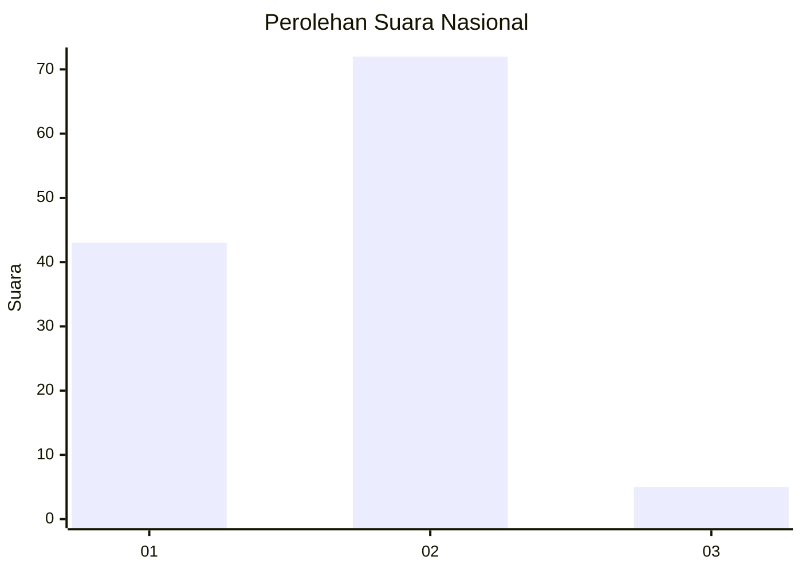
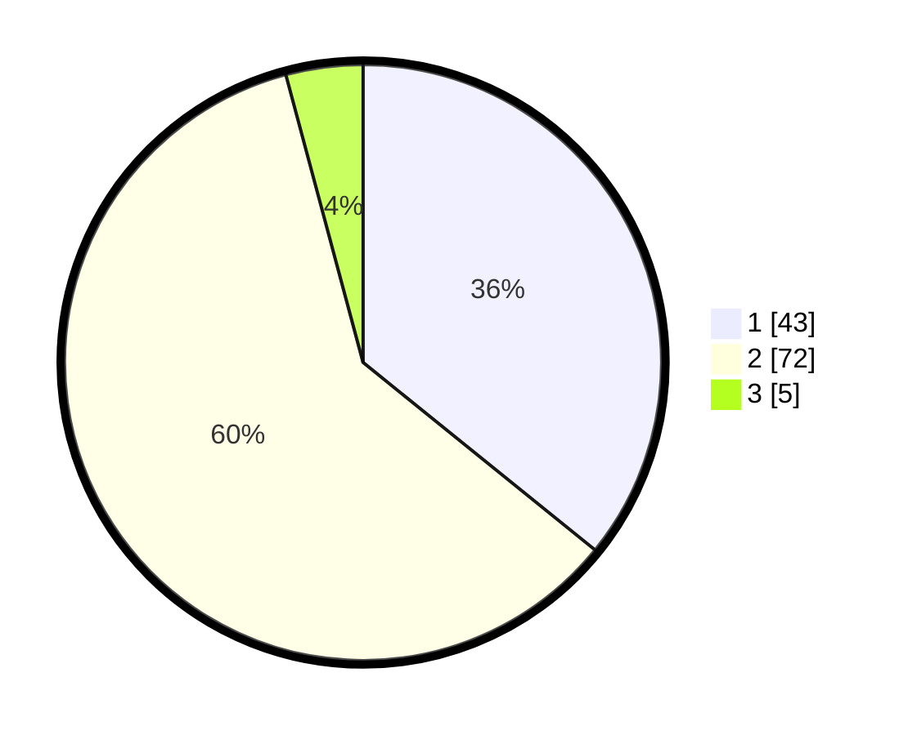

# Hasil

## Grafik

## Tabel

| No. | Nama Paslon    | Suara | Suara (raw) | Persentase |
|:--- |:-------------- | -----:| -----------:| ----------:|
| 1   | ANIES MUHAIMIN | 43    | [43][p-1]   | 35,83      |
| 2   | PRABOWO GIBRAN | 72    | [72][p-2]   | 60,00      |
| 3   | GANJAR MAHFUD  | 5     | [5][p-3]    | 4,17       |

[p-1]: https://github.com/gigit-pemilu/pemilu-2024/blob/main/pilpres/hitung-suara/sub/11-aceh/sub/10-aceh-singkil/sub/06-gunung-meriah/sub/2020-pandan-sari/sub/004-tps/sub/paslon-1.txt
[p-2]: https://github.com/gigit-pemilu/pemilu-2024/blob/main/pilpres/hitung-suara/sub/11-aceh/sub/10-aceh-singkil/sub/06-gunung-meriah/sub/2020-pandan-sari/sub/004-tps/sub/paslon-2.txt
[p-3]: https://github.com/gigit-pemilu/pemilu-2024/blob/main/pilpres/hitung-suara/sub/11-aceh/sub/10-aceh-singkil/sub/06-gunung-meriah/sub/2020-pandan-sari/sub/004-tps/sub/paslon-3.txt

## Foto C Plano

https://sirekap-obj-formc.kpu.go.id/e707/pemilu/ppwp/11/10/06/20/20/1110062020004-20240214-215059--33484072-b4bb-4141-bd3a-34832f10f164.jpg

https://sirekap-obj-formc.kpu.go.id/e707/pemilu/ppwp/11/10/06/20/20/1110062020004-20240226-182112--14ca3fbf-c753-4b5e-9d91-c780b318c24b.jpg

https://sirekap-obj-formc.kpu.go.id/e707/pemilu/ppwp/11/10/06/20/20/1110062020004-20240214-215135--e8014dee-fabb-46a6-b86f-01190131c34d.jpg

## Metadata

| Key        | Value               |
| ---------- | ------------------- |
| Time Stamp | 2024-02-26 19:00:00 |

## DATA PEMILIH TETAP

Jumlah pemilih dalam DPT: **134**.
 * L: **71**.
 * P: **63**.

## DATA PENGGUNA HAK PILIH

Jumlah pengguna hak pilih dalam DPT: **114**.
 * L: **61**.
 * P: **53**.

Jumlah pengguna hak pilih dalam DPTb: **3**.
 * L: **2**.
 * P: **1**.

Jumlah pengguna hak pilih dalam DPK: **6**.
 * L: **2**.
 * P: **4**.

Jumlah pengguna hak pilih: **123**.
 * L: **65**.
 * P: **58**.

## JUMLAH SUARA SAH DAN TIDAK SAH

JUMLAH SELURUH SUARA SAH: **120**.

JUMLAH SUARA TIDAK SAH: **3**.

JUMLAH SELURUH SUARA SAH DAN SUARA TIDAK SAH: **123**.

