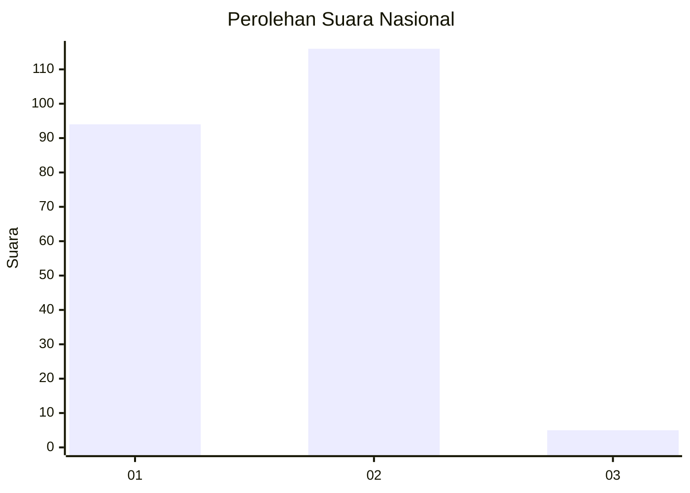
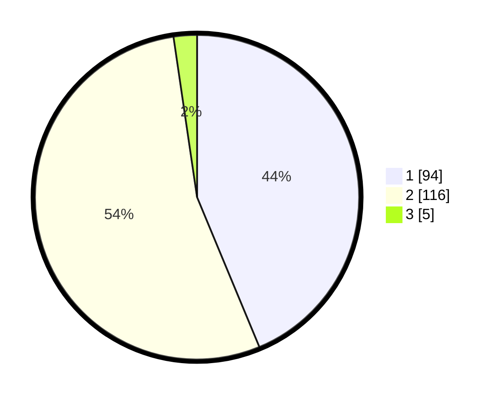

# Hasil

## Grafik

## Tabel

| No. | Nama Paslon    | Suara | Suara (raw) | Persentase |
|:--- |:-------------- | -----:| -----------:| ----------:|
| 1   | ANIES MUHAIMIN | 94    | [94][p-1]   | 43,72      |
| 2   | PRABOWO GIBRAN | 116   | [116][p-2]  | 53,95      |
| 3   | GANJAR MAHFUD  | 5     | [5][p-3]    | 2,33       |

[p-1]: https://github.com/gigit-pemilu/pemilu-2024/blob/main/pilpres/hitung-suara/sub/11-aceh/sub/10-aceh-singkil/sub/06-gunung-meriah/sub/2022-tulaan/sub/004-tps/sub/paslon-1.txt
[p-2]: https://github.com/gigit-pemilu/pemilu-2024/blob/main/pilpres/hitung-suara/sub/11-aceh/sub/10-aceh-singkil/sub/06-gunung-meriah/sub/2022-tulaan/sub/004-tps/sub/paslon-2.txt
[p-3]: https://github.com/gigit-pemilu/pemilu-2024/blob/main/pilpres/hitung-suara/sub/11-aceh/sub/10-aceh-singkil/sub/06-gunung-meriah/sub/2022-tulaan/sub/004-tps/sub/paslon-3.txt

## Foto C Plano

https://sirekap-obj-formc.kpu.go.id/b026/pemilu/ppwp/11/10/06/20/22/1110062022004-20240223-121514--4a2ae8c3-4d64-4864-b2d1-8434c0db57da.jpg

https://sirekap-obj-formc.kpu.go.id/b026/pemilu/ppwp/11/10/06/20/22/1110062022004-20240222-124637--5e2f9fb6-80e8-4fbb-bc94-4680faa94077.jpg

https://sirekap-obj-formc.kpu.go.id/b026/pemilu/ppwp/11/10/06/20/22/1110062022004-20240223-121407--6afdaaf2-6c3b-4368-8ab4-b5ab283969dc.jpg

## Metadata

| Key        | Value               |
| ---------- | ------------------- |
| Time Stamp | 2024-02-24 22:31:28 |

