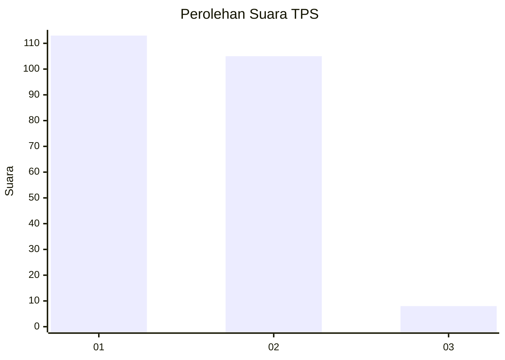
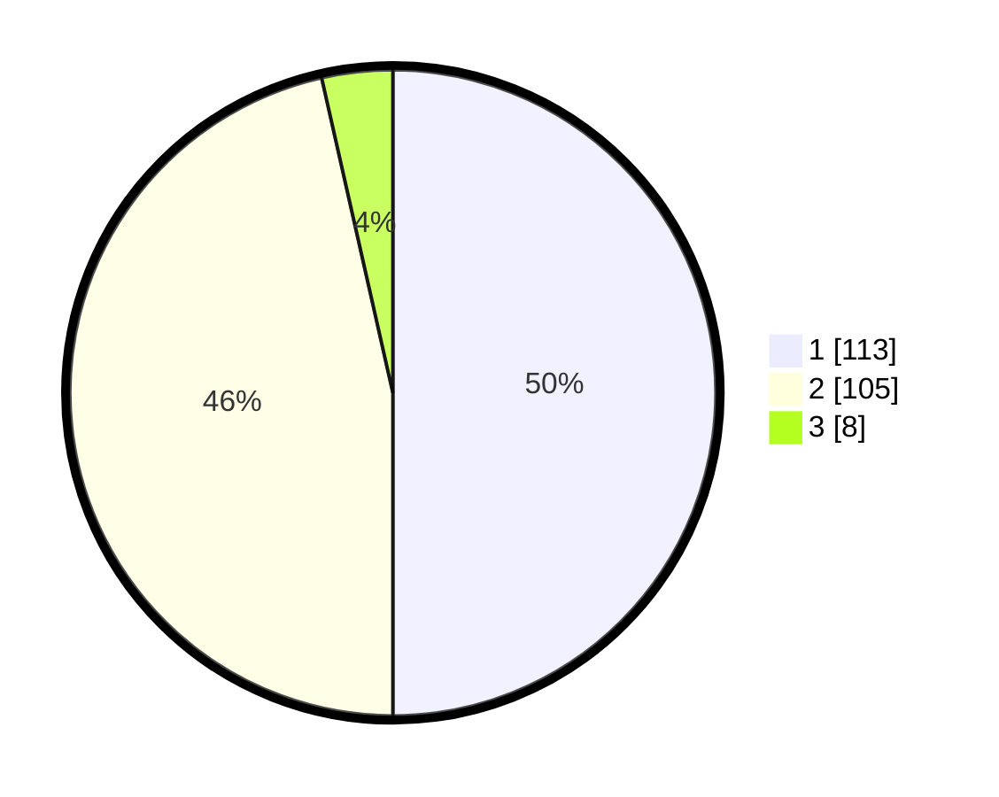

# Hasil

## Grafik

## Tabel

| No. | Nama Paslon    | Suara | Suara (raw) | Persentase |
|:--- |:-------------- | -----:| -----------:| ----------:|
| 1   | ANIES MUHAIMIN | 113   | [113][p-1]  | 50,00      |
| 2   | PRABOWO GIBRAN | 105   | [105][p-2]  | 46,46      |
| 3   | GANJAR MAHFUD  | 8     | [8][p-3]    | 3,54       |

[p-1]: https://github.com/gigit-pemilu/pemilu-2024-11-aceh/blob/main/pilpres/hitung-suara/sub/11-aceh/sub/10-aceh-singkil/sub/06-gunung-meriah/sub/2022-tulaan/sub/005-tps/sub/paslon-1.txt
[p-2]: https://github.com/gigit-pemilu/pemilu-2024-11-aceh/blob/main/pilpres/hitung-suara/sub/11-aceh/sub/10-aceh-singkil/sub/06-gunung-meriah/sub/2022-tulaan/sub/005-tps/sub/paslon-2.txt
[p-3]: https://github.com/gigit-pemilu/pemilu-2024-11-aceh/blob/main/pilpres/hitung-suara/sub/11-aceh/sub/10-aceh-singkil/sub/06-gunung-meriah/sub/2022-tulaan/sub/005-tps/sub/paslon-3.txt

## Foto C Plano

https://sirekap-obj-formc.kpu.go.id/6f7d/pemilu/ppwp/11/10/06/20/22/1110062022005-20240223-122113--cc061421-f1a7-4a42-9579-607ba92578a6.jpg

https://sirekap-obj-formc.kpu.go.id/6f7d/pemilu/ppwp/11/10/06/20/22/1110062022005-20240222-141832--95b95432-4d2b-48d8-941d-1611cc247e21.jpg

https://sirekap-obj-formc.kpu.go.id/6f7d/pemilu/ppwp/11/10/06/20/22/1110062022005-20240222-141947--38d96666-ad13-40fb-85c1-0e80de0d1460.jpg

## Metadata

| Key        | Value               |
| ---------- | ------------------- |
| Time Stamp | 2024-02-24 22:31:28 |

