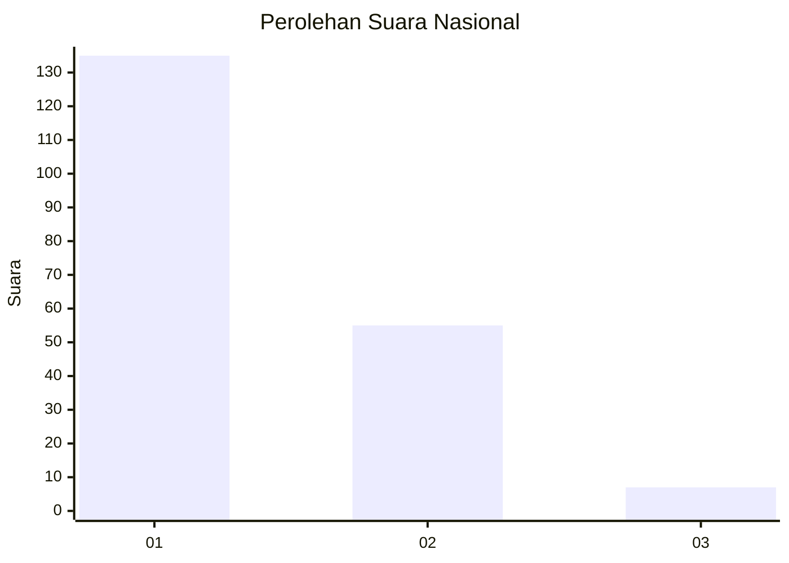
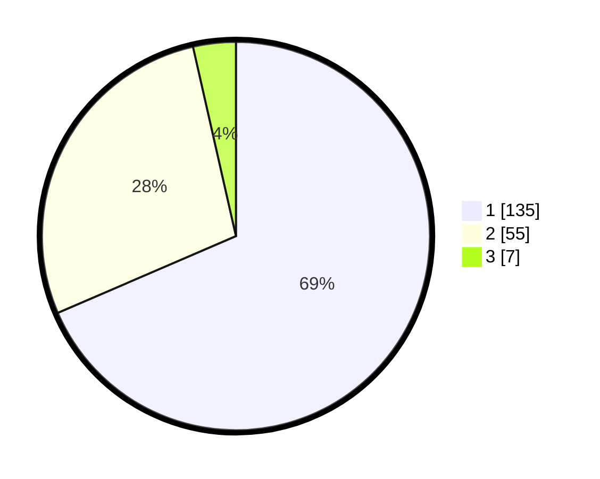

# Hasil

## Grafik

## Tabel

| No. | Nama Paslon    | Suara | Suara (raw) | Persentase |
|:--- |:-------------- | -----:| -----------:| ----------:|
| 1   | ANIES MUHAIMIN | 135   | [135][p-1]  | 68,53      |
| 2   | PRABOWO GIBRAN | 55    | [55][p-2]   | 27,92      |
| 3   | GANJAR MAHFUD  | 7     | [7][p-3]    | 3,55       |

[p-1]: https://github.com/gigit-pemilu/pemilu-2024/blob/main/pilpres/hitung-suara/sub/11-aceh/sub/10-aceh-singkil/sub/06-gunung-meriah/sub/2024-lae-butar/sub/007-tps/sub/paslon-1.txt
[p-2]: https://github.com/gigit-pemilu/pemilu-2024/blob/main/pilpres/hitung-suara/sub/11-aceh/sub/10-aceh-singkil/sub/06-gunung-meriah/sub/2024-lae-butar/sub/007-tps/sub/paslon-2.txt
[p-3]: https://github.com/gigit-pemilu/pemilu-2024/blob/main/pilpres/hitung-suara/sub/11-aceh/sub/10-aceh-singkil/sub/06-gunung-meriah/sub/2024-lae-butar/sub/007-tps/sub/paslon-3.txt

## Foto C Plano

https://sirekap-obj-formc.kpu.go.id/62ab/pemilu/ppwp/11/10/06/20/24/1110062024007-20240227-123441--7a50db3a-3f39-4dea-88d6-e992f86c5ff9.jpg

https://sirekap-obj-formc.kpu.go.id/62ab/pemilu/ppwp/11/10/06/20/24/1110062024007-20240227-123204--4700e9a7-445b-4e74-b990-ff40d640ca3e.jpg

https://sirekap-obj-formc.kpu.go.id/62ab/pemilu/ppwp/11/10/06/20/24/1110062024007-20240227-123333--7728adfc-a70d-4e2c-8fe1-33a549f10ad0.jpg

## Metadata

| Key        | Value               |
| ---------- | ------------------- |
| Time Stamp | 2024-02-27 22:00:00 |

## DATA PEMILIH TETAP

Jumlah pemilih dalam DPT: **212**.
 * L: **100**.
 * P: **112**.

## DATA PENGGUNA HAK PILIH

Jumlah pengguna hak pilih dalam DPT: **290**.
 * L: **92**.
 * P: **98**.

Jumlah pengguna hak pilih dalam DPTb: **202**.
 * L: **0**.
 * P: **2**.

Jumlah pengguna hak pilih dalam DPK: **9**.
 * L: **5**.
 * P: **4**.

Jumlah pengguna hak pilih: **129**.
 * L: **97**.
 * P: **2**.

## JUMLAH SUARA SAH DAN TIDAK SAH

JUMLAH SELURUH SUARA SAH: **197**.

JUMLAH SUARA TIDAK SAH: **2**.

JUMLAH SELURUH SUARA SAH DAN SUARA TIDAK SAH: **199**.

