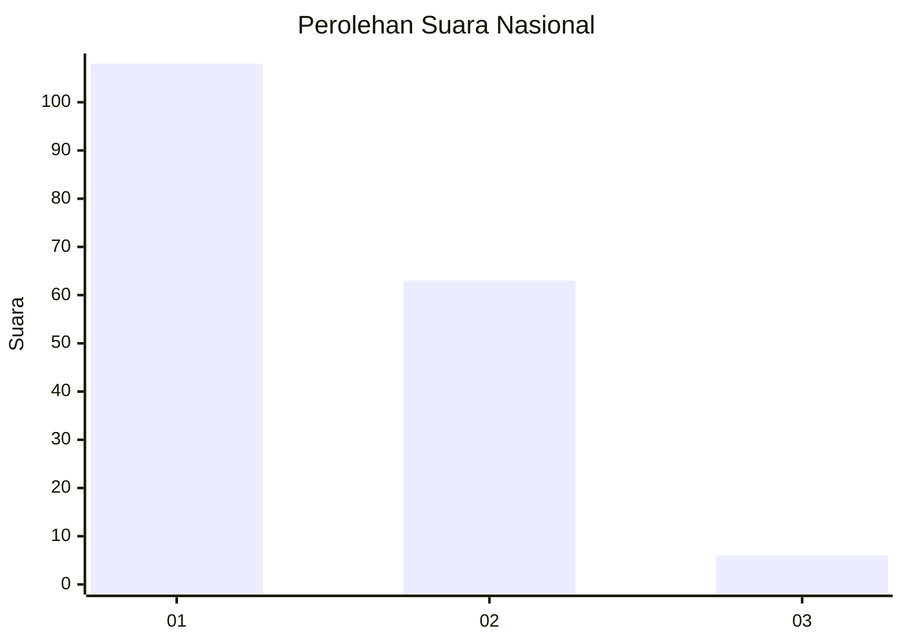
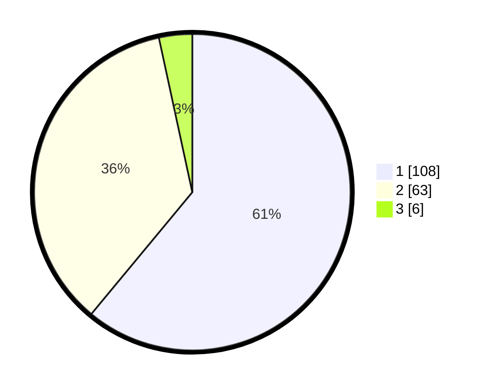

# Hasil

## Grafik

## Tabel

| No. | Nama Paslon    | Suara | Suara (raw) | Persentase |
|:--- |:-------------- | -----:| -----------:| ----------:|
| 1   | ANIES MUHAIMIN | 108   | [108][p-1]  | 61,02      |
| 2   | PRABOWO GIBRAN | 63    | [63][p-2]   | 35,59      |
| 3   | GANJAR MAHFUD  | 6     | [6][p-3]    | 3,39       |

[p-1]: https://github.com/gigit-pemilu/pemilu-2024/blob/main/pilpres/hitung-suara/sub/11-aceh/sub/10-aceh-singkil/sub/06-gunung-meriah/sub/2025-sianjo-anjo-meriah/sub/001-tps/sub/paslon-1.txt
[p-2]: https://github.com/gigit-pemilu/pemilu-2024/blob/main/pilpres/hitung-suara/sub/11-aceh/sub/10-aceh-singkil/sub/06-gunung-meriah/sub/2025-sianjo-anjo-meriah/sub/001-tps/sub/paslon-2.txt
[p-3]: https://github.com/gigit-pemilu/pemilu-2024/blob/main/pilpres/hitung-suara/sub/11-aceh/sub/10-aceh-singkil/sub/06-gunung-meriah/sub/2025-sianjo-anjo-meriah/sub/001-tps/sub/paslon-3.txt

## Foto C Plano

https://sirekap-obj-formc.kpu.go.id/a6dd/pemilu/ppwp/11/10/06/20/25/1110062025001-20240219-112808--d7f1ecbd-d2e5-4d41-8718-2e0e1a0569ba.jpg

https://sirekap-obj-formc.kpu.go.id/a6dd/pemilu/ppwp/11/10/06/20/25/1110062025001-20240219-112849--0f2cd4cf-8ffd-4443-970b-36cf3036cc6f.jpg

https://sirekap-obj-formc.kpu.go.id/a6dd/pemilu/ppwp/11/10/06/20/25/1110062025001-20240219-113005--56de7fb0-cc5a-4518-bed0-9e46aae8e866.jpg

## Metadata

| Key        | Value               |
| ---------- | ------------------- |
| Time Stamp | 2024-02-19 12:00:00 |

## DATA PEMILIH TETAP

Jumlah pemilih dalam DPT: **194**.
 * L: **102**.
 * P: **92**.

## DATA PENGGUNA HAK PILIH

Jumlah pengguna hak pilih dalam DPT: **173**.
 * L: **89**.
 * P: **84**.

Jumlah pengguna hak pilih dalam DPTb: **2**.
 * L: **1**.
 * P: **1**.

Jumlah pengguna hak pilih dalam DPK: **3**.
 * L: **2**.
 * P: **1**.

Jumlah pengguna hak pilih: **178**.
 * L: **92**.
 * P: **86**.

## JUMLAH SUARA SAH DAN TIDAK SAH

JUMLAH SELURUH SUARA SAH: **177**.

JUMLAH SUARA TIDAK SAH: **1**.

JUMLAH SELURUH SUARA SAH DAN SUARA TIDAK SAH: **178**.

