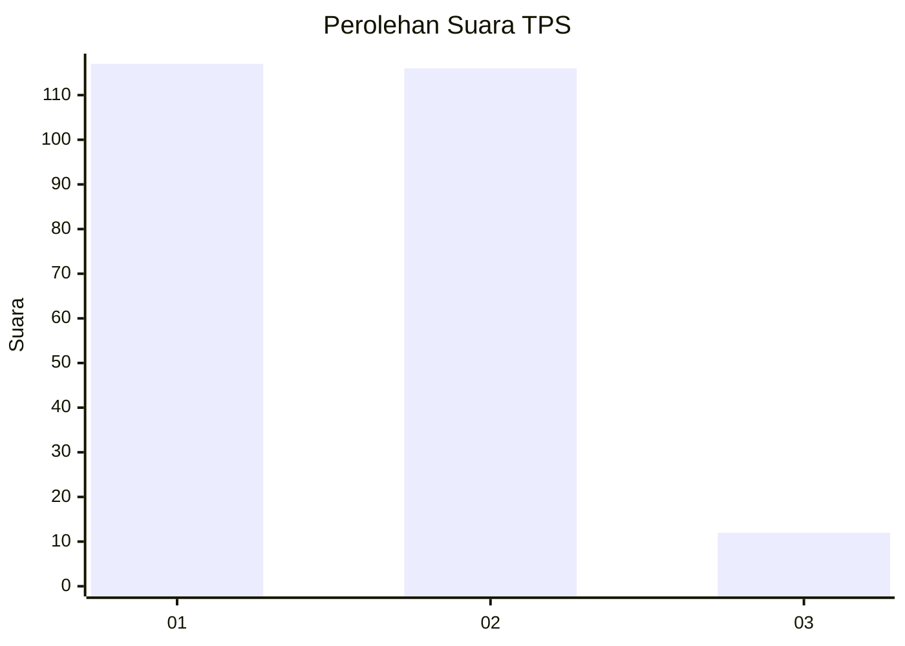
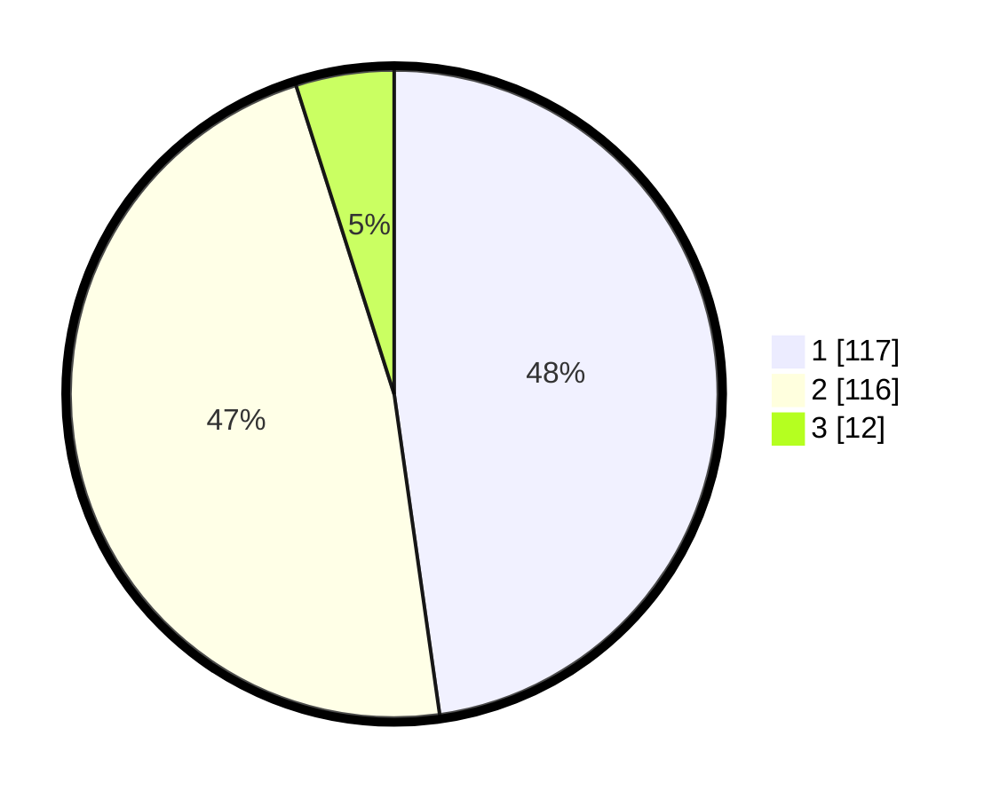

# Hasil

## Grafik

## Tabel

| No. | Nama Paslon    | Suara | Suara (raw) | Persentase |
|:--- |:-------------- | -----:| -----------:| ----------:|
| 1   | ANIES MUHAIMIN | 117   | [117][p-1]  | 47,76      |
| 2   | PRABOWO GIBRAN | 116   | [116][p-2]  | 47,35      |
| 3   | GANJAR MAHFUD  | 12    | [12][p-3]   | 4,90       |

[p-1]: https://github.com/gigit-pemilu/pemilu-2024-11-aceh/blob/main/pilpres/hitung-suara/sub/11-aceh/sub/10-aceh-singkil/sub/09-kota-baharu/sub/2004-samar-dua/sub/001-tps/sub/paslon-1.txt
[p-2]: https://github.com/gigit-pemilu/pemilu-2024-11-aceh/blob/main/pilpres/hitung-suara/sub/11-aceh/sub/10-aceh-singkil/sub/09-kota-baharu/sub/2004-samar-dua/sub/001-tps/sub/paslon-2.txt
[p-3]: https://github.com/gigit-pemilu/pemilu-2024-11-aceh/blob/main/pilpres/hitung-suara/sub/11-aceh/sub/10-aceh-singkil/sub/09-kota-baharu/sub/2004-samar-dua/sub/001-tps/sub/paslon-3.txt

## Foto C Plano

https://sirekap-obj-formc.kpu.go.id/1f34/pemilu/ppwp/11/10/09/20/04/1110092004001-20240220-155816--eb4f8de5-831e-4ffa-a99f-c01a4ff49178.jpg

https://sirekap-obj-formc.kpu.go.id/1f34/pemilu/ppwp/11/10/09/20/04/1110092004001-20240220-160953--3bdc3a19-5e34-4c68-b16e-a8cd7ba0c156.jpg

https://sirekap-obj-formc.kpu.go.id/1f34/pemilu/ppwp/11/10/09/20/04/1110092004001-20240220-161104--cb7cf7c9-96e3-4e66-acd7-9f203e63ab94.jpg

## Metadata

| Key        | Value               |
| ---------- | ------------------- |
| Time Stamp | 2024-02-20 17:00:00 |

## DATA PEMILIH TETAP

Jumlah pemilih dalam DPT: **269**.
 * L: **125**.
 * P: **144**.

## DATA PENGGUNA HAK PILIH

Jumlah pengguna hak pilih dalam DPT: **261**.
 * L: **122**.
 * P: **139**.

Jumlah pengguna hak pilih dalam DPTb: **3**.
 * L: **2**.
 * P: **1**.

Jumlah pengguna hak pilih dalam DPK: **0**.
 * L: **0**.
 * P: **0**.

Jumlah pengguna hak pilih: **264**.
 * L: **124**.
 * P: **140**.

## JUMLAH SUARA SAH DAN TIDAK SAH

JUMLAH SELURUH SUARA SAH: **245**.

JUMLAH SUARA TIDAK SAH: **19**.

JUMLAH SELURUH SUARA SAH DAN SUARA TIDAK SAH: **264**.

