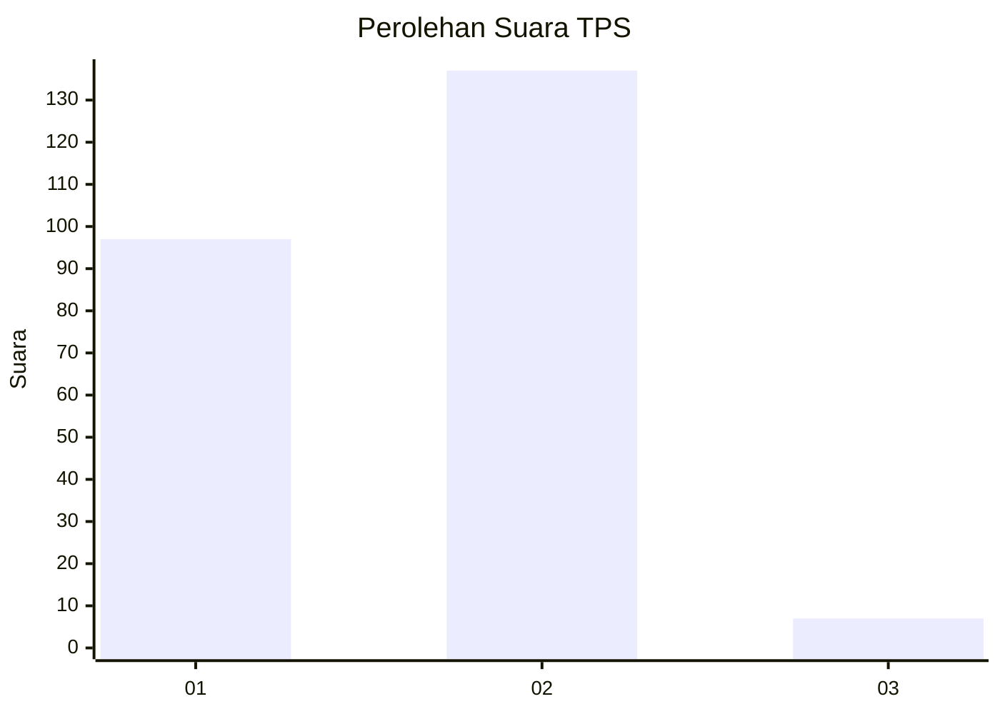
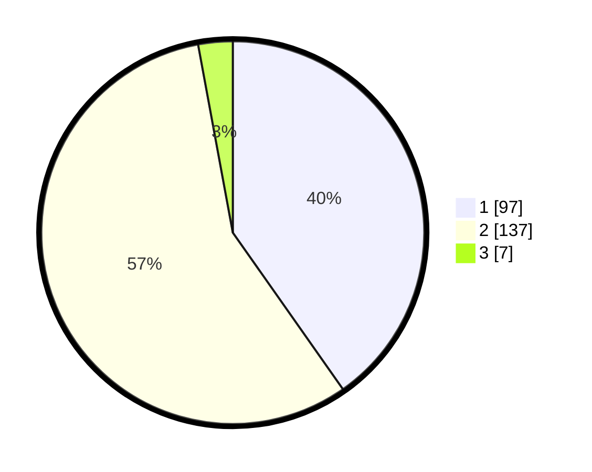

# Hasil

## Grafik

## Tabel

| No. | Nama Paslon    | Suara | Suara (raw) | Persentase |
|:--- |:-------------- | -----:| -----------:| ----------:|
| 1   | ANIES MUHAIMIN | 97    | [97][p-1]   | 40,25      |
| 2   | PRABOWO GIBRAN | 137   | [137][p-2]  | 56,85      |
| 3   | GANJAR MAHFUD  | 7     | [7][p-3]    | 2,90       |

[p-1]: https://github.com/gigit-pemilu/pemilu-2024-11-aceh/blob/main/pilpres/hitung-suara/sub/11-aceh/sub/10-aceh-singkil/sub/09-kota-baharu/sub/2006-muara-pea/sub/001-tps/sub/paslon-1.txt
[p-2]: https://github.com/gigit-pemilu/pemilu-2024-11-aceh/blob/main/pilpres/hitung-suara/sub/11-aceh/sub/10-aceh-singkil/sub/09-kota-baharu/sub/2006-muara-pea/sub/001-tps/sub/paslon-2.txt
[p-3]: https://github.com/gigit-pemilu/pemilu-2024-11-aceh/blob/main/pilpres/hitung-suara/sub/11-aceh/sub/10-aceh-singkil/sub/09-kota-baharu/sub/2006-muara-pea/sub/001-tps/sub/paslon-3.txt

## Foto C Plano

https://sirekap-obj-formc.kpu.go.id/c004/pemilu/ppwp/11/10/09/20/06/1110092006001-20240219-235341--076f31de-b5e0-40dd-8126-fe859756490c.jpg

https://sirekap-obj-formc.kpu.go.id/c004/pemilu/ppwp/11/10/09/20/06/1110092006001-20240219-234611--6d2d1776-3ce6-4e13-b0a0-0b14af576f49.jpg

https://sirekap-obj-formc.kpu.go.id/c004/pemilu/ppwp/11/10/09/20/06/1110092006001-20240219-234751--003a63d6-ea06-42ad-98bb-02acde5c1293.jpg

## Metadata

| Key        | Value               |
| ---------- | ------------------- |
| Time Stamp | 2024-02-20 00:00:00 |

