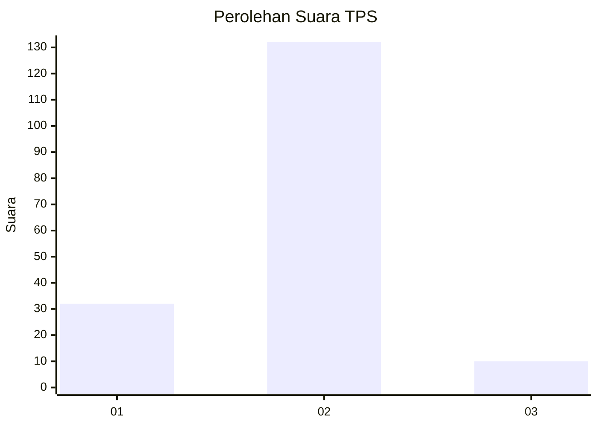
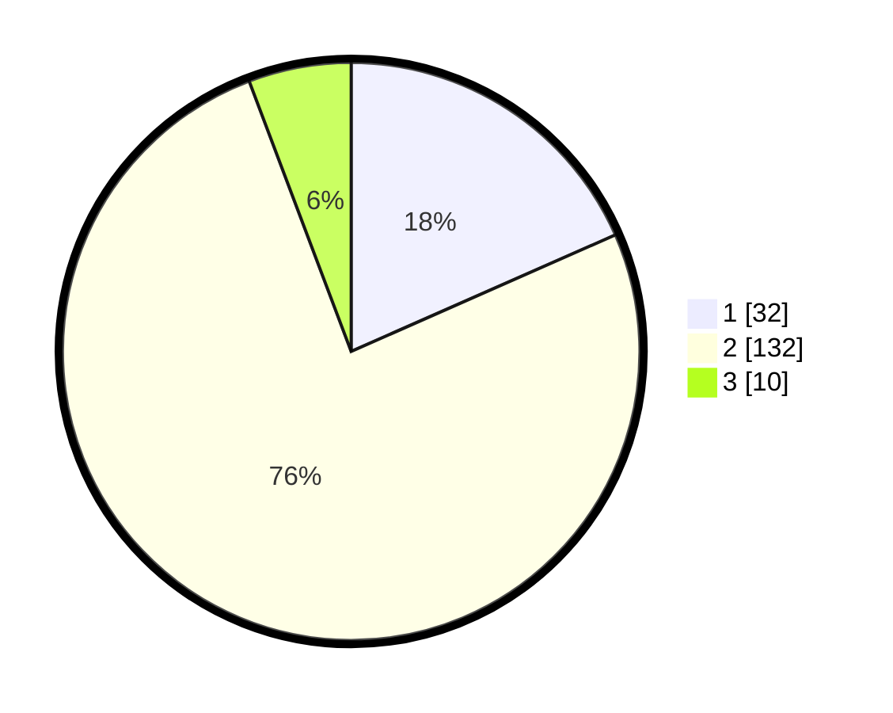

# Hasil

## Grafik

## Tabel

| No. | Nama Paslon    | Suara | Suara (raw) | Persentase |
|:--- |:-------------- | -----:| -----------:| ----------:|
| 1   | ANIES MUHAIMIN | 32    | [32][p-1]   | 18,39      |
| 2   | PRABOWO GIBRAN | 132   | [132][p-2]  | 75,86      |
| 3   | GANJAR MAHFUD  | 10    | [10][p-3]   | 5,75       |

[p-1]: https://github.com/gigit-pemilu/pemilu-2024-11-aceh/blob/main/pilpres/hitung-suara/sub/11-aceh/sub/10-aceh-singkil/sub/09-kota-baharu/sub/2008-sumber-mukti/sub/005-tps/sub/paslon-1.txt
[p-2]: https://github.com/gigit-pemilu/pemilu-2024-11-aceh/blob/main/pilpres/hitung-suara/sub/11-aceh/sub/10-aceh-singkil/sub/09-kota-baharu/sub/2008-sumber-mukti/sub/005-tps/sub/paslon-2.txt
[p-3]: https://github.com/gigit-pemilu/pemilu-2024-11-aceh/blob/main/pilpres/hitung-suara/sub/11-aceh/sub/10-aceh-singkil/sub/09-kota-baharu/sub/2008-sumber-mukti/sub/005-tps/sub/paslon-3.txt

## Foto C Plano

https://sirekap-obj-formc.kpu.go.id/7745/pemilu/ppwp/11/10/09/20/08/1110092008005-20240218-113538--c0a7c03d-bdde-42ea-abfd-938dca0bd37d.jpg

https://sirekap-obj-formc.kpu.go.id/7745/pemilu/ppwp/11/10/09/20/08/1110092008005-20240215-023314--3345a96f-d090-4159-b7db-d13f3f5c12a4.jpg

https://sirekap-obj-formc.kpu.go.id/7745/pemilu/ppwp/11/10/09/20/08/1110092008005-20240215-023420--9ae52061-e271-4f10-8997-0bff2fe79591.jpg

## Metadata

| Key        | Value               |
| ---------- | ------------------- |
| Time Stamp | 2024-02-19 06:16:00 |

