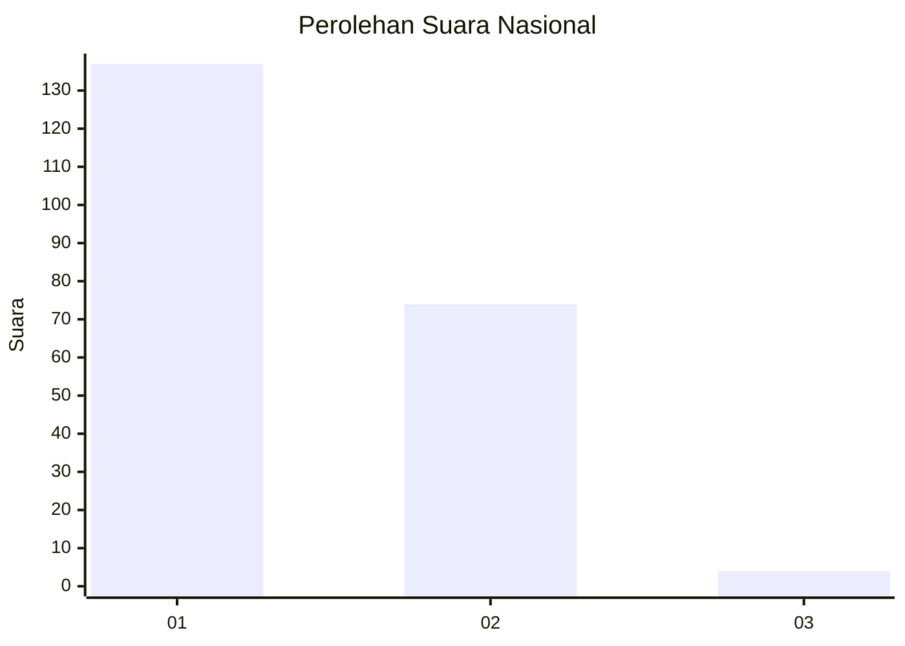
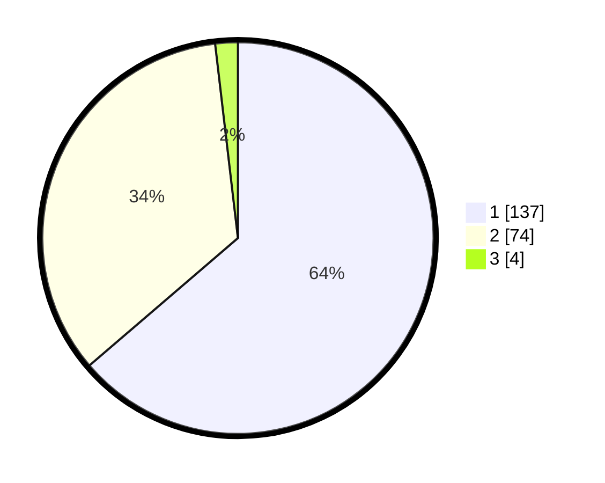

# Hasil

## Grafik

## Tabel

| No. | Nama Paslon    | Suara | Suara (raw) | Persentase |
|:--- |:-------------- | -----:| -----------:| ----------:|
| 1   | ANIES MUHAIMIN | 137   | [137][p-1]  | 63,72      |
| 2   | PRABOWO GIBRAN | 74    | [74][p-2]   | 34,42      |
| 3   | GANJAR MAHFUD  | 4     | [4][p-3]    | 1,86       |

[p-1]: https://github.com/gigit-pemilu/pemilu-2024/blob/main/pilpres/hitung-suara/sub/11-aceh/sub/10-aceh-singkil/sub/10-singkil-utara/sub/2002-gosong-telaga-selatan/sub/002-tps/sub/paslon-1.txt
[p-2]: https://github.com/gigit-pemilu/pemilu-2024/blob/main/pilpres/hitung-suara/sub/11-aceh/sub/10-aceh-singkil/sub/10-singkil-utara/sub/2002-gosong-telaga-selatan/sub/002-tps/sub/paslon-2.txt
[p-3]: https://github.com/gigit-pemilu/pemilu-2024/blob/main/pilpres/hitung-suara/sub/11-aceh/sub/10-aceh-singkil/sub/10-singkil-utara/sub/2002-gosong-telaga-selatan/sub/002-tps/sub/paslon-3.txt

## Foto C Plano

https://sirekap-obj-formc.kpu.go.id/5a61/pemilu/ppwp/11/10/10/20/02/1110102002002-20240219-104736--ba20e872-3412-4154-8846-0c569376521a.jpg

https://sirekap-obj-formc.kpu.go.id/5a61/pemilu/ppwp/11/10/10/20/02/1110102002002-20240219-104857--38c642ae-91b9-40e1-a787-ffda626f45fd.jpg

https://sirekap-obj-formc.kpu.go.id/5a61/pemilu/ppwp/11/10/10/20/02/1110102002002-20240219-105040--32268dda-c624-4e4c-a703-66bc2207bfb3.jpg

## Metadata

| Key        | Value               |
| ---------- | ------------------- |
| Time Stamp | 2024-02-19 11:00:00 |

## DATA PEMILIH TETAP

Jumlah pemilih dalam DPT: **246**.
 * L: **130**.
 * P: **116**.

## DATA PENGGUNA HAK PILIH

Jumlah pengguna hak pilih dalam DPT: **222**.
 * L: **110**.
 * P: **112**.

Jumlah pengguna hak pilih dalam DPTb: **2**.
 * L: **0**.
 * P: **2**.

Jumlah pengguna hak pilih dalam DPK: **0**.
 * L: **0**.
 * P: **0**.

Jumlah pengguna hak pilih: **224**.
 * L: **110**.
 * P: **114**.

## JUMLAH SUARA SAH DAN TIDAK SAH

JUMLAH SELURUH SUARA SAH: **215**.

JUMLAH SUARA TIDAK SAH: **9**.

JUMLAH SELURUH SUARA SAH DAN SUARA TIDAK SAH: **224**.

