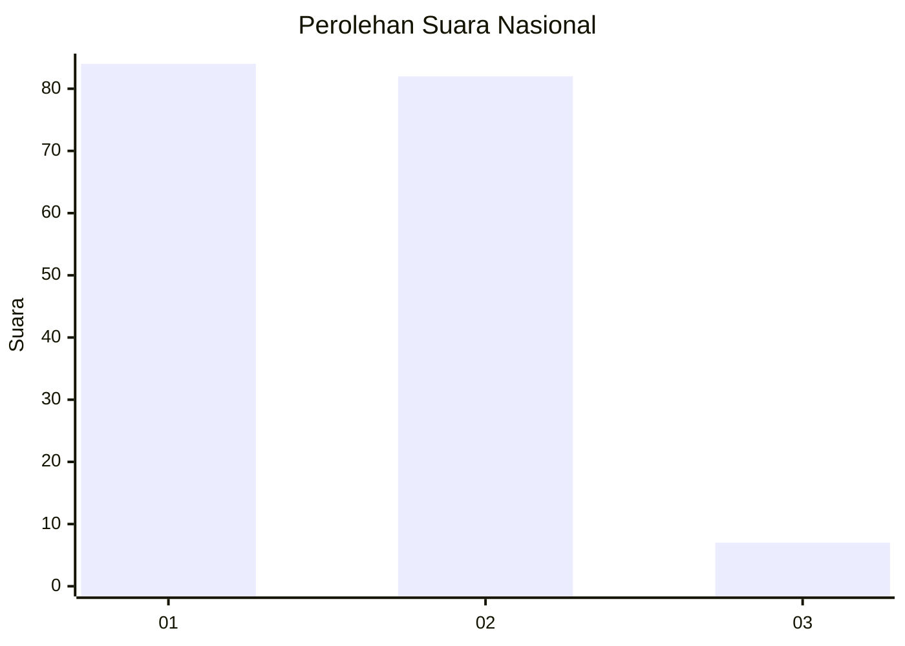
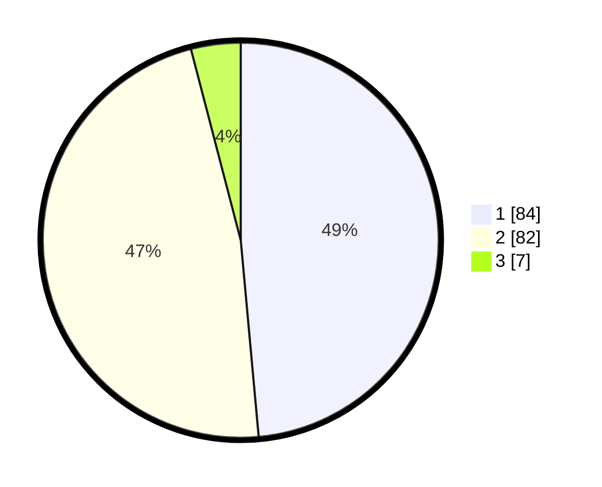

# Hasil

## Grafik

## Tabel

| No. | Nama Paslon    | Suara | Suara (raw) | Persentase |
|:--- |:-------------- | -----:| -----------:| ----------:|
| 1   | ANIES MUHAIMIN | 84    | [84][p-1]   | 48,55      |
| 2   | PRABOWO GIBRAN | 82    | [82][p-2]   | 47,40      |
| 3   | GANJAR MAHFUD  | 7     | [7][p-3]    | 4,05       |

[p-1]: https://github.com/gigit-pemilu/pemilu-2024/blob/main/pilpres/hitung-suara/sub/11-aceh/sub/10-aceh-singkil/sub/10-singkil-utara/sub/2003-kampung-baru/sub/002-tps/sub/paslon-1.txt
[p-2]: https://github.com/gigit-pemilu/pemilu-2024/blob/main/pilpres/hitung-suara/sub/11-aceh/sub/10-aceh-singkil/sub/10-singkil-utara/sub/2003-kampung-baru/sub/002-tps/sub/paslon-2.txt
[p-3]: https://github.com/gigit-pemilu/pemilu-2024/blob/main/pilpres/hitung-suara/sub/11-aceh/sub/10-aceh-singkil/sub/10-singkil-utara/sub/2003-kampung-baru/sub/002-tps/sub/paslon-3.txt

## Foto C Plano

https://sirekap-obj-formc.kpu.go.id/4fe0/pemilu/ppwp/11/10/10/20/03/1110102003002-20240219-161940--97155401-51aa-4bca-a4c0-55df7f955830.jpg

https://sirekap-obj-formc.kpu.go.id/4fe0/pemilu/ppwp/11/10/10/20/03/1110102003002-20240219-162107--3b8b6693-1752-4e0d-b6ea-190c45d6c680.jpg

https://sirekap-obj-formc.kpu.go.id/4fe0/pemilu/ppwp/11/10/10/20/03/1110102003002-20240219-162149--5dfab4f0-4b42-4710-b9be-c8b1676efd3f.jpg

## Metadata

| Key        | Value               |
| ---------- | ------------------- |
| Time Stamp | 2024-02-24 22:31:28 |

## DATA PEMILIH TETAP

Jumlah pemilih dalam DPT: **372**.
 * L: **48**.
 * P: **70**.

## DATA PENGGUNA HAK PILIH

Jumlah pengguna hak pilih dalam DPT: **120**.
 * L: **84**.
 * P: **86**.

Jumlah pengguna hak pilih dalam DPTb: **2**.
 * L: **4**.
 * P: **8**.

Jumlah pengguna hak pilih dalam DPK: **3**.
 * L: **76**.
 * P: **3**.

Jumlah pengguna hak pilih: **106**.
 * L: **93**.
 * P: **90**.

## JUMLAH SUARA SAH DAN TIDAK SAH

JUMLAH SELURUH SUARA SAH: **173**.

JUMLAH SUARA TIDAK SAH: **8**.

JUMLAH SELURUH SUARA SAH DAN SUARA TIDAK SAH: **181**.

