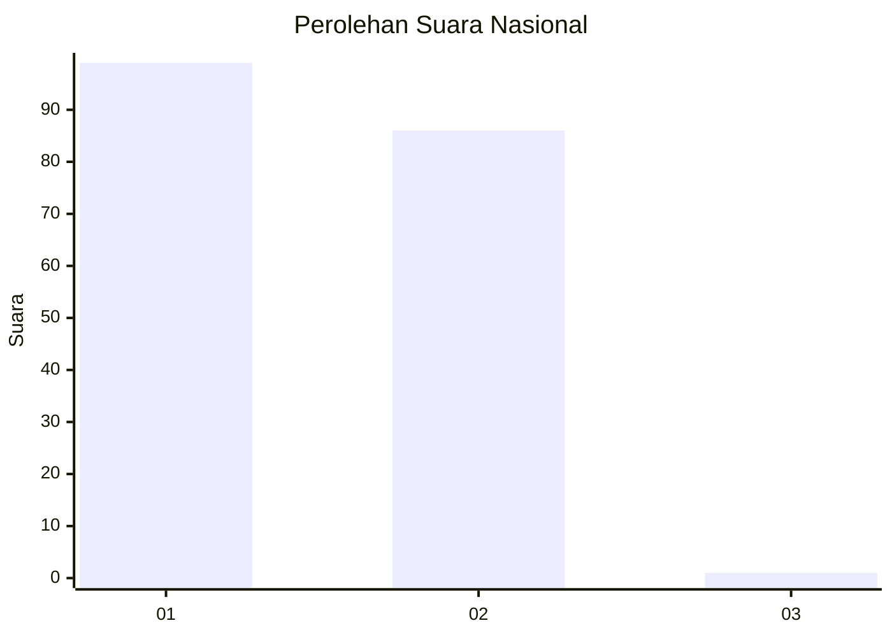
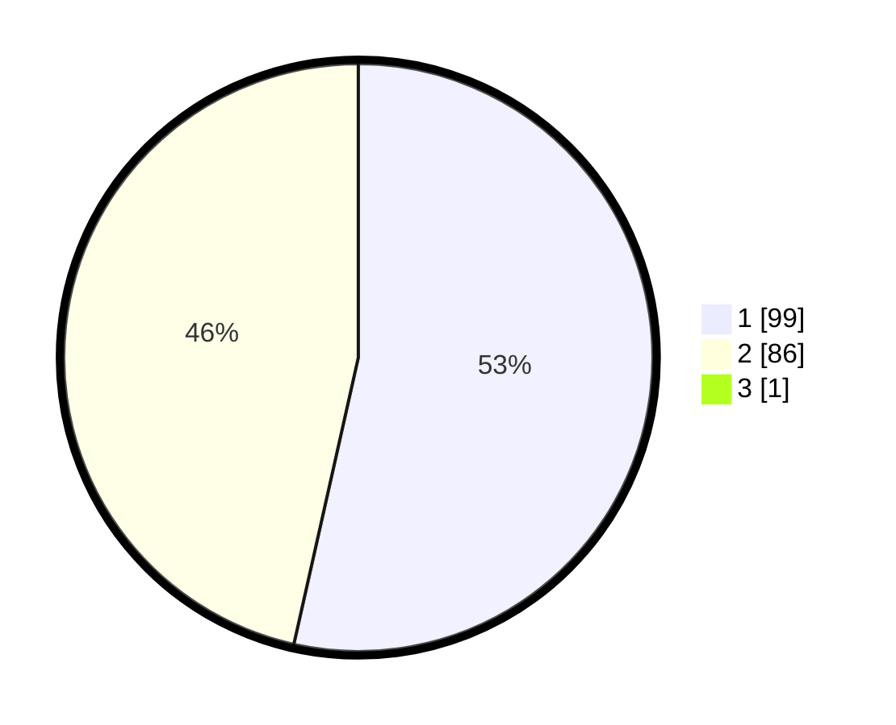

# Hasil

## Grafik

## Tabel

| No. | Nama Paslon    | Suara | Suara (raw) | Persentase |
|:--- |:-------------- | -----:| -----------:| ----------:|
| 1   | ANIES MUHAIMIN | 99    | [99][p-1]   | 53,23      |
| 2   | PRABOWO GIBRAN | 86    | [86][p-2]   | 46,24      |
| 3   | GANJAR MAHFUD  | 1     | [1][p-3]    | 0,54       |

[p-1]: https://github.com/gigit-pemilu/pemilu-2024/blob/main/pilpres/hitung-suara/sub/11-aceh/sub/10-aceh-singkil/sub/10-singkil-utara/sub/2003-kampung-baru/sub/005-tps/sub/paslon-1.txt
[p-2]: https://github.com/gigit-pemilu/pemilu-2024/blob/main/pilpres/hitung-suara/sub/11-aceh/sub/10-aceh-singkil/sub/10-singkil-utara/sub/2003-kampung-baru/sub/005-tps/sub/paslon-2.txt
[p-3]: https://github.com/gigit-pemilu/pemilu-2024/blob/main/pilpres/hitung-suara/sub/11-aceh/sub/10-aceh-singkil/sub/10-singkil-utara/sub/2003-kampung-baru/sub/005-tps/sub/paslon-3.txt

## Foto C Plano

https://sirekap-obj-formc.kpu.go.id/8ff8/pemilu/ppwp/11/10/10/20/03/1110102003005-20240219-232504--10b74513-6bc4-4899-b601-dd99f4099926.jpg

https://sirekap-obj-formc.kpu.go.id/8ff8/pemilu/ppwp/11/10/10/20/03/1110102003005-20240219-232604--bcc891fd-e75c-45c9-963e-5253edb0fda3.jpg

https://sirekap-obj-formc.kpu.go.id/8ff8/pemilu/ppwp/11/10/10/20/03/1110102003005-20240219-232803--ae52aedc-d9c6-4326-9d7b-bc291b912d5f.jpg

## Metadata

| Key        | Value               |
| ---------- | ------------------- |
| Time Stamp | 2024-02-24 22:31:28 |

## DATA PEMILIH TETAP

Jumlah pemilih dalam DPT: **230**.
 * L: **289**.
 * P: **259**.

## DATA PENGGUNA HAK PILIH

Jumlah pengguna hak pilih dalam DPT: **887**.
 * L: **295**.
 * P: **993**.

Jumlah pengguna hak pilih dalam DPTb: **2**.
 * L: **8**.
 * P: **208**.

Jumlah pengguna hak pilih dalam DPK: **6**.
 * L: **93**.
 * P: **3**.

Jumlah pengguna hak pilih: **290**.
 * L: **29**.
 * P: **93**.

## JUMLAH SUARA SAH DAN TIDAK SAH

JUMLAH SELURUH SUARA SAH: **186**.

JUMLAH SUARA TIDAK SAH: **4**.

JUMLAH SELURUH SUARA SAH DAN SUARA TIDAK SAH: **190**.

