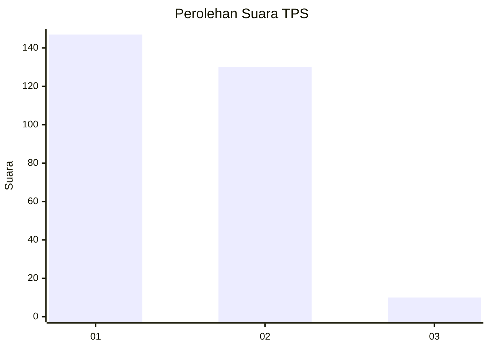
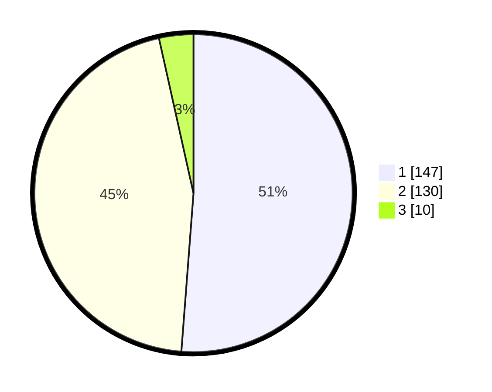

# Hasil

## Grafik

## Tabel

| No. | Nama Paslon    | Suara | Suara (raw) | Persentase |
|:--- |:-------------- | -----:| -----------:| ----------:|
| 1   | ANIES MUHAIMIN | 147   | [147][p-1]  | 51,22      |
| 2   | PRABOWO GIBRAN | 130   | [130][p-2]  | 45,30      |
| 3   | GANJAR MAHFUD  | 10    | [10][p-3]   | 3,48       |

[p-1]: https://github.com/gigit-pemilu/pemilu-2024-11-aceh/blob/main/pilpres/hitung-suara/sub/11-aceh/sub/10-aceh-singkil/sub/10-singkil-utara/sub/2004-ketapang-indah/sub/001-tps/sub/paslon-1.txt
[p-2]: https://github.com/gigit-pemilu/pemilu-2024-11-aceh/blob/main/pilpres/hitung-suara/sub/11-aceh/sub/10-aceh-singkil/sub/10-singkil-utara/sub/2004-ketapang-indah/sub/001-tps/sub/paslon-2.txt
[p-3]: https://github.com/gigit-pemilu/pemilu-2024-11-aceh/blob/main/pilpres/hitung-suara/sub/11-aceh/sub/10-aceh-singkil/sub/10-singkil-utara/sub/2004-ketapang-indah/sub/001-tps/sub/paslon-3.txt

## Foto C Plano

https://sirekap-obj-formc.kpu.go.id/1bee/pemilu/ppwp/11/10/10/20/04/1110102004001-20240221-202951--51ba3be8-e490-432e-afa4-170ec3d0c5f2.jpg

https://sirekap-obj-formc.kpu.go.id/1bee/pemilu/ppwp/11/10/10/20/04/1110102004001-20240221-203055--95d8e85f-ba21-4ef7-bd5f-d57982c57361.jpg

https://sirekap-obj-formc.kpu.go.id/1bee/pemilu/ppwp/11/10/10/20/04/1110102004001-20240221-203151--796db2da-3f71-4988-a74b-0d1113991deb.jpg

## Metadata

| Key        | Value               |
| ---------- | ------------------- |
| Time Stamp | 2024-02-24 22:31:28 |

## DATA PEMILIH TETAP

Jumlah pemilih dalam DPT: **226**.
 * L: **234**.
 * P: **152**.

## DATA PENGGUNA HAK PILIH

Jumlah pengguna hak pilih dalam DPT: **246**.
 * L: **448**.
 * P: **228**.

Jumlah pengguna hak pilih dalam DPTb: **32**.
 * L: **239**.
 * P: **964**.

Jumlah pengguna hak pilih dalam DPK: **655**.
 * L: **904**.
 * P: **668**.

Jumlah pengguna hak pilih: **292**.
 * L: **852**.
 * P: **640**.

## JUMLAH SUARA SAH DAN TIDAK SAH

JUMLAH SELURUH SUARA SAH: **287**.

JUMLAH SUARA TIDAK SAH: **5**.

JUMLAH SELURUH SUARA SAH DAN SUARA TIDAK SAH: **292**.

