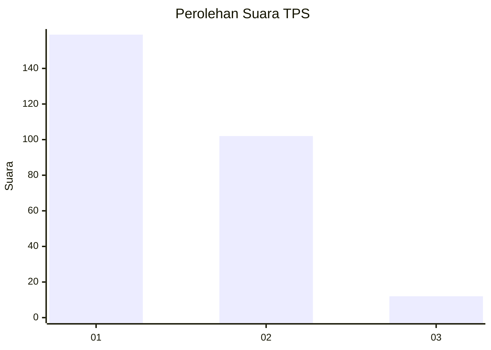
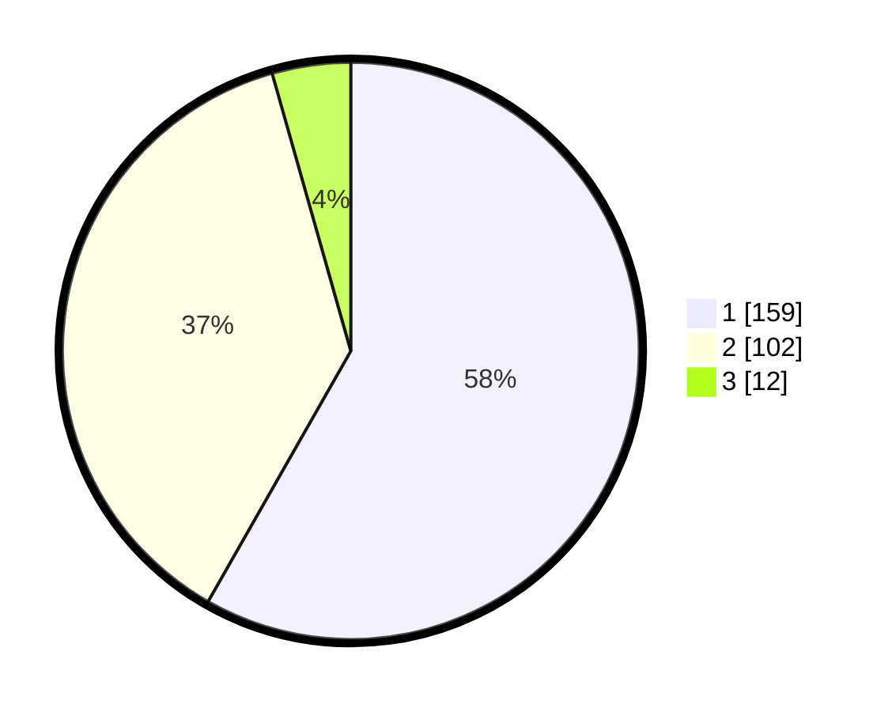

# Hasil

## Grafik

## Tabel

| No. | Nama Paslon    | Suara | Suara (raw) | Persentase |
|:--- |:-------------- | -----:| -----------:| ----------:|
| 1   | ANIES MUHAIMIN | 159   | [159][p-1]  | 58,24      |
| 2   | PRABOWO GIBRAN | 102   | [102][p-2]  | 37,36      |
| 3   | GANJAR MAHFUD  | 12    | [12][p-3]   | 4,40       |

[p-1]: https://github.com/gigit-pemilu/pemilu-2024-11-aceh/blob/main/pilpres/hitung-suara/sub/11-aceh/sub/10-aceh-singkil/sub/10-singkil-utara/sub/2004-ketapang-indah/sub/002-tps/sub/paslon-1.txt
[p-2]: https://github.com/gigit-pemilu/pemilu-2024-11-aceh/blob/main/pilpres/hitung-suara/sub/11-aceh/sub/10-aceh-singkil/sub/10-singkil-utara/sub/2004-ketapang-indah/sub/002-tps/sub/paslon-2.txt
[p-3]: https://github.com/gigit-pemilu/pemilu-2024-11-aceh/blob/main/pilpres/hitung-suara/sub/11-aceh/sub/10-aceh-singkil/sub/10-singkil-utara/sub/2004-ketapang-indah/sub/002-tps/sub/paslon-3.txt

## Foto C Plano

https://sirekap-obj-formc.kpu.go.id/46dc/pemilu/ppwp/11/10/10/20/04/1110102004002-20240221-215233--307fefed-3647-429e-8828-4431d3055d77.jpg

https://sirekap-obj-formc.kpu.go.id/46dc/pemilu/ppwp/11/10/10/20/04/1110102004002-20240221-215443--4cd00805-826e-455c-aef9-74f0ba77f232.jpg

https://sirekap-obj-formc.kpu.go.id/46dc/pemilu/ppwp/11/10/10/20/04/1110102004002-20240221-215550--e22b95a9-5843-47b0-81d8-b04b42cdd129.jpg

## Metadata

| Key        | Value               |
| ---------- | ------------------- |
| Time Stamp | 2024-02-24 22:31:28 |

## DATA PEMILIH TETAP

Jumlah pemilih dalam DPT: **289**.
 * L: **537**.
 * P: **852**.

## DATA PENGGUNA HAK PILIH

Jumlah pengguna hak pilih dalam DPT: **247**.
 * L: **466**.
 * P: **831**.

Jumlah pengguna hak pilih dalam DPTb: **25**.
 * L: **22**.
 * P: **3**.

Jumlah pengguna hak pilih dalam DPK: **66**.
 * L: **5**.
 * P: **6**.

Jumlah pengguna hak pilih: **283**.
 * L: **143**.
 * P: **640**.

## JUMLAH SUARA SAH DAN TIDAK SAH

JUMLAH SELURUH SUARA SAH: **273**.

JUMLAH SUARA TIDAK SAH: **10**.

JUMLAH SELURUH SUARA SAH DAN SUARA TIDAK SAH: **283**.

