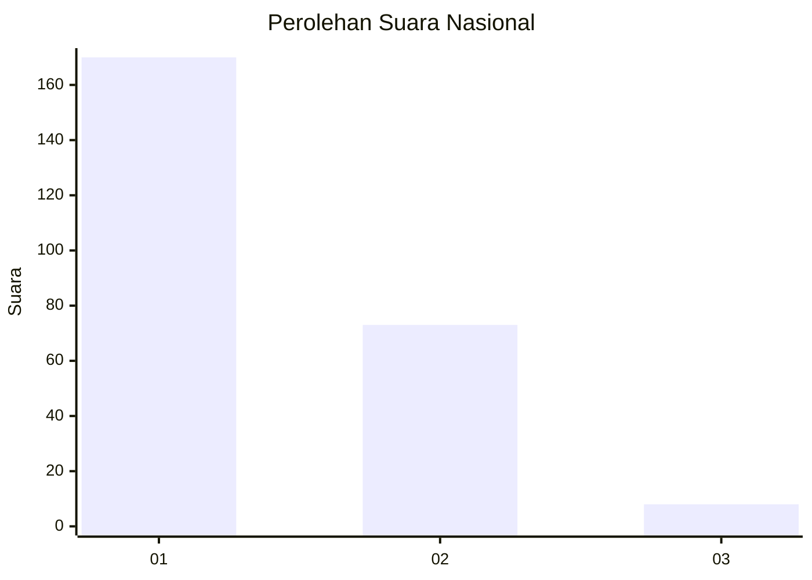
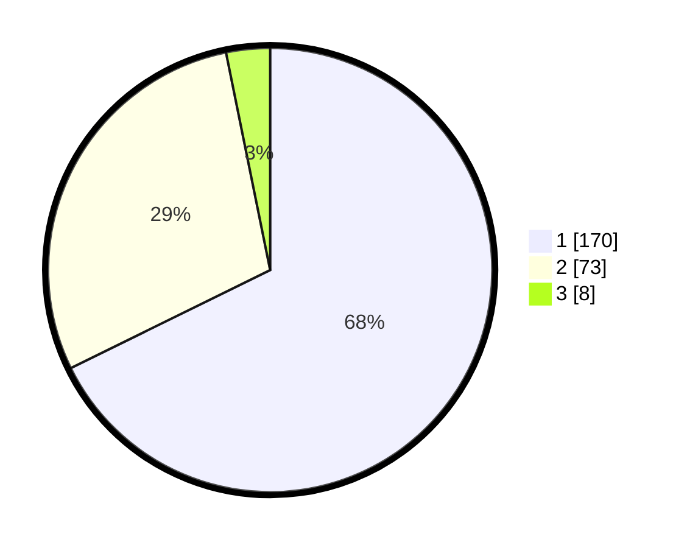

# Hasil

## Grafik

## Tabel

| No. | Nama Paslon    | Suara | Suara (raw) | Persentase |
|:--- |:-------------- | -----:| -----------:| ----------:|
| 1   | ANIES MUHAIMIN | 170   | [170][p-1]  | 67,73      |
| 2   | PRABOWO GIBRAN | 73    | [73][p-2]   | 29,08      |
| 3   | GANJAR MAHFUD  | 8     | [8][p-3]    | 3,19       |

[p-1]: https://github.com/gigit-pemilu/pemilu-2024/blob/main/pilpres/hitung-suara/sub/11-aceh/sub/10-aceh-singkil/sub/10-singkil-utara/sub/2004-ketapang-indah/sub/003-tps/sub/paslon-1.txt
[p-2]: https://github.com/gigit-pemilu/pemilu-2024/blob/main/pilpres/hitung-suara/sub/11-aceh/sub/10-aceh-singkil/sub/10-singkil-utara/sub/2004-ketapang-indah/sub/003-tps/sub/paslon-2.txt
[p-3]: https://github.com/gigit-pemilu/pemilu-2024/blob/main/pilpres/hitung-suara/sub/11-aceh/sub/10-aceh-singkil/sub/10-singkil-utara/sub/2004-ketapang-indah/sub/003-tps/sub/paslon-3.txt

## Foto C Plano

https://sirekap-obj-formc.kpu.go.id/82da/pemilu/ppwp/11/10/10/20/04/1110102004003-20240222-093655--c1036e35-d014-44cc-8f9c-e80c85f320dc.jpg

https://sirekap-obj-formc.kpu.go.id/82da/pemilu/ppwp/11/10/10/20/04/1110102004003-20240222-093833--b53cae65-cdf5-4d86-8de6-f19d88353cf2.jpg

https://sirekap-obj-formc.kpu.go.id/82da/pemilu/ppwp/11/10/10/20/04/1110102004003-20240222-093919--db394b1b-a56e-4f6e-aa26-30abf907d27c.jpg

## Metadata

| Key        | Value               |
| ---------- | ------------------- |
| Time Stamp | 2024-02-24 22:31:28 |

## DATA PEMILIH TETAP

Jumlah pemilih dalam DPT: **223**.
 * L: **823**.
 * P: **862**.

## DATA PENGGUNA HAK PILIH

Jumlah pengguna hak pilih dalam DPT: **223**.
 * L: **223**.
 * P: **325**.

Jumlah pengguna hak pilih dalam DPTb: **232**.
 * L: **255**.
 * P: **225**.

Jumlah pengguna hak pilih dalam DPK: **222**.
 * L: **252**.
 * P: **225**.

Jumlah pengguna hak pilih: **222**.
 * L: **325**.
 * P: **355**.

## JUMLAH SUARA SAH DAN TIDAK SAH

JUMLAH SELURUH SUARA SAH: **251**.

JUMLAH SUARA TIDAK SAH: **6**.

JUMLAH SELURUH SUARA SAH DAN SUARA TIDAK SAH: **257**.

