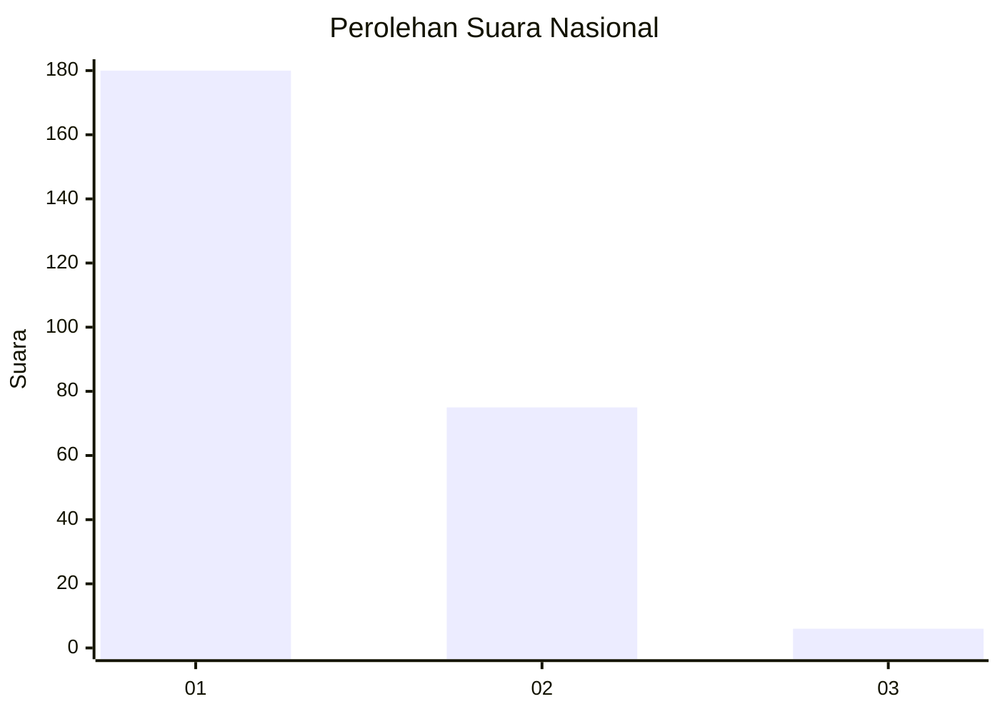
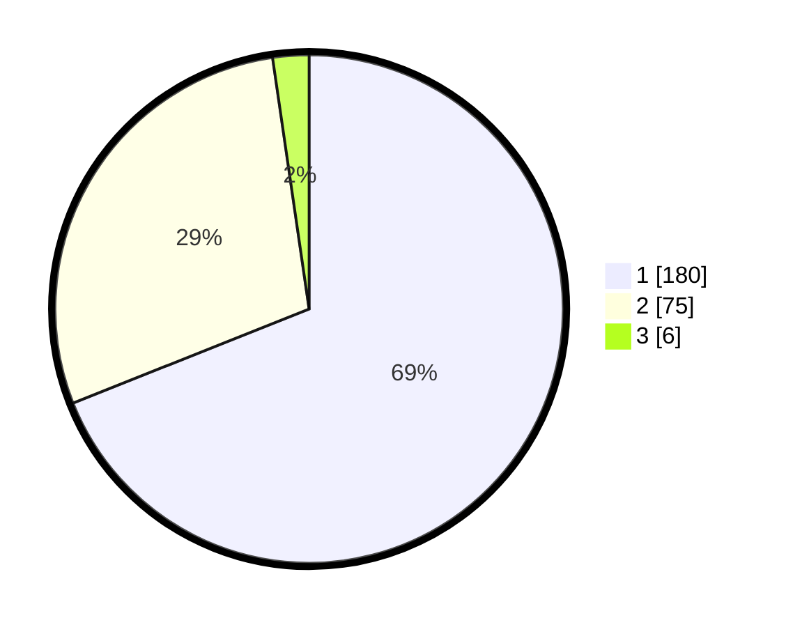

# Hasil

## Grafik

## Tabel

| No. | Nama Paslon    | Suara | Suara (raw) | Persentase |
|:--- |:-------------- | -----:| -----------:| ----------:|
| 1   | ANIES MUHAIMIN | 180   | [180][p-1]  | 68,97      |
| 2   | PRABOWO GIBRAN | 75    | [75][p-2]   | 28,74      |
| 3   | GANJAR MAHFUD  | 6     | [6][p-3]    | 2,30       |

[p-1]: https://github.com/gigit-pemilu/pemilu-2024/blob/main/pilpres/hitung-suara/sub/11-aceh/sub/10-aceh-singkil/sub/10-singkil-utara/sub/2004-ketapang-indah/sub/004-tps/sub/paslon-1.txt
[p-2]: https://github.com/gigit-pemilu/pemilu-2024/blob/main/pilpres/hitung-suara/sub/11-aceh/sub/10-aceh-singkil/sub/10-singkil-utara/sub/2004-ketapang-indah/sub/004-tps/sub/paslon-2.txt
[p-3]: https://github.com/gigit-pemilu/pemilu-2024/blob/main/pilpres/hitung-suara/sub/11-aceh/sub/10-aceh-singkil/sub/10-singkil-utara/sub/2004-ketapang-indah/sub/004-tps/sub/paslon-3.txt

## Foto C Plano

https://sirekap-obj-formc.kpu.go.id/6f4b/pemilu/ppwp/11/10/10/20/04/1110102004004-20240222-104000--7f4c3278-3a59-4450-a101-65bdfd417ab8.jpg

https://sirekap-obj-formc.kpu.go.id/6f4b/pemilu/ppwp/11/10/10/20/04/1110102004004-20240222-103846--612bb21c-8fd0-4e7e-860d-3c8718eb84a9.jpg

https://sirekap-obj-formc.kpu.go.id/6f4b/pemilu/ppwp/11/10/10/20/04/1110102004004-20240222-103925--d964384b-28a2-4b0e-9d4a-35a39363f9f1.jpg

## Metadata

| Key        | Value               |
| ---------- | ------------------- |
| Time Stamp | 2024-02-24 22:31:28 |

## DATA PEMILIH TETAP

Jumlah pemilih dalam DPT: **239**.
 * L: **173**.
 * P: **342**.

## DATA PENGGUNA HAK PILIH

Jumlah pengguna hak pilih dalam DPT: **262**.
 * L: **832**.
 * P: **630**.

Jumlah pengguna hak pilih dalam DPTb: **85**.
 * L: **5**.
 * P: **882**.

Jumlah pengguna hak pilih dalam DPK: **883**.
 * L: **883**.
 * P: **882**.

Jumlah pengguna hak pilih: **220**.
 * L: **136**.
 * P: **433**.

## JUMLAH SUARA SAH DAN TIDAK SAH

JUMLAH SELURUH SUARA SAH: **261**.

JUMLAH SUARA TIDAK SAH: **9**.

JUMLAH SELURUH SUARA SAH DAN SUARA TIDAK SAH: **270**.

