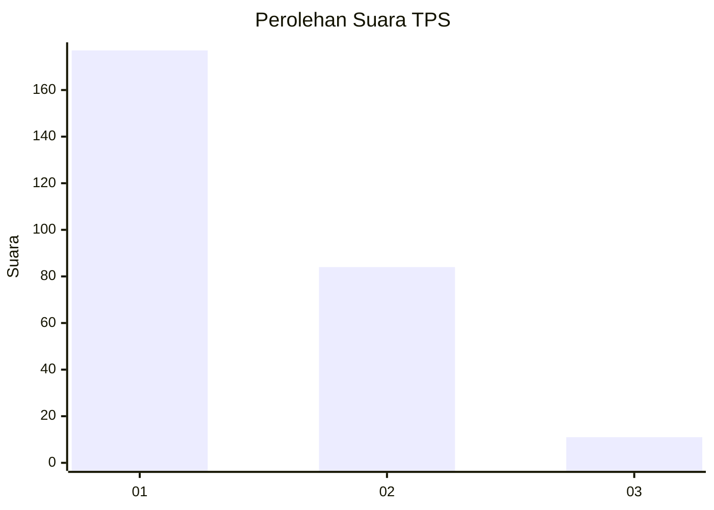
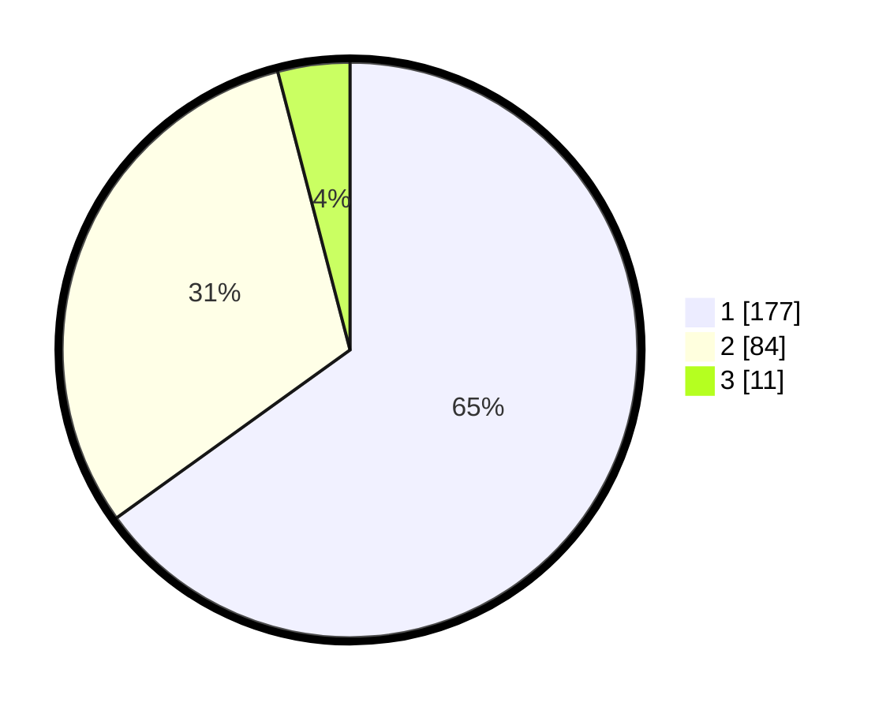

# Hasil

## Grafik

## Tabel

| No. | Nama Paslon    | Suara | Suara (raw) | Persentase |
|:--- |:-------------- | -----:| -----------:| ----------:|
| 1   | ANIES MUHAIMIN | 177   | [177][p-1]  | 65,07      |
| 2   | PRABOWO GIBRAN | 84    | [84][p-2]   | 30,88      |
| 3   | GANJAR MAHFUD  | 11    | [11][p-3]   | 4,04       |

[p-1]: https://github.com/gigit-pemilu/pemilu-2024-11-aceh/blob/main/pilpres/hitung-suara/sub/11-aceh/sub/10-aceh-singkil/sub/10-singkil-utara/sub/2004-ketapang-indah/sub/005-tps/sub/paslon-1.txt
[p-2]: https://github.com/gigit-pemilu/pemilu-2024-11-aceh/blob/main/pilpres/hitung-suara/sub/11-aceh/sub/10-aceh-singkil/sub/10-singkil-utara/sub/2004-ketapang-indah/sub/005-tps/sub/paslon-2.txt
[p-3]: https://github.com/gigit-pemilu/pemilu-2024-11-aceh/blob/main/pilpres/hitung-suara/sub/11-aceh/sub/10-aceh-singkil/sub/10-singkil-utara/sub/2004-ketapang-indah/sub/005-tps/sub/paslon-3.txt

## Foto C Plano

https://sirekap-obj-formc.kpu.go.id/e805/pemilu/ppwp/11/10/10/20/04/1110102004005-20240222-135203--6e71fdd0-762d-41d5-8890-0cfb51dbd261.jpg

https://sirekap-obj-formc.kpu.go.id/e805/pemilu/ppwp/11/10/10/20/04/1110102004005-20240222-135303--33e8be6a-e53f-4fc8-9c7f-f4fa35da80ab.jpg

https://sirekap-obj-formc.kpu.go.id/e805/pemilu/ppwp/11/10/10/20/04/1110102004005-20240222-135417--3e2b0280-804e-41f8-9e53-77973c8119a1.jpg

## Metadata

| Key        | Value               |
| ---------- | ------------------- |
| Time Stamp | 2024-02-24 22:31:28 |

## DATA PEMILIH TETAP

Jumlah pemilih dalam DPT: **390**.
 * L: **145**.
 * P: **355**.

## DATA PENGGUNA HAK PILIH

Jumlah pengguna hak pilih dalam DPT: **265**.
 * L: **522**.
 * P: **133**.

Jumlah pengguna hak pilih dalam DPTb: **489**.
 * L: **883**.
 * P: **26**.

Jumlah pengguna hak pilih dalam DPK: **822**.
 * L: **888**.
 * P: **828**.

Jumlah pengguna hak pilih: **275**.
 * L: **536**.
 * P: **639**.

## JUMLAH SUARA SAH DAN TIDAK SAH

JUMLAH SELURUH SUARA SAH: **272**.

JUMLAH SUARA TIDAK SAH: **3**.

JUMLAH SELURUH SUARA SAH DAN SUARA TIDAK SAH: **275**.

