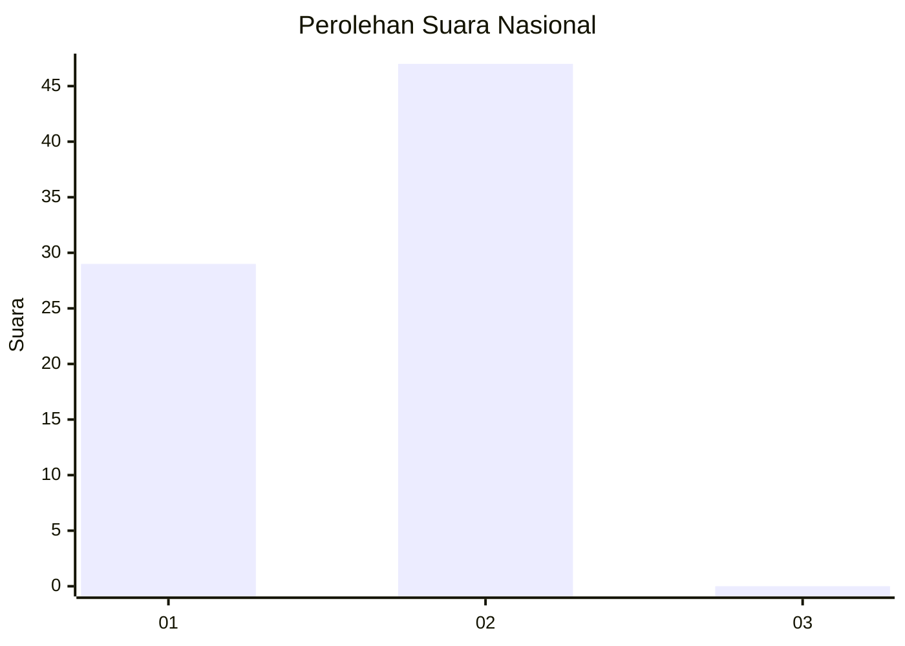
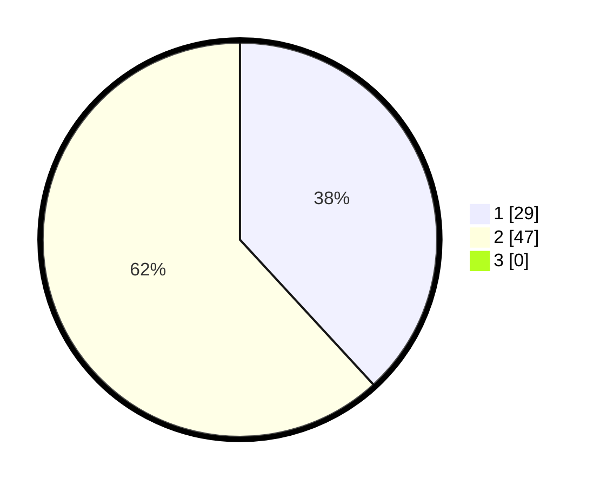

# Hasil

## Grafik

## Tabel

| No. | Nama Paslon    | Suara | Suara (raw) | Persentase |
|:--- |:-------------- | -----:| -----------:| ----------:|
| 1   | ANIES MUHAIMIN | 29    | [29][p-1]   | 38,16      |
| 2   | PRABOWO GIBRAN | 47    | [47][p-2]   | 61,84      |
| 3   | GANJAR MAHFUD  | 0     | [0][p-3]    | 0,00       |

[p-1]: https://github.com/gigit-pemilu/pemilu-2024/blob/main/pilpres/hitung-suara/sub/11-aceh/sub/10-aceh-singkil/sub/10-singkil-utara/sub/2004-ketapang-indah/sub/901-tps/sub/paslon-1.txt
[p-2]: https://github.com/gigit-pemilu/pemilu-2024/blob/main/pilpres/hitung-suara/sub/11-aceh/sub/10-aceh-singkil/sub/10-singkil-utara/sub/2004-ketapang-indah/sub/901-tps/sub/paslon-2.txt
[p-3]: https://github.com/gigit-pemilu/pemilu-2024/blob/main/pilpres/hitung-suara/sub/11-aceh/sub/10-aceh-singkil/sub/10-singkil-utara/sub/2004-ketapang-indah/sub/901-tps/sub/paslon-3.txt

## Foto C Plano

https://sirekap-obj-formc.kpu.go.id/abef/pemilu/ppwp/11/10/10/20/04/1110102004901-20240222-143636--c612d02c-75e6-4381-b5a7-d7562cd07484.jpg

https://sirekap-obj-formc.kpu.go.id/abef/pemilu/ppwp/11/10/10/20/04/1110102004901-20240222-143714--cb9b0045-47c7-42cf-ac7d-3ad94921395b.jpg

https://sirekap-obj-formc.kpu.go.id/abef/pemilu/ppwp/11/10/10/20/04/1110102004901-20240222-143853--bc282d6d-c737-40fc-9fa6-a99e7225bfb5.jpg

## Metadata

| Key        | Value               |
| ---------- | ------------------- |
| Time Stamp | 2024-02-22 15:00:00 |

## DATA PEMILIH TETAP

Jumlah pemilih dalam DPT: **75**.
 * L: **73**.
 * P: **2**.

## DATA PENGGUNA HAK PILIH

Jumlah pengguna hak pilih dalam DPT: **40**.
 * L: **39**.
 * P: **1**.

Jumlah pengguna hak pilih dalam DPTb: **37**.
 * L: **37**.
 * P: **0**.

Jumlah pengguna hak pilih dalam DPK: **0**.
 * L: **0**.
 * P: **0**.

Jumlah pengguna hak pilih: **77**.
 * L: **76**.
 * P: **1**.

## JUMLAH SUARA SAH DAN TIDAK SAH

JUMLAH SELURUH SUARA SAH: **76**.

JUMLAH SUARA TIDAK SAH: **1**.

JUMLAH SELURUH SUARA SAH DAN SUARA TIDAK SAH: **77**.

