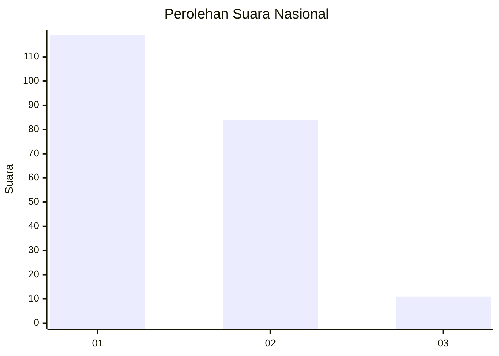
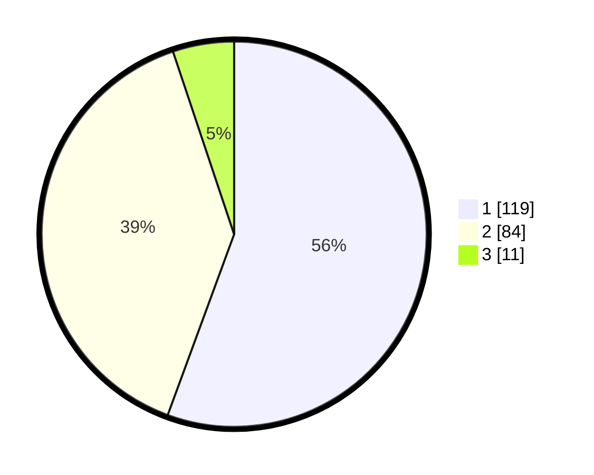

# Hasil

## Grafik

## Tabel

| No. | Nama Paslon    | Suara | Suara (raw) | Persentase |
|:--- |:-------------- | -----:| -----------:| ----------:|
| 1   | ANIES MUHAIMIN | 119   | [119][p-1]  | 55,61      |
| 2   | PRABOWO GIBRAN | 84    | [84][p-2]   | 39,25      |
| 3   | GANJAR MAHFUD  | 11    | [11][p-3]   | 5,14       |

[p-1]: https://github.com/gigit-pemilu/pemilu-2024/blob/main/pilpres/hitung-suara/sub/11-aceh/sub/10-aceh-singkil/sub/10-singkil-utara/sub/2006-gosong-telaga-barat/sub/002-tps/sub/paslon-1.txt
[p-2]: https://github.com/gigit-pemilu/pemilu-2024/blob/main/pilpres/hitung-suara/sub/11-aceh/sub/10-aceh-singkil/sub/10-singkil-utara/sub/2006-gosong-telaga-barat/sub/002-tps/sub/paslon-2.txt
[p-3]: https://github.com/gigit-pemilu/pemilu-2024/blob/main/pilpres/hitung-suara/sub/11-aceh/sub/10-aceh-singkil/sub/10-singkil-utara/sub/2006-gosong-telaga-barat/sub/002-tps/sub/paslon-3.txt

## Foto C Plano

https://sirekap-obj-formc.kpu.go.id/9e43/pemilu/ppwp/11/10/10/20/06/1110102006002-20240220-213348--127020e9-c3f0-4d5e-9f78-08fe6ed22638.jpg

https://sirekap-obj-formc.kpu.go.id/9e43/pemilu/ppwp/11/10/10/20/06/1110102006002-20240220-213509--e2e28f91-cdb1-42e4-a7b3-ebb603cb9616.jpg

https://sirekap-obj-formc.kpu.go.id/9e43/pemilu/ppwp/11/10/10/20/06/1110102006002-20240220-213558--a55384fa-5ff4-4dc7-acff-79462ce79120.jpg

## Metadata

| Key        | Value               |
| ---------- | ------------------- |
| Time Stamp | 2024-02-24 22:31:28 |

## DATA PEMILIH TETAP

Jumlah pemilih dalam DPT: **260**.
 * L: **531**.
 * P: **829**.

## DATA PENGGUNA HAK PILIH

Jumlah pengguna hak pilih dalam DPT: **223**.
 * L: **9**.
 * P: **64**.

Jumlah pengguna hak pilih dalam DPTb: **88**.
 * L: **808**.
 * P: **888**.

Jumlah pengguna hak pilih dalam DPK: **888**.
 * L: **88**.
 * P: **8**.

Jumlah pengguna hak pilih: **223**.
 * L: **109**.
 * P: **514**.

## JUMLAH SUARA SAH DAN TIDAK SAH

JUMLAH SELURUH SUARA SAH: **214**.

JUMLAH SUARA TIDAK SAH: **9**.

JUMLAH SELURUH SUARA SAH DAN SUARA TIDAK SAH: **223**.

