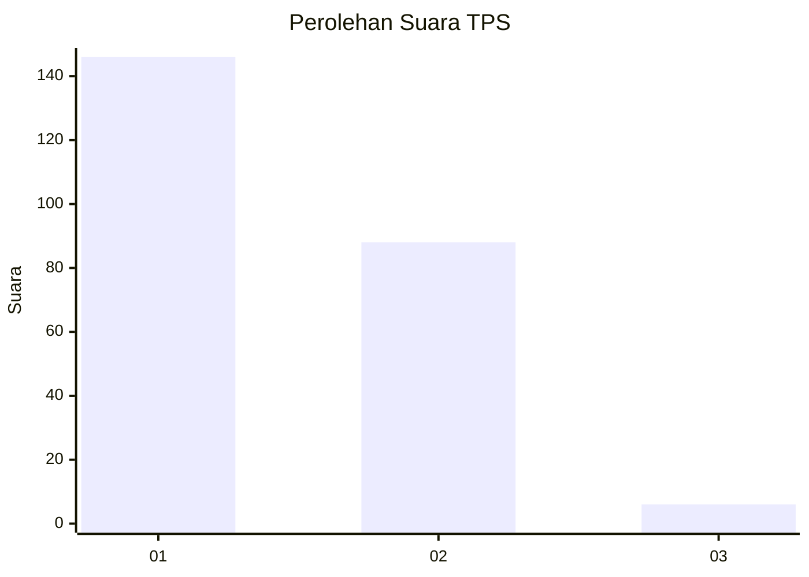
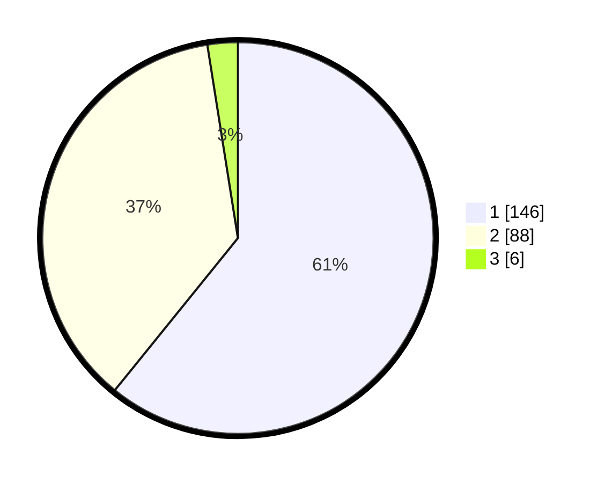

# Hasil

## Grafik

## Tabel

| No. | Nama Paslon    | Suara | Suara (raw) | Persentase |
|:--- |:-------------- | -----:| -----------:| ----------:|
| 1   | ANIES MUHAIMIN | 146   | [146][p-1]  | 60,83      |
| 2   | PRABOWO GIBRAN | 88    | [88][p-2]   | 36,67      |
| 3   | GANJAR MAHFUD  | 6     | [6][p-3]    | 2,50       |

[p-1]: https://github.com/gigit-pemilu/pemilu-2024-11-aceh/blob/main/pilpres/hitung-suara/sub/11-aceh/sub/10-aceh-singkil/sub/10-singkil-utara/sub/2006-gosong-telaga-barat/sub/003-tps/sub/paslon-1.txt
[p-2]: https://github.com/gigit-pemilu/pemilu-2024-11-aceh/blob/main/pilpres/hitung-suara/sub/11-aceh/sub/10-aceh-singkil/sub/10-singkil-utara/sub/2006-gosong-telaga-barat/sub/003-tps/sub/paslon-2.txt
[p-3]: https://github.com/gigit-pemilu/pemilu-2024-11-aceh/blob/main/pilpres/hitung-suara/sub/11-aceh/sub/10-aceh-singkil/sub/10-singkil-utara/sub/2006-gosong-telaga-barat/sub/003-tps/sub/paslon-3.txt

## Foto C Plano

https://sirekap-obj-formc.kpu.go.id/7ae5/pemilu/ppwp/11/10/10/20/06/1110102006003-20240220-231749--683a33bf-88e8-4ebe-ad95-9e77d43d5720.jpg

https://sirekap-obj-formc.kpu.go.id/7ae5/pemilu/ppwp/11/10/10/20/06/1110102006003-20240220-231826--19a4f6fc-e34e-440d-a4b9-f3d9676c0e62.jpg

https://sirekap-obj-formc.kpu.go.id/7ae5/pemilu/ppwp/11/10/10/20/06/1110102006003-20240220-232219--b02feec8-b398-457d-bbda-3faca2b40dbe.jpg

## Metadata

| Key        | Value               |
| ---------- | ------------------- |
| Time Stamp | 2024-02-24 22:31:28 |

## DATA PEMILIH TETAP

Jumlah pemilih dalam DPT: **233**.
 * L: **440**.
 * P: **637**.

## DATA PENGGUNA HAK PILIH

Jumlah pengguna hak pilih dalam DPT: **243**.
 * L: **220**.
 * P: **823**.

Jumlah pengguna hak pilih dalam DPTb: **8**.
 * L: **808**.
 * P: **80**.

Jumlah pengguna hak pilih dalam DPK: **881**.
 * L: **881**.
 * P: **808**.

Jumlah pengguna hak pilih: **244**.
 * L: **26**.
 * P: **123**.

## JUMLAH SUARA SAH DAN TIDAK SAH

JUMLAH SELURUH SUARA SAH: **240**.

JUMLAH SUARA TIDAK SAH: **4**.

JUMLAH SELURUH SUARA SAH DAN SUARA TIDAK SAH: **244**.

